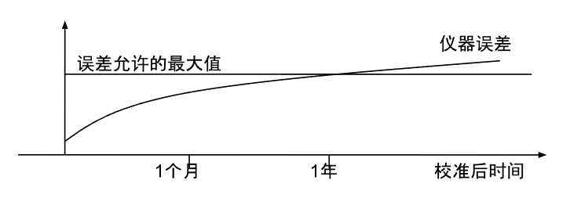
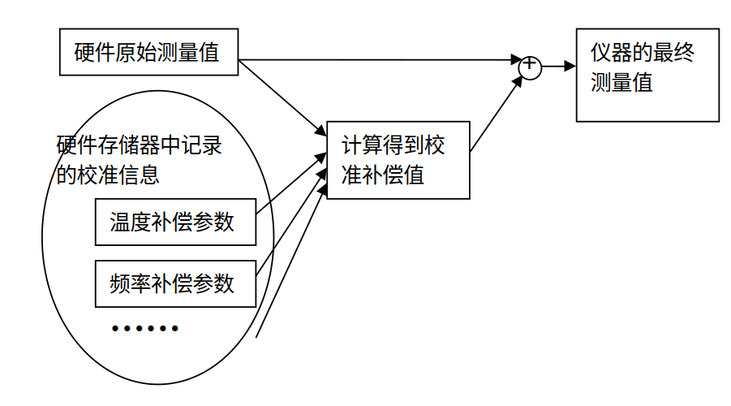

## 仪器误差

仪器误差是指测量值 $ a $ 与信号真实值 $ A $ 之间的差异，用 Δ 表示：  

$ Δ = | a - A | $

误差主要来源于以下几个方面：  

- 原理误差：由于测量原理和方法本身存在局限性或假设不准确，导致的系统性偏差。  
- 装置误差：由测量仪器、设备或装置本身的缺陷或不完善引起的误差。  
- 环境误差：测量过程中环境条件（如温度、湿度、电磁干扰等）变化对测量结果的影响。  
- 使用误差：由于操作不当、读数不准确或违反操作规程等人为因素引起的误差。  

根据误差的性质，可将其分为三类：  

- 系统误差：主要由仪器设计不完美、元器件老化或环境变化等因素引起。此类误差在测量过程中呈现稳定或可预测的趋势，因此可以通过校正方法予以补偿或消除。系统误差中有一部分是由于时间变化引起的，如漂移误差，因此需要定期校准以保持测量精度。  
- 随机误差：由仪器内部噪声或难以控制的外部因素（如信号源相位噪声）引起，呈现不可预测的波动特性。由于其随机性，无法通过校准彻底消除，但可以通过多次测量并取平均值来减小影响。  
- 粗大误差：通常由偶然因素（如操作失误或设备故障）引起，测量值与其他数据相比差异显著。尽管粗大误差无法通过校准消除，但由于其异常显著性，可以通过数据筛选和统计分析予以剔除。  

误差的大小直接影响仪器的精确度。若某仪器在所有测量条件下的误差均在允许范围内，则可认为该仪器的精确度达到相应标准。  

为提高仪器的精确度，我们通常采用自动校准方法，即通过修改软件中某些参数来补偿系统误差（包括漂移误差）。由于漂移误差会随着使用时间累积，仪器需要定期校准以保持其精确度。

## 仪器校准的基本概念  

校准（Calibration）是将被校准仪器与已知精确度的标准仪器进行比较，并通过调整或修正来补偿误差的过程。在传统仪器管理中，校准也常被称为“校验”。  

### 校准对仪器误差与精确度的影响  

电子元器件的性能会随着使用时间和环境条件的变化而产生漂移，进而影响测量结果的准确性。这种漂移导致仪器测量值的不确定性增加。如果仪器长时间未进行校准，其测量误差可能会超过用户的精度要求，从而无法准确反映被测量信号的真实值。  

为确保测量的可靠性和精确度，必须定期对仪器进行校准。下图展示了一般仪器的测量误差随时间变化的趋势。可以看出，误差会随着使用时间的增加逐渐积累，并在某一时刻超过允许的误差范围。  

  

为了保持测量精确度，需在误差超出允许范围之前进行校准。通常，仪器误差达到规定范围所需的时间是可以预估的。例如，图中所示仪器在校准后约 1 至 2 年内误差会超出规定范围，因此建议每年对该仪器进行一次定期校准。  

### 校准的目的  

校准的主要目的是提高仪器的测量精确度和可靠性，包括以下几方面：  

- 减少测量误差：通过校准补偿系统误差，确保测量结果的准确性。  
- 保证测量一致性：确保仪器在多次测量中保持一致性和稳定性。  
- 提高测量效率：减少因误差过大导致的重复测量和结果修正，提高工作效率。  

常用仪器的精确度通常由国际或国家标准规定，因此校准目标应达到或高于相应标准要求，以确保测量结果的权威性和可信度。  

### 校准的基本要求  

- 环境条件：校准环境应满足温度、湿度等规定要求。如果在校准实验室进行，需严格控制环境条件；若在现场进行，则应确保环境条件能满足仪器正常工作的要求。  
- 标准仪器：用于校准的标准仪器其不确定度应为被校准仪器不确定度的 1/3 至 1/10。通常，标准仪器的精确度需比被校准仪器高至少一个数量级，以确保校准的准确性。  
- 校准人员：校准应由具备资质并经过严格考核的人员进行。只有经认可实验室的持证人员出具的校准证书和报告才被认为是有效的。  

## 仪器的调整方法  

为了便于校准，许多仪器设计时都预留了调节输出测量值的接口或方法。模块化仪器通常采用以下几种调节方式：  

### 机械调整方式  

某些仪器通过暴露的可调元器件（如可变电阻或可调电容）来调节测量参数。操作时，用户手动旋转或滑动这些器件，从而改变仪器的输出值。这种调整方式需要人工反复调节和观测，直至测量误差满足要求，因此无法实现自动化校准。  

早期或较低档次的模块化仪器中常见机械调整方式，但随着技术发展，这类仪器已较为少见。  

### 电子调整方式  

为克服机械调整的不便，大多数现代仪器采用电子调整方式。用户通过向特定寄存器写入数值来修改仪器参数。例如，为调节输出频率，可以将期望的频率值写入寄存器中，再通过数模转换电路将其转化为电压信号，最终通过压控频率电路生成对应频率的输出信号。  

尽管部分仪器允许用户在显示界面上手动调整参数，但这一方式仍需用户边观察测量值边进行调节，无法完全自动化。  

### 计算机控制调节  

高端传统仪器通常提供与计算机通信的接口，使用户能够通过计算机发送指令或数据，从而实现自动化校准。  

模块化仪器则完全依赖计算机操作，没有直接的用户交互界面，因此校准也必须通过计算机完成。这种设计为自动化校准提供了理想的硬件基础。 

### 纯软件调整方式  

纯软件调整方式是模块化虚拟仪器特有的一种校准方法。在这种方式中，仪器硬件参数保持不变，校准结果以表征曲线的数学公式或表格形式记录在仪器存储器中（如ROM）。虚拟仪器的核心功能由软件实现，而底层硬件仅负责基础信号采集。因此，虚拟仪器最终显示的测量值已通过软件校正、分析和处理。  

#### 原理与实现  

纯软件调整方式通过软件对底层硬件误差进行补偿，其过程下图所示：  

 

1. 读取校准参数： 虚拟仪器从底层硬件存储器中读取校准参数，这些参数可以是表征曲线的数学公式或表格形式，如温度补偿、频率补偿、电压补偿等。  
2. 获取原始输出： 仪器读取底层硬件的原始输出值。  
3. 计算误差补偿： 根据原始输出值和校准参数，虚拟仪器在软件中计算误差补偿值。  
4. 输出修正结果： 最终显示给用户的测量值为原始测量值与误差补偿值之和。  

#### 优势与特点  

纯软件调整方式相比机械和电子调整方式，具有以下显著优势：  

- 更高的补偿复杂度： 该方式可以实现极为复杂的误差补偿。以功率测量为例，测量值受信号功率、频率、波形、温度等多个因素影响，这些因素之间关系复杂且非线性。电子调整方式只能通过调节有限的硬件参数进行补偿，难以准确描述所有因素间的复杂关系。而纯软件调整方式则可通过高阶曲线拟合、多参数高次方程、甚至查表法来精确建模和补偿。  

- 更高的校准精度： 由于不受硬件调节元件数量的限制，纯软件调整方式可以根据需要设置足够多的补偿参数。例如，在特别复杂的测量场景下，如果影响因素间的关系无法用线性方程表示，则可以通过多组查表数据描述不同条件下的误差变化规律，从而显著提高仪器的整体精确度。  

#### 示例：功率计的校准补偿表  

以下是一个功率计的校准补偿表示例，表中记录了不同频率下的补偿系数。仪器在进行功率测量时，会根据被测信号频率从表中获取相应的补偿系数，并进行误差修正。  

| 频率      | 补偿系数 |  
|-----------|-----------|  
| 300 kHz   | 1.12      |  
| 1 MHz     | 1.05      |  
| 10 MHz    | 1.05      |  
| 100 MHz   | 1.02      |  
| 500 MHz   | 1.02      |  
| 1 GHz     | 1.00      |  
| 5 GHz     | 1.05      |  
| 20 GHz    | 1.10      |  
| 30 GHz    | 1.15      |  

通过这种补偿方式，仪器能够更准确地反映真实测量值，并在更广泛的测量条件下保持较高精度。   
