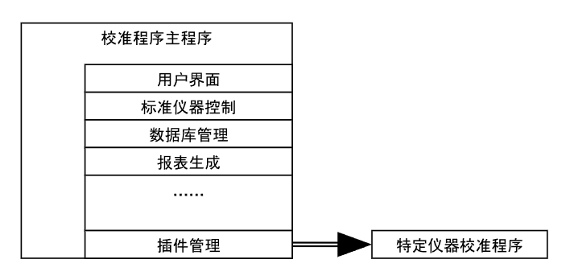
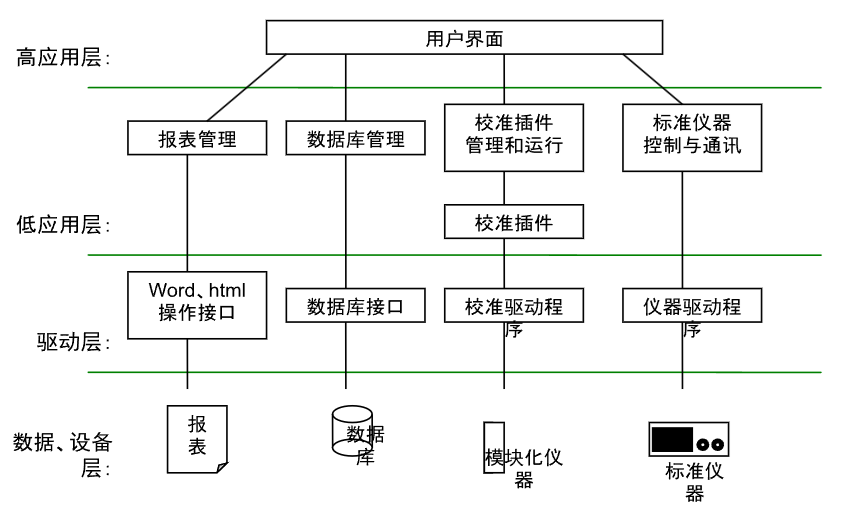
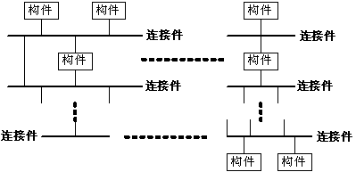

## 仪器的分类

### 模块化仪器的分类

模块化仪器通常根据其功能进行分类，主要包括信号转换模块（如体表电位模块、X射线发射模块、X射线接收模块等）、数据采集模块（如数据采集卡、示波器卡等）、控制模块（如电机控制模块、RF信号发生模块）、数据分析处理模块（如CPU、DSP芯片、电脑主机）、数据存储模块（如硬盘控制模块）、显示模块（如显卡、打印控制模块）以及通讯模块（如以太网模块、蓝牙模块）。此外，一些模块可能兼具多种功能，例如RF信号发生模块不仅用于信号控制，还可作为通讯模块，用于发送无线射频信号。  

通过模块化划分可以发现，许多模块具有通用性，甚至可能与其他领域的仪器模块类似，例如机械运动控制模块和通讯模块。为了确保不同模块能够高效集成，模块化仪器通常采用统一的总线接口，如PCI、VXI和PXI等。这种标准化接口、相对单一的功能设计以及相似的控制方式，为开发通用校准系统奠定了基础。  

同时，不同模块化仪器的校准程序存在一定的重复性，因此在编写校准程序时，需要充分考虑软件的可重用性。这样，当新增仪器需要校准时，仅需针对仪器的特定功能编写新的代码，而通用部分则可复用现有代码，提高开发效率并降低成本。

### 标准仪器的种类

标准仪器是指用于与被校准仪器进行比对或测量其特定参数的高精度仪器。例如，高精度万用表、示波器、信号发生器和标准频率源等常用于校准过程。本文主要讨论用于模块化仪器校准的标准仪器。  

由于模块化仪器通常由功能单一、趋于标准化的模块组成，其校准所需的标准仪器也往往是通用的，例如示波器、信号发生器和标准频率源等。然而，即使是同类的标准仪器，也可能存在多个品牌、型号和厂商的选择，不同型号的仪器在驱动方式和通信协议上往往有所不同。此外，不同的校准实验室可能会选用不同品牌和型号的标准仪器。如果校准程序仅针对某一特定型号的标准仪器开发，那么当实验室更换标准仪器时，原有校准程序可能无法兼容，必须重新编写代码以适配新的仪器，增加了开发和维护成本。  

因此，在设计通用校准系统时，必须优先解决标准仪器的互换性问题。这意味着校准系统应具备良好的适应性和扩展性，能够在不修改代码的情况下兼容不同型号，甚至是未来可能引入的新仪器。为此，校准系统需要采用统一的仪器抽象接口或驱动层，从而屏蔽不同仪器之间的实现差异，使其能够灵活适配各种标准仪器，提高系统的通用性和可维护性。

### 通用校准框架的难点  

编写通用校准框架的最大挑战在于，如何在种类繁多、型号各异的被校准仪器和标准仪器之间，提取并抽象出它们的共性。不同的校准实验室可能会使用功能类似但型号不同的标准仪器，而要使同一校准解决方案适用于所有可用的标准仪器，关键就在于对其共性进行抽象。  

通过建立统一的抽象接口，校准系统可以屏蔽不同仪器的具体实现细节，使其能够支持不同厂商和型号的设备。这样，即使引入了新的标准仪器，用户也只需编写针对该仪器的适配层，而无需修改整个校准系统，从而提高系统的可扩展性和适应性。  

## 通用校准系统框架的功能  

### 框架的概念  

在软件设计模式的研究中，Gamma等人将框架定义为：“框架是一组协同工作的类，它们为特定类型的软件构建了一个可重用的设计。” 软件开发过程中，已经出现了各种针对不同应用领域的框架，而通用校准系统框架正是专门针对模块化仪器校准这一领域的解决方案。  

该框架的核心思想是将各类模块化仪器的校准程序中通用的功能部分提取并抽象，从而提高代码的复用性和维护性。例如，对标准仪器的控制、校准数据的采集处理、校准报表的生成等，均属于校准流程中的通用任务。这些功能将在框架中实现标准化，并通过模块化设计，使不同校准任务可以协同工作，同时提供灵活的扩展机制，使用户能够便捷地适配新的仪器或校准需求。

### 基于插件的校准系统体系结构  

为了应对数量众多的模块化仪器，建立一套通用的校准解决方案，我们采用基于插件的系统架构。在该架构下，校准过程中所需的通用功能（如标准仪器的控制、数据采集、报表生成等）由统一的代码实现，而针对不同仪器的特定校准功能则由独立的插件模块完成。这种设计方式确保了通用功能的稳定性，同时允许针对不同仪器的校准逻辑以插件形式灵活扩展。  

在整体架构中，主程序负责提供核心功能，如用户界面、插件管理和数据处理，而每个插件则专注于具体仪器的校准操作。插件可以独立开发、动态加载，不需要修改主程序，即可添加对新型号仪器的支持，从而极大提升系统的可扩展性和维护性。  

### 插件管理与动态加载机制  

程序启动时，主程序会自动加载通用功能模块（包括用户界面、日志管理、报表生成等），同时，插件管理模块会扫描系统中可用的校准插件，并在用户界面中列出所有已安装的插件。用户只需选择相应的插件，即可加载该插件，并执行相应的校准任务。  

由于插件采用动态加载，当新型号的仪器需要校准时，无需对主程序进行任何修改，只需编写一个新的插件并添加到系统，即可完成对新仪器的支持。这种设计方式不仅减少了系统升级的成本，同时也增强了系统的灵活性和适应性。  

### 插件与主程序之间的数据交换  

在校准过程中，插件与主程序之间存在大量实时数据交换。例如：  

- 状态同步：主程序需要获取插件的当前运行状态，如进度信息、错误报告等。  
- 命令交互：插件需要接收主程序发送的控制命令，如启动、暂停、终止校准任务等。  

为了确保所有插件能够正确与主程序交互，通用校准系统框架定义了一套标准化的数据交换接口，通常采用结构化数据或预定义的接口函数进行通信。这种接口规范使得不同插件能够以一致的方式与主程序交互，确保系统的稳定性和兼容性。  

为了降低用户编写插件的难度，通用校准系统框架已预置了完整的接口库，用户可以直接调用这些封装好的底层函数。例如：  

- 显示校准状态（在主用户界面更新校准进度）  
- 数据库操作（存储和检索校准数据）  
- 仪器控制（发送控制指令到标准仪器）  

通过提供这些高层API，用户无需关心底层数据通信细节，只需关注校准逻辑的实现，从而大幅提升开发效率，使校准系统的开发和维护更加高效便捷。

## 校准系统层次结构  

### 层次划分  

上图展示了通用校准系统的层次结构。在软件设计过程中，我们借鉴了开放系统互连（OSI）参考模型，对系统的各个功能模块进行合理分层，以确保系统的可扩展性和模块化。  

合理的层次划分带来了以下优势：  

- 模块解耦：上层模块仅通过调用下层提供的接口来获取服务，而不直接访问底层实现细节，从而降低系统耦合度。  
- 职责明确：下层模块仅提供特定功能，不依赖于上层模块，也无需感知上层的存在。  
- 灵活扩展：下层模块可以为多个上层模块提供服务，使得相同的基础组件能够复用于不同的校准任务。  

这种层次结构的独立性，不仅提升了代码的复用性，还为团队协作、调试和维护提供了便利，使系统具备更强的可维护性和拓展性。  

### C2体系结构风格  

在开发校准系统时，我们优先考虑如何复用现有的软件构件，如用户界面组件、批处理执行组件、仪器驱动组件等。近年来，软件行业积累了大量经验和可复用资源，我们的系统设计旨在充分利用这些成熟组件，以提高开发效率。  

为此，我们在系统架构设计中采用了C2体系结构风格。C2风格的核心思想是：通过连接件（connectors）将并行运行的构件（components）组织成一个结构化的网络，并遵循特定的交互规则。其主要特征包括：  

- 组件和连接件均具有明确的上下层关系，即每个构件的顶部必须连接到某个连接件的底部，反之亦然。  
- 组件之间不允许直接通信，必须通过连接件进行信息传递，以确保模块解耦。  
- 连接件可以连接多个构件，实现灵活的信息传递和事件驱动机制。  
- 当两个连接件直接连接时，必须遵循自底向上的数据流动规则，即数据从下层连接件的顶部传输到上层连接件的底部。  

展示上图了C2风格的系统结构示意图，其中构件与连接件的关系清晰地体现了C2架构的组织原则。  

通过采用C2风格，我们的通用校准系统具备了高扩展性、低耦合性和强适应性，能够灵活应对不同型号仪器的校准需求，并支持未来新设备的无缝集成。
