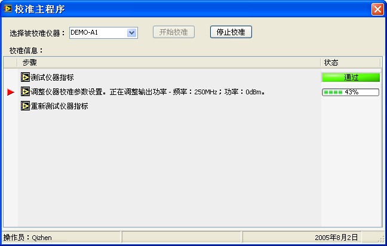
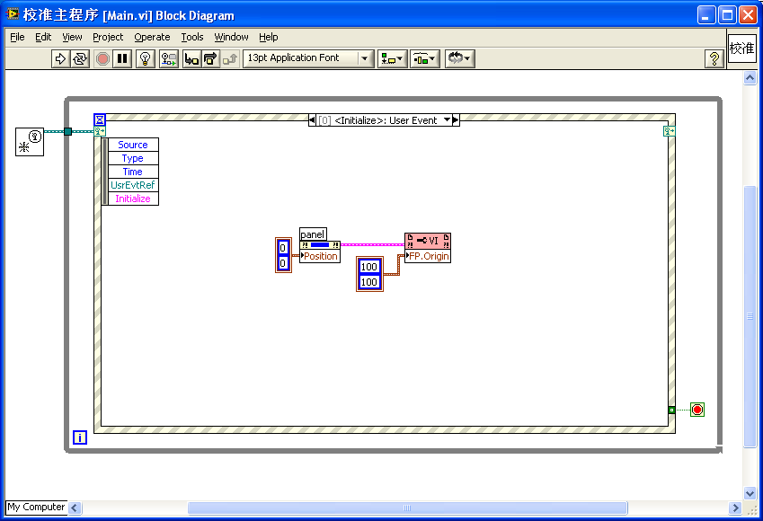
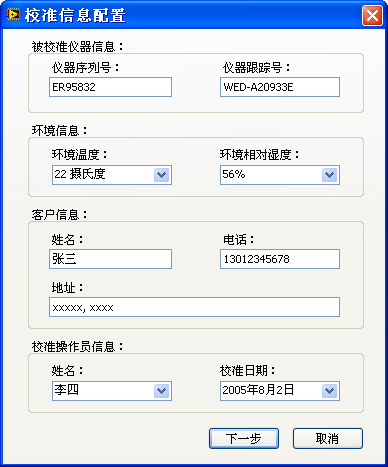
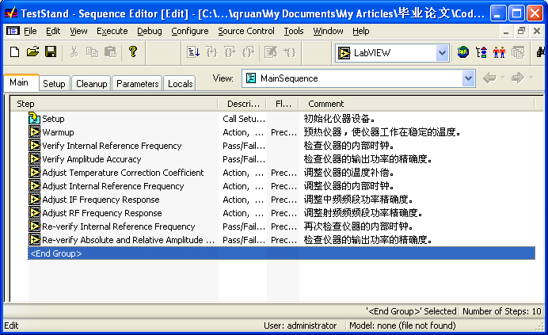
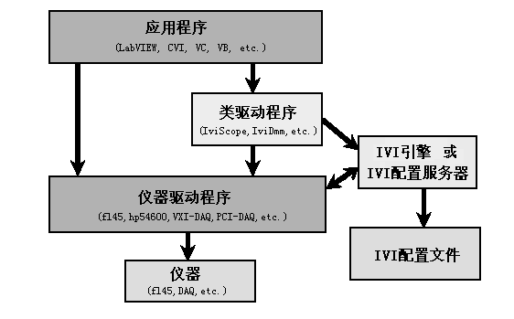
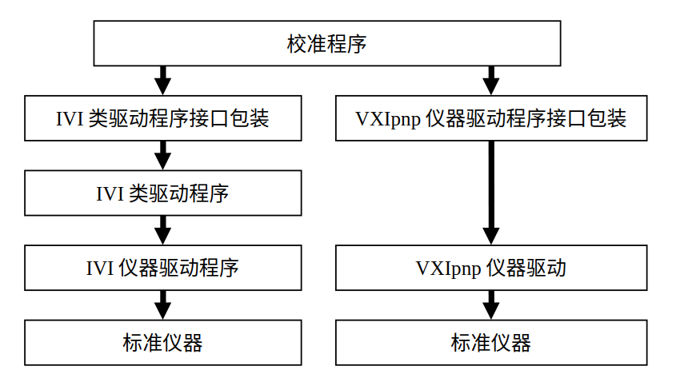

## 开发平台的选择

### 硬件平台需求

模块化仪器的显著优势之一在于其与普通微型计算机的便捷通信能力。因此，我们选择普通微型计算机作为校准系统的硬件开发平台，以兼顾成本效益和系统灵活性。目前，模块化仪器常用的接口总线主要包括PCI和PXI两种类型。PCI总线因其广泛应用和高性价比而常见于传统设备，而PXI总线则以其高带宽和模块化设计更适用于现代测控系统。在设计校准程序时，应确保同时兼容这两种总线，以提升系统的通用性和扩展性。

### 操作系统的选取

操作系统是校准系统开发的核心基础，其选择需综合考虑普及程度、软硬件兼容性以及资源支持情况。目前使用的最广泛的、对各种软硬件支持最好的、资源最丰富的操作系统无疑是微软公司的Windows
XP/2000。因此我们也选择在Windows
XP上开发校准主程序。但开发需要尽可能多地考虑软件的可移植性，为以后软件支持其他操作系统打好基础。同时，为确保系统的长期适应性，开发过程中需注重软件的可移植性设计，例如通过模块化架构和跨平台 API，为未来适配 Linux 或 macOS 等其他操作系统奠定基础。

### 编程语言的选定

通用校准系统对编程语言的核心要求是能够高效、便捷地操作和控制被校准仪器及标准仪器，同时具备良好的扩展性和开发效率。

经过全面对比，我们最终选定美国国家仪器公司（National Instruments）开发的LabVIEW作为本项目的编程语言。LabVIEW 是一种图形化编程语言，专为测量与控制领域设计，其在仪器设备控制、总线通信（如PCI、PXI）以及数据信号分析处理方面的支持尤为出色，使其成为仪器校准开发的理想选择。与传统的文本编程语言（如C++或Python）相比，LabVIEW 通过直观的图形化界面降低了开发门槛，同时保留了强大的功能性。

此外，LabVIEW 的开放性进一步增强了其适用性。它原生支持动态数据交换（DDE）、结构化查询语言（SQL）以及 TCP/UDP 等网络协议，便于实现校准系统的数据存储、传输和远程通信功能。更重要的是，LabVIEW 具备跨平台特性，能够无缝运行于 Windows、Linux 和 macOS 等操作系统。这种特性不仅提升了系统的灵活性，也为未来向非 Windows 平台的迁移提供了便利。因此，选用 LabVIEW 作为开发语言，不仅满足了当前需求，还为系统的长期发展打下了坚实基础。

### 其他组件的搭配

为提升开发效率和系统功能性，我们在校准系统中集成了多种第三方组件。例如，在数据库管理方面，采用开源的LabSQL组件以实现高效的数据存取；在仪器驱动方面，引入IVI（可互换虚拟仪器）标准组件，确保标准仪器的兼容性与可互换性。此外，我们选用了 National Instruments 的 TestStand 作为测试序列管理工具。TestStand 提供了强大的批处理能力、报表生成功能以及数据库读写支持，相较于纯代码实现，其模块化设计显著简化了调试和维护流程，使校准系统的开发更高效、可控。

## 用户界面的设计与实现

### 用户界面的核心功能

校准系统的用户界面主要服务于三个关键功能：
1. 校准前信息输入：在校准开始前，要求用户录入相关信息，包括被校准仪器的型号与序列号、标准仪器的型号、环境条件（如温度、湿度）等。
2. 校准过程监控：在校准进行时，实时显示当前校准的项目、执行状态和进度信息。
3. 校准结果展示：校准完成后，呈现校准结果并生成详细报表。

在这三项功能中，校准过程的状态监控占据了最长的交互时间，因此应作为界面的核心部分进行设计。其余功能则可通过弹出式对话框实现，以保持主界面的简洁性和专注性。

### 主界面设计

主界面的核心任务是实时展示校准状态。为提升软件的易用性和符合用户操作习惯，我们将仪器选择以及校准过程的控制功能（如开始、暂停、停止）集成到主界面中。

  

如上图所示，主界面布局直观高效。用户启动系统后，首先通过界面顶部的下拉菜单或候选框选择被校准仪器。仪器选中后，系统自动加载对应的校准插件。一个完整的校准流程通常包含多个按序执行的检测和调整项目，这些项目以列表形式清晰展示在主界面上。校准进行时，用户可实时查看当前执行的项目名称、进度条以及相关状态提示（如“进行中”、“已完成”或“异常”），从而全面掌握校准进程。

  

上图展示了主界面的后台实现逻辑。代码基于 LabVIEW 的事件驱动循环结构开发，通过监听用户操作（如仪器选择或控制按钮点击）和仪器状态变化，动态更新界面显示内容。这种设计确保了界面的响应性和实时性，同时便于后续功能的扩展和维护。

### 环境与标准仪器配置界面

  

校准过程需记录大量信息以生成合规的校准报表，包括被校准仪器的序列号、环境参数（温度、湿度等）、客户信息、操作员姓名，以及标准仪器的型号和序列号等。此外，为便于实验室仪器管理，每台进出实验室的仪器需分配唯一的跟踪编号。这些信息通过专门的配置界面收集。

配置界面在用户选定具体校准程序后弹出。由于信息量较大，单一对话框难以满足需求，因此我们采用了向导式设计。如上图所示，第一页用于输入除标准仪器外的所有校准信息（如环境条件和仪器跟踪号），后续页面则逐一对应每台标准仪器，引导用户分步填写相关型号和参数。这种分步输入方式降低了用户的认知负担，提高了数据录入的准确性和效率。

### 校准结果界面

  

校准完成后，系统自动弹出校准结果界面（如上图所示），以醒目的方式告知用户校准是否成功。若仪器调整后的各项性能指标均符合预定标准，则显示“校准成功”；若存在未达标指标，则标记为“校准失败”，并提示具体异常项。这种直观反馈帮助用户快速判断结果。

用户关闭结果界面后，系统会自动生成并展示 HTML 格式的校准报表。报表详细列出仪器各项性能指标的测试数据和判定结果，用户可通过浏览器查看或导出，便于存档和分享。

## 校准插件的设计与实现

仪器校准通常遵循三个主要步骤：检测被校准仪器的初始性能指标、调整仪器参数、以及对调整后的仪器进行验证，以确认调整效果。每一步骤可能包含多个具体的测试或调整项目，构成完整的校准流程。

### 检测被校准仪器的性能指标

校准的第一步是对仪器调整前的性能指标进行全面检测并记录。这些数据将作为后续调整效果的基准，用于与调整后结果对比，判断校准是否成功。为确保检测结果全面反映仪器的工作状态，应设计合理的测试方案，覆盖关键性能参数。

检测过程通常通过选取若干具有代表性的测试点和条件组合，采用交叉验证的方式进行。例如，在校准功率计时，可在仪器支持的功率范围（如 0 dBm 至 -30 dBm）和频率范围（如 10 MHz 至 10 GHz）内，选择多组典型值，并以其正交组合作为标准输入信号，检验仪器在各种条件下的测量准确性。以下表格展示了某功率计在不同频率和功率条件下的测量读数，供参考：

| 功率 / 频率 | 10 MHz | 100 MHz | 1 GHz | 5 GHz | 10 GHz |
|-----------------|------------|-------------|-----------|-----------|------------|
| 0 dBm       | -0.04      | -0.03       | -0.14     | -0.07     | -0.10      |
| -10 dBm     | -10.23     | -10.20      | -10.15    | -10.11    | -10.07     |
| -20 dBm     | -20.01     | -20.08      | -20.11    | -20.07    | -20.09     |
| -30 dBm     | -30.13     | -30.23      | -30.17    | -30.16    | -30.09     |

通过上述测试，可评估仪器在宽频带和动态范围内的性能一致性，为后续调整提供数据支持。

### 调整被校准仪器的参数

完成初次检测后，进入仪器参数调整阶段。调整的目标是修正仪器偏差，使其性能指标达到标准要求。调整过程中需特别注意以下事项：
- 状态备份：在调整前，必须记录仪器当前的设置状态（如参数配置或固件值）。这一步骤至关重要，若调整失败，可通过恢复原始状态避免仪器进一步偏离预期。
- 逐步调整：根据检测结果，针对性地调整关键参数，例如增益、偏移或频率响应，确保逐步逼近目标性能。

调整操作通常结合标准仪器和校准算法完成，具体实现依赖于仪器类型和校准插件的功能设计。

### 验证调整后的性能指标

调整完成后，需对仪器进行重新测试，以验证调整效果是否满足校准标准。验证测试的内容和条件应与初次检测完全一致，包括相同的测试点和环境设置，以便直接对比前后数据，判断调整是否成功。例如，若功率计在调整后，所有测量值均落入允许误差范围内（如 ±0.1 dBm），则可判定校准通过。

  

如上图所示，校准流程在 National Instruments 的 TestStand 环境中实现。TestStand 通过序列化管理检测、调整和验证步骤，确保流程的自动化和可追溯性。对于校准插件的具体实现细节，我们将在后续章节以 NI 5610 射频上变频模块为例，进一步展开详细说明。

## 标准仪器控制模块的实现

标准仪器控制模块的核心目标是实现标准仪器的可互换性。以功率计为例，市场上存在多个厂商的多种型号，不同实验室可能选用不同的设备。若校准系统仅支持特定型号的仪器，其通用性将受到限制，无法满足多样化的应用需求。为解决这一问题，我们采用了IVI（可互换虚拟仪器）架构作为基础，并在此基础上进行了改进。

### IVI架构概述

IVI架构是当前支持仪器互换的主流程序框架。

  

如上图所示，IVI 架构通过类驱动程序实现仪器互换性。应用程序调用统一的类驱动程序接口，而类驱动程序根据 IVI 配置文件动态加载对应的专用驱动程序。当实验室更换仪器时，仅需更新配置文件，无需修改应用程序代码，即可适配新仪器。这种设计显著提升了测试系统的灵活性和通用性。

### IVI 驱动程序的优势

IVI驱动程序在设计上具有以下优点：
- 互换性：所有 IVI 驱动程序遵循统一的接口规范，易于理解和使用，降低了系统的维护与升级成本。
- 模拟功能：每个专用驱动程序内置针对特定型号的模拟功能，使开发人员在无实体仪器的情况下也能进行程序开发和调试。
- 状态缓存：IVI 驱动程序可记录仪器属性的当前状态，减少与仪器的频繁通信，从而提升系统性能。
- 开源性：IVI 驱动程序提供开放源代码，允许高级用户根据需求优化或扩展功能。
- 资源丰富：作为免费软件，大量 IVI 驱动程序可从官方网站下载，降低了获取成本。

### IVI 驱动程序的局限性

尽管 IVI 架构优势明显，但其主要瓶颈在于开发难度。编写 IVI 驱动程序不仅要求开发者熟悉仪器特性，还需深入掌握 IVI 规范。对于复杂仪器，即使经验丰富的程序员也可能需要约半年时间完成开发。这一高门槛导致 IVI 驱动程序的资源远不如传统 VXIpnp 驱动程序丰富，尤其是对于较新或小众型号的仪器，往往缺乏现成的 IVI 支持。

相比之下，传统的 VXIpnp 驱动程序虽资源充足，但不具备互换性，无法直接应用于需要灵活切换仪器的校准系统。在实际应用中，校准系统常需使用缺少 IVI 驱动程序的标准仪器，而用户通常缺乏时间为其开发专用驱动。为解决这一矛盾，我们对 IVI 架构进行了优化改进。

### 对 IVI 架构的改进方案

鉴于 IVI 驱动程序的局限性，我们未直接采用标准 IVI 体系结构，而是设计了一种改进方案：在 IVI 类驱动程序和 VXIpnp 驱动程序之上构建一层统一的接口层，实现两者的部分功能兼容性。改进后的架构如图13所示。

  

该改进方案的关键在于，通过上层统一接口封装 IVI 和 VXIpnp 驱动程序的功能，屏蔽底层差异，确保系统的仪器互换性。对于缺少IVI驱动程序的仪器，用户无需从头开发完整的 IVI 驱动，而只需实现少量接口函数即可满足校准需求。例如，在校准过程中使用的频谱仪通常仅需测量信号频率和功率，我们为其定义了四个基本接口函数：
1. 初始化：建立与仪器的通信连接。
2. 配置测量参数：设置频率范围、功率范围等测试条件。
3. 读取信号数据：获取频率和功率测量值。
4. 关闭仪器：断开连接并释放资源。

相比开发完整的 IVI 驱动程序（可能涉及数十个功能和复杂状态管理），这种方法显著降低了工作量。以频谱仪为例，编写上述四个函数仅需数小时，简单、高效且易于维护。这一改进不仅保留了 IVI 的互换性优势，还弥补了其资源不足的短板，使校准系统能够灵活适配更多仪器型号。

