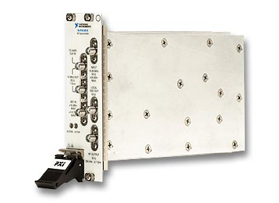
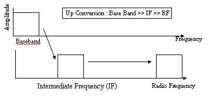
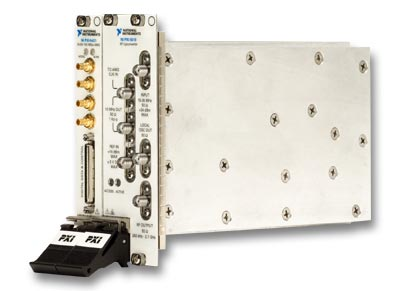
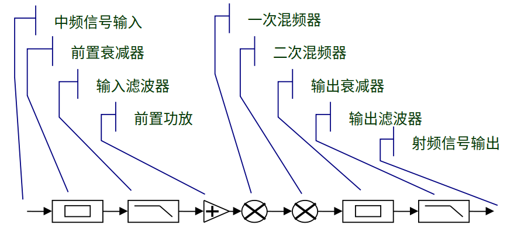
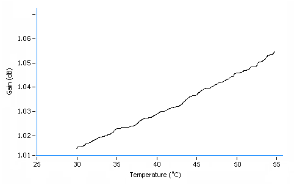
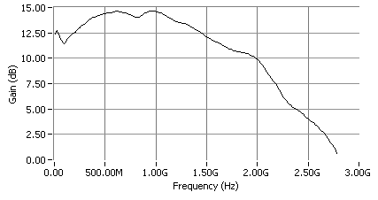

## PXI-5610射频上变频模块的功能概述

本文选用 National Instruments 公司生产的 PXI-5610 射频上变频模块作为研究对象。该模块是一款高性能的两槽PXI设备，最高工作频率可达 2.7 GHz，具备 20 MHz 的实时带宽。其内置高精度时钟的频率误差控制在 ±50 ppb 以内，适用于对信号精度要求较高的场景。

PXI-5610 的核心功能是通过混频过程，将输入的中频调制信号转换为射频段信号并输出。其工作原理如下图所示：输入的中频信号经过频率上移，最终生成射频段的调制信号：

需要注意的是，PXI-5610 本身不具备信号生成能力，需与信号发生器（如 PXI 信号发生模块）配合使用，组成完整的射频信号发生系统。

在与信号发生模块联合工作时，PXI-5610能够生成频率范围从 250 kHz 至2.7 GHz、带宽为 20 MHz 的射频信号，支持用户自定义调制或多种标准调制类型，包括 AM、FM、PM、ASK、FSK、MSK、GMSK、PSK、QPSK、PAM 和 QAM 等。这种灵活性使其广泛适用于生物医学、通信、消费电子、航空航天、军事和半导体等领域，为科学实验、应用开发和研究提供强大支持。典型应用包括无线电发射机和无线传感器网络等。

此外，PXI-5610 可与 National Instruments 的 LabVIEW 软件及调制工具套件无缝集成，进一步提升其在测试方案设计中的灵活性和效率。例如，通过软件控制，用户可以快速生成符合实验需求的复杂调制信号，满足多种行业的高标准要求。

## PXI-5610 对网络化与远程测控的支持

网络化和远程化是当前仪器技术发展的主要趋势，而远程通信能力则是实现这一目标的关键基础。PXI-5610 射频上变频模块凭借其高性能射频信号处理能力，在支持网络化和远程测控方面具有显著优势。该模块可通过与信号发生器和控制软件（如LabVIEW）的集成，生成稳定的高频信号，为远程通信系统提供可靠的技术支持。

在具体应用中，PXI-5610 能够适配多种远程通信手段，包括基于 Internet 的网络控制、无线通信协议（如Wi-Fi或专用射频协议），以及传统有线系统（如电话网络）。例如，在无线传感器网络中，PXI-5610 可用于生成测试信号，验证传感器节点在不同频率和调制方式下的通信性能。此外，其支持高达2.7 GHz的射频信号输出，使其适用于现代高速通信系统的开发与测试，如5G相关技术或卫星通信设备。

除通信领域外，PXI-5610 在远程医疗仪器中也有重要应用。利用其高频信号处理能力，该模块可支持基于射频的检测或治疗设备，例如微波理疗仪。通过与远程控制系统的结合，医生能够在远端调节仪器参数，实现对患者的实时监测或治疗。这种灵活性得益于 PXI-5610 的高带宽和精准时钟，确保信号传输的稳定性和一致性。

随着通信技术、计算机技术和电子工程的进步，远程测控系统正朝着通用化、专业化和小型化方向发展。PXI-5610 的高集成度和模块化设计符合这一趋势，使其成为构建高效远程测试平台的核心组件。然而，由于其性能优异且价格较高，PXI-5610 主要应用于高端测试设备、专业通信系统和高精度科研仪器，而非普通消费级产品。

## PXI-5610 射频上变频模块的工作原理

PXI-5610 的工作原理基于射频信号的频率上移过程，其核心是将中频信号转换为射频信号并输出。上图展示了详细的工作流程：中频信号从输入端进入后，首先经过用户可调的前置衰减器，降低信号功率以保护后续电路；接着通过滤波器去除噪声干扰；前置放大器则提升信号强度，进一步改善系统的信噪比。为实现从较低中频到高达 2.7 GHz 射频的宽范围频率调整，PXI-5610 通常采用两次或多次混频处理，将信号逐步上移至目标频段；最后，输出信号通过输出衰减器和滤波器进行功率调整与净化后输出。

这一流程确保了信号在频率转换过程中保持高精度和低失真，适用于需要宽频带和高稳定性的应用场景。图18的工作原理图直观地呈现了各阶段的功能，为理解信号处理路径提供了清晰参考。

## PXI-5610 的校准原理

为了保证 PXI-5610 的高性能表现，National Instruments 为其配备了专用驱动程序 NI-RFGEN。该驱动程序不仅支持用户对模块的控制和数据交互，还内置了校准所需的接口函数，便于精确调整仪器参数。

PXI-5610 的校准主要涉及以下关键项目：
- 温度漂移补偿：校正因温度变化引起的输出功率波动。
- 内置时钟频率调整：确保 10 MHz 时钟信号的误差在 ±50 ppb 以内。
- 输入端功率补偿：在 5 MHz 至 25 MHz 频率范围内，根据输入频率调整功率一致性。
- 输出端功率补偿：在 250 kHz 至 2.7 GHz 频率范围内，针对输出频率变化进行功率校准。
- 输入输出相位差调整：消除输入与输出信号间的相位偏差。

上述校准项目根据复杂度分为两种调整方式。内置时钟频率和输入输出相位差的校准较为简单，仅需通过电子调节修改单一参数即可完成。PXI-5610 为此提供了专用寄存器地址，用户可直接写入数据实现调整。而温度漂移、输入功率和输出功率的补偿由于涉及复杂的非线性变化，必须通过软件方式进行处理。NI-RFGEN 驱动程序中的校准函数支持这些调整，用户可利用软件算法对测量数据进行实时修正，确保仪器在不同工作条件下的精度和稳定性。

## PXI-5610 射频上变频模块的校准参数

### 温度漂移的功率补偿

PXI-5610的输出功率受温度影响显著：在其他条件恒定时，温度升高会导致输出功率增加。研究表明，温度与输出功率之间的关系可用线性方程近似描述。PXI-5610内置温度传感器，可实时监测仪器的工作温度。基于此，用户能够根据当前温度对原始测量值进行修正，从而有效补偿温度变化引起的误差。

温度补偿公式如下：  
V = Vo × (Ca + Cb × T)  
其中：  
- V：最终修正后的测量值；  
- Vo：仪器测得的原始输出值；  
- Ca：温漂误差的常数项；  
- Cb：温漂误差的线性系数；  
- T：仪器当前温度（单位：℃）。  

上图描绘了输出功率随温度变化的趋势。温度补偿的核心任务是通过线性拟合该曲线，确定公式中的参数 Ca 和 Cb。为此，需要获取准确的温度-功率变化数据。具体操作步骤如下：  
1. 实验环境准备：使用无散热系统的 PXI 机箱，或者为 PXI-5610 装配加热装置，以精确控制温度变化。  
2. 初始状态设置：将待校准的 PXI-5610 置于室温（约 22℃）环境。  
3. 信号输出与升温：启动仪器，持续输出频率变化的信号。随着工作时间延长，由于机箱散热受限或加热装置作用，仪器温度逐渐上升，最高可达 55℃。  
4. 数据采集：每隔数秒记录一次温度和对应的输出功率，生成温度-功率变化曲线。  

通过对采集数据的线性拟合，可计算出 Ca 和 Cb 的数值，从而实现对温度漂移的精确补偿。这一方法确保 PXI-5610 在不同温度条件下仍能输出稳定的射频信号。

### 内置时钟频率调整

PXI-5610 内置一个 10 MHz 时钟源，其信号不仅用于模块内部计时，还可输出作为其他设备（如信号发生模块）的基准时钟。该时钟精度极高，正常工作误差需控制在 ±50 ppb 以内。为确保最佳性能，校准时需将误差进一步缩小至 ±10 ppb，即 10 MHz 信号的频率偏差小于 1 Hz。

内置时钟信号由压控晶振（VCXO）电路生成，用户可通过调节控制电压改变输出频率。PXI-5610提供了一个寄存器接口，用户向其中写入 2.5 至 7.5 之间的浮点数，即可在约 1000 Hz 范围内微调时钟频率。校准过程需反复调整该数值，并配合高精度频率计监测输出，直到误差满足要求。这一方法简单高效，确保时钟信号的高度稳定。

### 输出端射频频率功率补偿

在输入频率和功率恒定的情况下，PXI-5610 的输出功率会随输出频率的变化而波动，尤其在 250 kHz 至 2.7 GHz 的宽频范围内。这种频率-功率关系呈现为一条不规则的非线性曲线：

通过多次实验验证，采用 13 至 17 阶多项式对该曲线进行拟合，能有效平滑数据并接近真实值。拟合曲线与采样点的均方误差小于 0.0001，表明此方法在功率补偿中具有高精度。校准时，软件根据拟合结果自动调整输出功率，确保不同频率下信号的一致性。

### 输入端频率功率补偿

当输入功率和频移固定不变时，PXI-5610 的输出功率仍会因输入频率的变化而产生轻微波动，范围通常为 5 MHz 至 25 MHz 。下图展示了这一频率-功率关系曲线，其变化幅度相较输出端曲线更为平缓。

由于输入频率范围较窄，采用 7 至 8 阶多项式即可实现对曲线的精确拟合。拟合后，软件根据计算结果补偿输入端功率变化，从而减少因频率差异带来的输出误差。这种方法计算复杂度较低，适用于快速校准。

### 输入输出相位差调整

理想情况下，PXI-5610 的输入信号与输出信号应保持零相位差。为实现这一目标，模块允许用户通过修改相关寄存器的值调整输出信号相位。校准时，用户可利用 NI-RFGEN 驱动程序提供的接口，结合外部相位测量设备，逐步调整寄存器参数，直至输入与输出信号完全同步。此过程操作简单，通常只需数次迭代即可完成，确保信号处理的高一致性。

