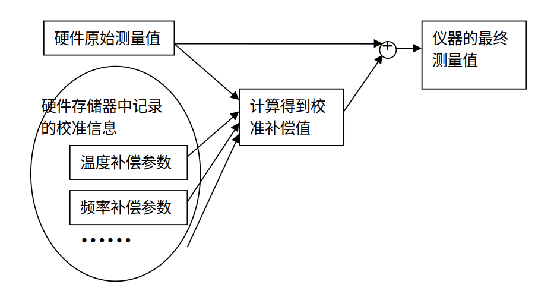

为了确保测量精度，仪器需要定期校准。传统仪器的校准参数较少，通常采用手动校准方式。然而，随着集成化、模块化仪器的广泛应用，其校准过程变得更加复杂。此外，模块化仪器缺乏直接供用户操作的界面，必须依赖计算机进行控制，这使得自动化校准成为必然选择。虚拟仪器的概念为构建高效、自动化的校准系统提供了灵活的解决方案。

## 模块化仪器校准原理

### 仪器误差

仪器误差是指测量值 $a$ 与真值 $A$ 之间的差异，通常用 $\Delta = |a - A|$ 表示。

误差主要来源于以下几个方面：  

- 原理误差：由测量原理或方法的固有局限性引起的系统性偏差。  
- 装置误差：由仪器或设备本身缺陷引起的误差。  
- 环境误差：测量过程中环境条件（如温度、湿度、电磁干扰等）变化对测量结果的影响。  
- 人为误差：由操作人员失误或不当操作引起的误差。  

根据误差的性质，可将其分为三类：  

- 系统误差：主要由仪器设计或制造缺陷、元器件老化或环境变化等因素引起。此类误差在测量过程中具有可预测的特性，可通过校正方法补偿或消除，其中包括随时间变化的漂移误差，因此需定期校准以维持测量精度。
- 随机误差：由仪器内部噪声或难以控制的外部因素（如信号源相位噪声）引起，具有随机波动特性，无法通过校准消除，但可通过多次测量取平均值减小其影响。
- 粗大误差：通常由偶然因素（如操作失误或设备故障）引起，测量值与其他数据差异显著，虽无法通过校准消除，但因其显著异常，可通过数据筛选和统计分析剔除。 

误差的大小直接影响仪器的精确度。若某仪器在所有测量条件下的误差均在允许范围内，则可认为该仪器的精确度达到相应标准。  

为提高仪器的精确度，我们通常采用自动校准方法，即通过修改软件中某些参数来补偿系统误差（包括漂移误差）。由于漂移误差会随着使用时间累积，仪器需要定期校准以保持其精确度。

### 仪器校准的基本概念  

校准（Calibration）是将待校准仪器与更高精度的标准仪器进行比较，通过参数调整或误差修正来补偿偏差的过程。校准也常被称为“校验”，尤其在传统管理中。 

#### 校准对仪器误差与精确度的影响  

电子元器件的性能会因使用时间和环境条件变化而漂移，进而影响测量结果的准确性。这种漂移导致仪器测量值的不确定性增加。若仪器长时间未校准，其测量误差可能超过用户对精度的要求，从而无法准确反映被测量的真值。  

为确保测量精度，必须定期对仪器进行校准。下图展示了仪器测量误差随时间变化的趋势。可以看出，误差随使用时间累积，并在某一时刻超出允许范围。  

  

为了保持测量精度，需在误差超出允许范围前进行校准。通常，仪器误差达到允许范围所需的时间可以预估。例如，图中所示仪器在校准后大约 1 至 2 年后误差会超出允许范围，因此建议每年校准一次。

#### 校准的目的  

校准的主要目的是确保仪器的测量精度和可靠性，包括以下几个方面：

- 减小测量误差：通过补偿系统误差，确保测量结果的准确性；
- 确保测量一致性：保证仪器在多次测量中的稳定性；
- 提升测量效率：通过减小误差避免重复测量和结果修正。
- 
常用仪器的精度通常由国际或国家标准规定，因此校准目标应符合或超过这些标准，以确保测量结果的权威性和可信度。  

#### 校准的基本要求  

- 环境条件：校准环境应满足温度、湿度等规定要求。如果在校准实验室进行，需严格控制环境条件；若在现场进行，则应确保环境条件能满足仪器正常工作的要求。  
- 标准仪器：用于校准的标准仪器其不确定度应为被校准仪器不确定度的 1/3 至 1/10。通常，标准仪器的精确度需比被校准仪器高至少一个数量级，以确保校准的准确性。  
- 校准人员：校准应由具备资质并经过严格考核的人员进行。只有经认可实验室的持证人员出具的校准证书和报告才被认为是有效的。  

### 仪器的调整方法  

为了便于校准，许多仪器设计时都预留了调节输出测量值的接口或方法。模块化仪器通常采用以下几种调节方式：  

#### 机械调整方式  

某些仪器通过暴露的可调元器件（如可变电阻或可调电容）来调节测量参数。操作时，用户手动旋转或滑动这些器件，从而改变仪器的输出值。这种调整方式需要人工反复调节和观测，直至测量误差满足要求，因此无法实现自动化校准。  

早期或较低档次的模块化仪器中常见机械调整方式，但随着技术发展，这类仪器已较为少见。  

#### 电子调整方式  

为克服机械调整的不便，大多数现代仪器采用电子调整方式。用户通过向特定寄存器写入数值来修改仪器参数。例如，为调节输出频率，可以将期望的频率值写入寄存器中，再通过数模转换电路将其转化为电压信号，最终通过压控频率电路生成对应频率的输出信号。  

尽管部分仪器允许用户在显示界面上手动调整参数，但这一方式仍需用户边观察测量值边进行调节，无法完全自动化。  

#### 计算机控制调节  

高端传统仪器通常提供与计算机通信的接口，使用户能够通过计算机发送指令或数据，从而实现自动化校准。  

模块化仪器则完全依赖计算机操作，没有直接的用户交互界面，因此校准也必须通过计算机完成。这种设计为自动化校准提供了理想的硬件基础。 

#### 纯软件调整方式  

纯软件调整方式是模块化虚拟仪器特有的一种校准方法。在这种方式中，仪器硬件参数保持不变，校准结果以表征曲线的数学公式或表格形式记录在仪器存储器中（如ROM）。虚拟仪器的核心功能由软件实现，而底层硬件仅负责基础信号采集。因此，虚拟仪器最终显示的测量值已通过软件校正、分析和处理。  

##### 原理与实现  

纯软件调整方式通过软件对底层硬件误差进行补偿，其过程下图所示：  

 

1. 读取校准参数： 虚拟仪器从底层硬件存储器中读取校准参数，这些参数可以是表征曲线的数学公式或表格形式，如温度补偿、频率补偿、电压补偿等。  
2. 获取原始输出： 仪器读取底层硬件的原始输出值。  
3. 计算误差补偿： 根据原始输出值和校准参数，虚拟仪器在软件中计算误差补偿值。  
4. 输出修正结果： 最终显示给用户的测量值为原始测量值与误差补偿值之和。  

##### 优势与特点  

纯软件调整方式相比机械和电子调整方式，具有以下显著优势：  

- 更高的补偿复杂度： 该方式可以实现极为复杂的误差补偿。以功率测量为例，测量值受信号功率、频率、波形、温度等多个因素影响，这些因素之间关系复杂且非线性。电子调整方式只能通过调节有限的硬件参数进行补偿，难以准确描述所有因素间的复杂关系。而纯软件调整方式则可通过高阶曲线拟合、多参数高次方程、甚至查表法来精确建模和补偿。  

- 更高的校准精度： 由于不受硬件调节元件数量的限制，纯软件调整方式可以根据需要设置足够多的补偿参数。例如，在特别复杂的测量场景下，如果影响因素间的关系无法用线性方程表示，则可以通过多组查表数据描述不同条件下的误差变化规律，从而显著提高仪器的整体精确度。  

##### 示例：功率计的校准补偿表  

以下是一个功率计的校准补偿表示例，表中记录了不同频率下的补偿系数。仪器在进行功率测量时，会根据被测信号频率从表中获取相应的补偿系数，并进行误差修正。  

| 频率      | 补偿系数 |  
|-----------|-----------|  
| 300 kHz   | 1.12      |  
| 1 MHz     | 1.05      |  
| 10 MHz    | 1.05      |  
| 100 MHz   | 1.02      |  
| 500 MHz   | 1.02      |  
| 1 GHz     | 1.00      |  
| 5 GHz     | 1.05      |  
| 20 GHz    | 1.10      |  
| 30 GHz    | 1.15      |  

通过这种补偿方式，仪器能够更准确地反映真实测量值，并在更广泛的测量条件下保持较高精度。   

## 通用校准系统框架

### 仪器的分类

#### 模块化仪器的分类

模块化仪器通常根据其功能进行分类，主要包括信号转换模块（如体表电位模块、X射线发射模块、X射线接收模块等）、数据采集模块（如数据采集卡、示波器卡等）、控制模块（如电机控制模块、RF信号发生模块）、数据分析处理模块（如CPU、DSP芯片、电脑主机）、数据存储模块（如硬盘控制模块）、显示模块（如显卡、打印控制模块）以及通讯模块（如以太网模块、蓝牙模块）。此外，一些模块可能兼具多种功能，例如RF信号发生模块不仅用于信号控制，还可作为通讯模块，用于发送无线射频信号。  

通过模块化划分可以发现，许多模块具有通用性，甚至可能与其他领域的仪器模块类似，例如机械运动控制模块和通讯模块。为了确保不同模块能够高效集成，模块化仪器通常采用统一的总线接口，如PCI、VXI和PXI等。这种标准化接口、相对单一的功能设计以及相似的控制方式，为开发通用校准系统奠定了基础。  

同时，不同模块化仪器的校准程序存在一定的重复性，因此在编写校准程序时，需要充分考虑软件的可重用性。这样，当新增仪器需要校准时，仅需针对仪器的特定功能编写新的代码，而通用部分则可复用现有代码，提高开发效率并降低成本。

#### 标准仪器的种类

标准仪器是指用于与被校准仪器进行比对或测量其特定参数的高精度仪器。例如，高精度万用表、示波器、信号发生器和标准频率源等常用于校准过程。本文主要讨论用于模块化仪器校准的标准仪器。  

由于模块化仪器通常由功能单一、趋于标准化的模块组成，其校准所需的标准仪器也往往是通用的，例如示波器、信号发生器和标准频率源等。然而，即使是同类的标准仪器，也可能存在多个品牌、型号和厂商的选择，不同型号的仪器在驱动方式和通信协议上往往有所不同。此外，不同的校准实验室可能会选用不同品牌和型号的标准仪器。如果校准程序仅针对某一特定型号的标准仪器开发，那么当实验室更换标准仪器时，原有校准程序可能无法兼容，必须重新编写代码以适配新的仪器，增加了开发和维护成本。  

因此，在设计通用校准系统时，必须优先解决标准仪器的互换性问题。这意味着校准系统应具备良好的适应性和扩展性，能够在不修改代码的情况下兼容不同型号，甚至是未来可能引入的新仪器。为此，校准系统需要采用统一的仪器抽象接口或驱动层，从而屏蔽不同仪器之间的实现差异，使其能够灵活适配各种标准仪器，提高系统的通用性和可维护性。

#### 通用校准框架的难点  

编写通用校准框架的最大挑战在于，如何在种类繁多、型号各异的被校准仪器和标准仪器之间，提取并抽象出它们的共性。不同的校准实验室可能会使用功能类似但型号不同的标准仪器，而要使同一校准解决方案适用于所有可用的标准仪器，关键就在于对其共性进行抽象。  

通过建立统一的抽象接口，校准系统可以屏蔽不同仪器的具体实现细节，使其能够支持不同厂商和型号的设备。这样，即使引入了新的标准仪器，用户也只需编写针对该仪器的适配层，而无需修改整个校准系统，从而提高系统的可扩展性和适应性。  

### 通用校准系统框架的功能  

#### 框架的概念  

在软件设计模式的研究中，Gamma等人将框架定义为：“框架是一组协同工作的类，它们为特定类型的软件构建了一个可重用的设计。” 软件开发过程中，已经出现了各种针对不同应用领域的框架，而通用校准系统框架正是专门针对模块化仪器校准这一领域的解决方案。  

该框架的核心思想是将各类模块化仪器的校准程序中通用的功能部分提取并抽象，从而提高代码的复用性和维护性。例如，对标准仪器的控制、校准数据的采集处理、校准报表的生成等，均属于校准流程中的通用任务。这些功能将在框架中实现标准化，并通过模块化设计，使不同校准任务可以协同工作，同时提供灵活的扩展机制，使用户能够便捷地适配新的仪器或校准需求。

#### 基于插件的校准系统体系结构  

为了应对数量众多的模块化仪器，建立一套通用的校准解决方案，我们采用基于插件的系统架构。在该架构下，校准过程中所需的通用功能（如标准仪器的控制、数据采集、报表生成等）由统一的代码实现，而针对不同仪器的特定校准功能则由独立的插件模块完成。这种设计方式确保了通用功能的稳定性，同时允许针对不同仪器的校准逻辑以插件形式灵活扩展。  

在整体架构中，主程序负责提供核心功能，如用户界面、插件管理和数据处理，而每个插件则专注于具体仪器的校准操作。插件可以独立开发、动态加载，不需要修改主程序，即可添加对新型号仪器的支持，从而极大提升系统的可扩展性和维护性。  

#### 插件管理与动态加载机制  

程序启动时，主程序会自动加载通用功能模块（包括用户界面、日志管理、报表生成等），同时，插件管理模块会扫描系统中可用的校准插件，并在用户界面中列出所有已安装的插件。用户只需选择相应的插件，即可加载该插件，并执行相应的校准任务。  

由于插件采用动态加载，当新型号的仪器需要校准时，无需对主程序进行任何修改，只需编写一个新的插件并添加到系统，即可完成对新仪器的支持。这种设计方式不仅减少了系统升级的成本，同时也增强了系统的灵活性和适应性。  

#### 插件与主程序之间的数据交换  

在校准过程中，插件与主程序之间存在大量实时数据交换。例如：  

- 状态同步：主程序需要获取插件的当前运行状态，如进度信息、错误报告等。  
- 命令交互：插件需要接收主程序发送的控制命令，如启动、暂停、终止校准任务等。  

为了确保所有插件能够正确与主程序交互，通用校准系统框架定义了一套标准化的数据交换接口，通常采用结构化数据或预定义的接口函数进行通信。这种接口规范使得不同插件能够以一致的方式与主程序交互，确保系统的稳定性和兼容性。  

为了降低用户编写插件的难度，通用校准系统框架已预置了完整的接口库，用户可以直接调用这些封装好的底层函数。例如：  

- 显示校准状态（在主用户界面更新校准进度）  
- 数据库操作（存储和检索校准数据）  
- 仪器控制（发送控制指令到标准仪器）  

通过提供这些高层API，用户无需关心底层数据通信细节，只需关注校准逻辑的实现，从而大幅提升开发效率，使校准系统的开发和维护更加高效便捷。

### 校准系统层次结构  

#### 层次划分  

上图展示了通用校准系统的层次结构。在软件设计过程中，我们借鉴了开放系统互连（OSI）参考模型，对系统的各个功能模块进行合理分层，以确保系统的可扩展性和模块化。  

合理的层次划分带来了以下优势：  

- 模块解耦：上层模块仅通过调用下层提供的接口来获取服务，而不直接访问底层实现细节，从而降低系统耦合度。  
- 职责明确：下层模块仅提供特定功能，不依赖于上层模块，也无需感知上层的存在。  
- 灵活扩展：下层模块可以为多个上层模块提供服务，使得相同的基础组件能够复用于不同的校准任务。  

这种层次结构的独立性，不仅提升了代码的复用性，还为团队协作、调试和维护提供了便利，使系统具备更强的可维护性和拓展性。  

#### C2体系结构风格  

在开发校准系统时，我们优先考虑如何复用现有的软件构件，如用户界面组件、批处理执行组件、仪器驱动组件等。近年来，软件行业积累了大量经验和可复用资源，我们的系统设计旨在充分利用这些成熟组件，以提高开发效率。  

为此，我们在系统架构设计中采用了C2体系结构风格。C2风格的核心思想是：通过连接件（connectors）将并行运行的构件（components）组织成一个结构化的网络，并遵循特定的交互规则。其主要特征包括：  

- 组件和连接件均具有明确的上下层关系，即每个构件的顶部必须连接到某个连接件的底部，反之亦然。  
- 组件之间不允许直接通信，必须通过连接件进行信息传递，以确保模块解耦。  
- 连接件可以连接多个构件，实现灵活的信息传递和事件驱动机制。  
- 当两个连接件直接连接时，必须遵循自底向上的数据流动规则，即数据从下层连接件的顶部传输到上层连接件的底部。  

展示上图了C2风格的系统结构示意图，其中构件与连接件的关系清晰地体现了C2架构的组织原则。  

通过采用C2风格，我们的通用校准系统具备了高扩展性、低耦合性和强适应性，能够灵活应对不同型号仪器的校准需求，并支持未来新设备的无缝集成。

## 校准主程序的实现

### 开发平台的选择

#### 硬件平台需求

模块化仪器的显著优势之一在于其与普通微型计算机的便捷通信能力。因此，我们选择普通微型计算机作为校准系统的硬件开发平台，以兼顾成本效益和系统灵活性。目前，模块化仪器常用的接口总线主要包括PCI和PXI两种类型。PCI总线因其广泛应用和高性价比而常见于传统设备，而PXI总线则以其高带宽和模块化设计更适用于现代测控系统。在设计校准程序时，应确保同时兼容这两种总线，以提升系统的通用性和扩展性。

#### 操作系统的选取

操作系统是校准系统开发的核心基础，其选择需综合考虑普及程度、软硬件兼容性以及资源支持情况。目前使用的最广泛的、对各种软硬件支持最好的、资源最丰富的操作系统无疑是微软公司的Windows
XP/2000。因此我们也选择在Windows
XP上开发校准主程序。但开发需要尽可能多地考虑软件的可移植性，为以后软件支持其他操作系统打好基础。同时，为确保系统的长期适应性，开发过程中需注重软件的可移植性设计，例如通过模块化架构和跨平台 API，为未来适配 Linux 或 macOS 等其他操作系统奠定基础。

#### 编程语言的选定

通用校准系统对编程语言的核心要求是能够高效、便捷地操作和控制被校准仪器及标准仪器，同时具备良好的扩展性和开发效率。

经过全面对比，我们最终选定美国国家仪器公司（National Instruments）开发的LabVIEW作为本项目的编程语言。LabVIEW 是一种图形化编程语言，专为测量与控制领域设计，其在仪器设备控制、总线通信（如PCI、PXI）以及数据信号分析处理方面的支持尤为出色，使其成为仪器校准开发的理想选择。与传统的文本编程语言（如C++或Python）相比，LabVIEW 通过直观的图形化界面降低了开发门槛，同时保留了强大的功能性。

此外，LabVIEW 的开放性进一步增强了其适用性。它原生支持动态数据交换（DDE）、结构化查询语言（SQL）以及 TCP/UDP 等网络协议，便于实现校准系统的数据存储、传输和远程通信功能。更重要的是，LabVIEW 具备跨平台特性，能够无缝运行于 Windows、Linux 和 macOS 等操作系统。这种特性不仅提升了系统的灵活性，也为未来向非 Windows 平台的迁移提供了便利。因此，选用 LabVIEW 作为开发语言，不仅满足了当前需求，还为系统的长期发展打下了坚实基础。

#### 其他组件的搭配

为提升开发效率和系统功能性，我们在校准系统中集成了多种第三方组件。例如，在数据库管理方面，采用开源的LabSQL组件以实现高效的数据存取；在仪器驱动方面，引入IVI（可互换虚拟仪器）标准组件，确保标准仪器的兼容性与可互换性。此外，我们选用了 National Instruments 的 TestStand 作为测试序列管理工具。TestStand 提供了强大的批处理能力、报表生成功能以及数据库读写支持，相较于纯代码实现，其模块化设计显著简化了调试和维护流程，使校准系统的开发更高效、可控。

### 用户界面的设计与实现

#### 用户界面的核心功能

校准系统的用户界面主要服务于三个关键功能：
1. 校准前信息输入：在校准开始前，要求用户录入相关信息，包括被校准仪器的型号与序列号、标准仪器的型号、环境条件（如温度、湿度）等。
2. 校准过程监控：在校准进行时，实时显示当前校准的项目、执行状态和进度信息。
3. 校准结果展示：校准完成后，呈现校准结果并生成详细报表。

在这三项功能中，校准过程的状态监控占据了最长的交互时间，因此应作为界面的核心部分进行设计。其余功能则可通过弹出式对话框实现，以保持主界面的简洁性和专注性。

#### 主界面设计

主界面的核心任务是实时展示校准状态。为提升软件的易用性和符合用户操作习惯，我们将仪器选择以及校准过程的控制功能（如开始、暂停、停止）集成到主界面中。

  

如上图所示，主界面布局直观高效。用户启动系统后，首先通过界面顶部的下拉菜单或候选框选择被校准仪器。仪器选中后，系统自动加载对应的校准插件。一个完整的校准流程通常包含多个按序执行的检测和调整项目，这些项目以列表形式清晰展示在主界面上。校准进行时，用户可实时查看当前执行的项目名称、进度条以及相关状态提示（如“进行中”、“已完成”或“异常”），从而全面掌握校准进程。

  

上图展示了主界面的后台实现逻辑。代码基于 LabVIEW 的事件驱动循环结构开发，通过监听用户操作（如仪器选择或控制按钮点击）和仪器状态变化，动态更新界面显示内容。这种设计确保了界面的响应性和实时性，同时便于后续功能的扩展和维护。

#### 环境与标准仪器配置界面

  

校准过程需记录大量信息以生成合规的校准报表，包括被校准仪器的序列号、环境参数（温度、湿度等）、客户信息、操作员姓名，以及标准仪器的型号和序列号等。此外，为便于实验室仪器管理，每台进出实验室的仪器需分配唯一的跟踪编号。这些信息通过专门的配置界面收集。

配置界面在用户选定具体校准程序后弹出。由于信息量较大，单一对话框难以满足需求，因此我们采用了向导式设计。如上图所示，第一页用于输入除标准仪器外的所有校准信息（如环境条件和仪器跟踪号），后续页面则逐一对应每台标准仪器，引导用户分步填写相关型号和参数。这种分步输入方式降低了用户的认知负担，提高了数据录入的准确性和效率。

#### 校准结果界面

  

校准完成后，系统自动弹出校准结果界面（如上图所示），以醒目的方式告知用户校准是否成功。若仪器调整后的各项性能指标均符合预定标准，则显示“校准成功”；若存在未达标指标，则标记为“校准失败”，并提示具体异常项。这种直观反馈帮助用户快速判断结果。

用户关闭结果界面后，系统会自动生成并展示 HTML 格式的校准报表。报表详细列出仪器各项性能指标的测试数据和判定结果，用户可通过浏览器查看或导出，便于存档和分享。

### 校准插件的设计与实现

仪器校准通常遵循三个主要步骤：检测被校准仪器的初始性能指标、调整仪器参数、以及对调整后的仪器进行验证，以确认调整效果。每一步骤可能包含多个具体的测试或调整项目，构成完整的校准流程。

#### 检测被校准仪器的性能指标

校准的第一步是对仪器调整前的性能指标进行全面检测并记录。这些数据将作为后续调整效果的基准，用于与调整后结果对比，判断校准是否成功。为确保检测结果全面反映仪器的工作状态，应设计合理的测试方案，覆盖关键性能参数。

检测过程通常通过选取若干具有代表性的测试点和条件组合，采用交叉验证的方式进行。例如，在校准功率计时，可在仪器支持的功率范围（如 0 dBm 至 -30 dBm）和频率范围（如 10 MHz 至 10 GHz）内，选择多组典型值，并以其正交组合作为标准输入信号，检验仪器在各种条件下的测量准确性。以下表格展示了某功率计在不同频率和功率条件下的测量读数，供参考：

| 功率 / 频率 | 10 MHz | 100 MHz | 1 GHz | 5 GHz | 10 GHz |
|-----------------|------------|-------------|-----------|-----------|------------|
| 0 dBm       | -0.04      | -0.03       | -0.14     | -0.07     | -0.10      |
| -10 dBm     | -10.23     | -10.20      | -10.15    | -10.11    | -10.07     |
| -20 dBm     | -20.01     | -20.08      | -20.11    | -20.07    | -20.09     |
| -30 dBm     | -30.13     | -30.23      | -30.17    | -30.16    | -30.09     |

通过上述测试，可评估仪器在宽频带和动态范围内的性能一致性，为后续调整提供数据支持。

#### 调整被校准仪器的参数

完成初次检测后，进入仪器参数调整阶段。调整的目标是修正仪器偏差，使其性能指标达到标准要求。调整过程中需特别注意以下事项：
- 状态备份：在调整前，必须记录仪器当前的设置状态（如参数配置或固件值）。这一步骤至关重要，若调整失败，可通过恢复原始状态避免仪器进一步偏离预期。
- 逐步调整：根据检测结果，针对性地调整关键参数，例如增益、偏移或频率响应，确保逐步逼近目标性能。

调整操作通常结合标准仪器和校准算法完成，具体实现依赖于仪器类型和校准插件的功能设计。

#### 验证调整后的性能指标

调整完成后，需对仪器进行重新测试，以验证调整效果是否满足校准标准。验证测试的内容和条件应与初次检测完全一致，包括相同的测试点和环境设置，以便直接对比前后数据，判断调整是否成功。例如，若功率计在调整后，所有测量值均落入允许误差范围内（如 ±0.1 dBm），则可判定校准通过。

  

如上图所示，校准流程在 National Instruments 的 TestStand 环境中实现。TestStand 通过序列化管理检测、调整和验证步骤，确保流程的自动化和可追溯性。对于校准插件的具体实现细节，我们将在后续章节以 NI 5610 射频上变频模块为例，进一步展开详细说明。

### 标准仪器控制模块的实现

标准仪器控制模块的核心目标是实现标准仪器的可互换性。以功率计为例，市场上存在多个厂商的多种型号，不同实验室可能选用不同的设备。若校准系统仅支持特定型号的仪器，其通用性将受到限制，无法满足多样化的应用需求。为解决这一问题，我们采用了IVI（可互换虚拟仪器）架构作为基础，并在此基础上进行了改进。

#### IVI架构概述

IVI架构是当前支持仪器互换的主流程序框架。

  

如上图所示，IVI 架构通过类驱动程序实现仪器互换性。应用程序调用统一的类驱动程序接口，而类驱动程序根据 IVI 配置文件动态加载对应的专用驱动程序。当实验室更换仪器时，仅需更新配置文件，无需修改应用程序代码，即可适配新仪器。这种设计显著提升了测试系统的灵活性和通用性。

#### IVI 驱动程序的优势

IVI驱动程序在设计上具有以下优点：
- 互换性：所有 IVI 驱动程序遵循统一的接口规范，易于理解和使用，降低了系统的维护与升级成本。
- 模拟功能：每个专用驱动程序内置针对特定型号的模拟功能，使开发人员在无实体仪器的情况下也能进行程序开发和调试。
- 状态缓存：IVI 驱动程序可记录仪器属性的当前状态，减少与仪器的频繁通信，从而提升系统性能。
- 开源性：IVI 驱动程序提供开放源代码，允许高级用户根据需求优化或扩展功能。
- 资源丰富：作为免费软件，大量 IVI 驱动程序可从官方网站下载，降低了获取成本。

#### IVI 驱动程序的局限性

尽管 IVI 架构优势明显，但其主要瓶颈在于开发难度。编写 IVI 驱动程序不仅要求开发者熟悉仪器特性，还需深入掌握 IVI 规范。对于复杂仪器，即使经验丰富的程序员也可能需要约半年时间完成开发。这一高门槛导致 IVI 驱动程序的资源远不如传统 VXIpnp 驱动程序丰富，尤其是对于较新或小众型号的仪器，往往缺乏现成的 IVI 支持。

相比之下，传统的 VXIpnp 驱动程序虽资源充足，但不具备互换性，无法直接应用于需要灵活切换仪器的校准系统。在实际应用中，校准系统常需使用缺少 IVI 驱动程序的标准仪器，而用户通常缺乏时间为其开发专用驱动。为解决这一矛盾，我们对 IVI 架构进行了优化改进。

#### 对 IVI 架构的改进方案

鉴于 IVI 驱动程序的局限性，我们未直接采用标准 IVI 体系结构，而是设计了一种改进方案：在 IVI 类驱动程序和 VXIpnp 驱动程序之上构建一层统一的接口层，实现两者的部分功能兼容性。改进后的架构如图13所示。

  

该改进方案的关键在于，通过上层统一接口封装 IVI 和 VXIpnp 驱动程序的功能，屏蔽底层差异，确保系统的仪器互换性。对于缺少IVI驱动程序的仪器，用户无需从头开发完整的 IVI 驱动，而只需实现少量接口函数即可满足校准需求。例如，在校准过程中使用的频谱仪通常仅需测量信号频率和功率，我们为其定义了四个基本接口函数：
1. 初始化：建立与仪器的通信连接。
2. 配置测量参数：设置频率范围、功率范围等测试条件。
3. 读取信号数据：获取频率和功率测量值。
4. 关闭仪器：断开连接并释放资源。

相比开发完整的 IVI 驱动程序（可能涉及数十个功能和复杂状态管理），这种方法显著降低了工作量。以频谱仪为例，编写上述四个函数仅需数小时，简单、高效且易于维护。这一改进不仅保留了 IVI 的互换性优势，还弥补了其资源不足的短板，使校准系统能够灵活适配更多仪器型号。

## 射频上变频模块仪器原理

### PXI-5610射频上变频模块的功能概述

本文选用 National Instruments 公司生产的 PXI-5610 射频上变频模块作为研究对象。该模块是一款高性能的两槽PXI设备，最高工作频率可达 2.7 GHz，具备 20 MHz 的实时带宽。其内置高精度时钟的频率误差控制在 ±50 ppb 以内，适用于对信号精度要求较高的场景。

PXI-5610 的核心功能是通过混频过程，将输入的中频调制信号转换为射频段信号并输出。其工作原理如下图所示：输入的中频信号经过频率上移，最终生成射频段的调制信号：

需要注意的是，PXI-5610 本身不具备信号生成能力，需与信号发生器（如 PXI 信号发生模块）配合使用，组成完整的射频信号发生系统。

在与信号发生模块联合工作时，PXI-5610能够生成频率范围从 250 kHz 至2.7 GHz、带宽为 20 MHz 的射频信号，支持用户自定义调制或多种标准调制类型，包括 AM、FM、PM、ASK、FSK、MSK、GMSK、PSK、QPSK、PAM 和 QAM 等。这种灵活性使其广泛适用于生物医学、通信、消费电子、航空航天、军事和半导体等领域，为科学实验、应用开发和研究提供强大支持。典型应用包括无线电发射机和无线传感器网络等。

此外，PXI-5610 可与 National Instruments 的 LabVIEW 软件及调制工具套件无缝集成，进一步提升其在测试方案设计中的灵活性和效率。例如，通过软件控制，用户可以快速生成符合实验需求的复杂调制信号，满足多种行业的高标准要求。

### PXI-5610 对网络化与远程测控的支持

网络化和远程化是当前仪器技术发展的主要趋势，而远程通信能力则是实现这一目标的关键基础。PXI-5610 射频上变频模块凭借其高性能射频信号处理能力，在支持网络化和远程测控方面具有显著优势。该模块可通过与信号发生器和控制软件（如LabVIEW）的集成，生成稳定的高频信号，为远程通信系统提供可靠的技术支持。

在具体应用中，PXI-5610 能够适配多种远程通信手段，包括基于 Internet 的网络控制、无线通信协议（如Wi-Fi或专用射频协议），以及传统有线系统（如电话网络）。例如，在无线传感器网络中，PXI-5610 可用于生成测试信号，验证传感器节点在不同频率和调制方式下的通信性能。此外，其支持高达2.7 GHz的射频信号输出，使其适用于现代高速通信系统的开发与测试，如5G相关技术或卫星通信设备。

除通信领域外，PXI-5610 在远程医疗仪器中也有重要应用。利用其高频信号处理能力，该模块可支持基于射频的检测或治疗设备，例如微波理疗仪。通过与远程控制系统的结合，医生能够在远端调节仪器参数，实现对患者的实时监测或治疗。这种灵活性得益于 PXI-5610 的高带宽和精准时钟，确保信号传输的稳定性和一致性。

随着通信技术、计算机技术和电子工程的进步，远程测控系统正朝着通用化、专业化和小型化方向发展。PXI-5610 的高集成度和模块化设计符合这一趋势，使其成为构建高效远程测试平台的核心组件。然而，由于其性能优异且价格较高，PXI-5610 主要应用于高端测试设备、专业通信系统和高精度科研仪器，而非普通消费级产品。

### PXI-5610 射频上变频模块的工作原理

PXI-5610 的工作原理基于射频信号的频率上移过程，其核心是将中频信号转换为射频信号并输出。上图展示了详细的工作流程：中频信号从输入端进入后，首先经过用户可调的前置衰减器，降低信号功率以保护后续电路；接着通过滤波器去除噪声干扰；前置放大器则提升信号强度，进一步改善系统的信噪比。为实现从较低中频到高达 2.7 GHz 射频的宽范围频率调整，PXI-5610 通常采用两次或多次混频处理，将信号逐步上移至目标频段；最后，输出信号通过输出衰减器和滤波器进行功率调整与净化后输出。

这一流程确保了信号在频率转换过程中保持高精度和低失真，适用于需要宽频带和高稳定性的应用场景。图18的工作原理图直观地呈现了各阶段的功能，为理解信号处理路径提供了清晰参考。

### PXI-5610 的校准原理

为了保证 PXI-5610 的高性能表现，National Instruments 为其配备了专用驱动程序 NI-RFGEN。该驱动程序不仅支持用户对模块的控制和数据交互，还内置了校准所需的接口函数，便于精确调整仪器参数。

PXI-5610 的校准主要涉及以下关键项目：
- 温度漂移补偿：校正因温度变化引起的输出功率波动。
- 内置时钟频率调整：确保 10 MHz 时钟信号的误差在 ±50 ppb 以内。
- 输入端功率补偿：在 5 MHz 至 25 MHz 频率范围内，根据输入频率调整功率一致性。
- 输出端功率补偿：在 250 kHz 至 2.7 GHz 频率范围内，针对输出频率变化进行功率校准。
- 输入输出相位差调整：消除输入与输出信号间的相位偏差。

上述校准项目根据复杂度分为两种调整方式。内置时钟频率和输入输出相位差的校准较为简单，仅需通过电子调节修改单一参数即可完成。PXI-5610 为此提供了专用寄存器地址，用户可直接写入数据实现调整。而温度漂移、输入功率和输出功率的补偿由于涉及复杂的非线性变化，必须通过软件方式进行处理。NI-RFGEN 驱动程序中的校准函数支持这些调整，用户可利用软件算法对测量数据进行实时修正，确保仪器在不同工作条件下的精度和稳定性。

### PXI-5610 射频上变频模块的校准参数

#### 温度漂移的功率补偿

PXI-5610的输出功率受温度影响显著：在其他条件恒定时，温度升高会导致输出功率增加。研究表明，温度与输出功率之间的关系可用线性方程近似描述。PXI-5610内置温度传感器，可实时监测仪器的工作温度。基于此，用户能够根据当前温度对原始测量值进行修正，从而有效补偿温度变化引起的误差。

温度补偿公式如下：  
V = Vo × (Ca + Cb × T)  
其中：  
- V：最终修正后的测量值；  
- Vo：仪器测得的原始输出值；  
- Ca：温漂误差的常数项；  
- Cb：温漂误差的线性系数；  
- T：仪器当前温度（单位：℃）。  

上图描绘了输出功率随温度变化的趋势。温度补偿的核心任务是通过线性拟合该曲线，确定公式中的参数 Ca 和 Cb。为此，需要获取准确的温度-功率变化数据。具体操作步骤如下：  
1. 实验环境准备：使用无散热系统的 PXI 机箱，或者为 PXI-5610 装配加热装置，以精确控制温度变化。  
2. 初始状态设置：将待校准的 PXI-5610 置于室温（约 22℃）环境。  
3. 信号输出与升温：启动仪器，持续输出频率变化的信号。随着工作时间延长，由于机箱散热受限或加热装置作用，仪器温度逐渐上升，最高可达 55℃。  
4. 数据采集：每隔数秒记录一次温度和对应的输出功率，生成温度-功率变化曲线。  

通过对采集数据的线性拟合，可计算出 Ca 和 Cb 的数值，从而实现对温度漂移的精确补偿。这一方法确保 PXI-5610 在不同温度条件下仍能输出稳定的射频信号。

#### 内置时钟频率调整

PXI-5610 内置一个 10 MHz 时钟源，其信号不仅用于模块内部计时，还可输出作为其他设备（如信号发生模块）的基准时钟。该时钟精度极高，正常工作误差需控制在 ±50 ppb 以内。为确保最佳性能，校准时需将误差进一步缩小至 ±10 ppb，即 10 MHz 信号的频率偏差小于 1 Hz。

内置时钟信号由压控晶振（VCXO）电路生成，用户可通过调节控制电压改变输出频率。PXI-5610提供了一个寄存器接口，用户向其中写入 2.5 至 7.5 之间的浮点数，即可在约 1000 Hz 范围内微调时钟频率。校准过程需反复调整该数值，并配合高精度频率计监测输出，直到误差满足要求。这一方法简单高效，确保时钟信号的高度稳定。

#### 输出端射频频率功率补偿

在输入频率和功率恒定的情况下，PXI-5610 的输出功率会随输出频率的变化而波动，尤其在 250 kHz 至 2.7 GHz 的宽频范围内。这种频率-功率关系呈现为一条不规则的非线性曲线：

通过多次实验验证，采用 13 至 17 阶多项式对该曲线进行拟合，能有效平滑数据并接近真实值。拟合曲线与采样点的均方误差小于 0.0001，表明此方法在功率补偿中具有高精度。校准时，软件根据拟合结果自动调整输出功率，确保不同频率下信号的一致性。

#### 输入端频率功率补偿

当输入功率和频移固定不变时，PXI-5610 的输出功率仍会因输入频率的变化而产生轻微波动，范围通常为 5 MHz 至 25 MHz 。下图展示了这一频率-功率关系曲线，其变化幅度相较输出端曲线更为平缓。

由于输入频率范围较窄，采用 7 至 8 阶多项式即可实现对曲线的精确拟合。拟合后，软件根据计算结果补偿输入端功率变化，从而减少因频率差异带来的输出误差。这种方法计算复杂度较低，适用于快速校准。

#### 输入输出相位差调整

理想情况下，PXI-5610 的输入信号与输出信号应保持零相位差。为实现这一目标，模块允许用户通过修改相关寄存器的值调整输出信号相位。校准时，用户可利用 NI-RFGEN 驱动程序提供的接口，结合外部相位测量设备，逐步调整寄存器参数，直至输入与输出信号完全同步。此过程操作简单，通常只需数次迭代即可完成，确保信号处理的高一致性。

## PXI-5610射频上变频模块仪器校准插件的实现

### 环境设备要求

#### 硬件设备要求

下表列出了校准PXI-5610所用的主要标准仪器及其关键参数指标：

| 标准仪器 | 型号 | 主要参数 |
|----------|------|----------|
| 频谱仪 | Agilent ESA | 频率范围: 109 MHz ~ 111 MHz   噪声: < -130 dBm/Hz   分辨率: > 1 Hz |
| 射频信号发生器 | Agilent ESG | 频率范围: 20 MHz ~ 2.8 GHz   功率范围: -30 dBm ~ +16 dBm   相位噪声: < -95 dBc/Hz |
| 功率计和功率计探头 | Anritsu ML2438A |  |
| 功率计和功率计探头 | Anritsu MA2421A探头 | 功率范围: -30 dBm ~ +20 dBm   频率范围: 100 kHz ~ 27 MHz   误差: 0.07 dB |
| 功率计和功率计探头 | Anritsu MA2473A探头 | 功率范围: -70 dBm ~ +20 dBm   频率范围: 20 MHz ~ 2.8 GHz   误差: 0.11 dB |
| 标准时钟频率源 | Datum 80403铷钟 | 频率: 10 MHz   精度: 1 ppb (±6E-10)   功率范围: > 5 dBm |
| 数字化仪 | NI PXI-5122 | |
| 波形发生器 | NI PXI-5421 | |

标准仪器的选择基于PXI-5610校准后所需的精度要求。通常，标准仪器的测量精度应优于被校准仪器至少一个数量级，以确保校准的准确性和可靠性。

#### PXI-5610 驱动程序  

  

National Instruments 公司为 PXI-5610 提供了专用驱动程序包 NI-RFSG。  
通过 NI-RFSG 提供的接口 VI（Virtual Instrument），用户可以在 LabVIEW 环境中控制 PXI-5610 的各项参数，例如：  

- 设置输出信号的频率  
- 调整输出功率的衰减倍数  

这些 VI 组件的模块化设计使得 PXI-5610 的控制变得更加灵活，能够方便地集成到自动化校准流程中。  

#### TestStand 中的校准流程 

PXI-5610 的完整校准流程可划分为 12 个主要步骤：  

1. 检验内置时钟频率输出  
2. 检验仪器输出功率（输出频率低于 10 MHz）  
3. 检验仪器输出功率（输出频率高于 10 MHz）  
4. 调整温度漂移功率补偿  
5. 调整内置时钟频率  
6. 调整输入端频率—功率补偿  
7. 调整输出端射频频率—功率补偿（输出频率高于 10 MHz）  
8. 调整输出端射频频率—功率补偿（输出频率低于 10 MHz）  
9. 调整输入输出相位差  
10. 二次检验内置时钟频率输出  
11. 二次检验仪器输出功率（输出频率低于 10 MHz）  
12. 二次检验仪器输出功率（输出频率高于 10 MHz）  

其中：  

- 步骤 1~3 主要用于检验被校准仪器的初始指标  
- 步骤 4~9 负责校准过程中对各项参数的调整  
- 步骤 10~12 则是对校准后的仪器进行二次验证  

由于功率计在检测高频和低频信号时需要使用不同的探头，因此，对于输出频率低于 10 MHz 和高于 10 MHz 的情况，需要分别进行测量。  

在程序设计过程中，每个校准步骤均由 LabVIEW 独立编写相应的 VI，并在 TestStand 中按照预定的执行顺序进行串联。此外，TestStand 还负责管理整个校准过程，包括：  

- 仪器的 初始化、关闭 和 预热  
- 校准数据的 存储与处理  
- 校准结果的 自动对比与分析  

值得注意的是，步骤 1~3 和 步骤 10~12 采用相同的 LabVIEW 测试程序，仅在 TestStand 中分别调用两次，以便对比校准前后的性能变化。  

下图展示了 TestStand 中的校准步骤组织方式：  

  

下图展示了 TestStand 中的参数传递：

  

在 TestStand 中，不同 VI 之间的数据传递主要通过以下两种方式：  

- Locals（局部变量） —— 仅在当前 TestStand 过程（Sequence）内有效，适用于临时存储计算结果或中间变量  
- Parameters（全局变量） —— 可在多个 VI 之间共享，适用于在不同测试步骤间传递校准参数  

这种变量管理机制确保了数据在整个校准流程中的有效性和一致性，提高了 PXI-5610 校准程序的可维护性和可靠性。  

### 检验内置时钟频率输出  

PXI-5610 模块的内置时钟在校准后，其频率应稳定在 10 MHz，并且误差不得超过 ±0.1 Hz。  
为了确保这一精度，所使用的标准仪器必须至少高一个数量级，即精度达到 1 ppb（±1×10⁻⁹）。  

由于普通晶振时钟难以满足这一精度要求，因此本次校准采用 铷钟 作为 高精度时钟基准。  

#### 1. 仪器连接方案  

下图展示了检验 PXI-5610 内置时钟频率的仪器连接示意图：  

- 标准频谱仪 用于测量 PXI-5610 的时钟信号  
- 铷钟 作为高精度频率基准，为频谱仪提供参考时钟信号  
- 其他设备 预先连接好，以便后续进行仪器输出功率的检验  

  

#### 2. 提高测量精度的方法  

一般频谱仪的分辨率通常难以直接达到 0.1 Hz 的精度。然而，我们可以通过 测量 PXI-5610 内置时钟信号的第 11 阶谐波 来 间接提高分辨率：  

- 基波频率：10 MHz  
- 第 11 阶谐波：110 MHz（基波频率的 11 倍）  
- 误差转换关系：  
  - 若 110 MHz 谐波的测量误差 ≤ 1 Hz  
  - 则 10 MHz 基波的误差 ≤ 0.1 Hz  

这种方法利用了 倍频谐波测量 的原理，以较高的频率测量信号，从而间接提升分辨率，使其满足校准要求。  

#### 3. LabVIEW 程序实现  

下图展示了 检验 PXI-5610 内置时钟频率输出的 LabVIEW 程序 及其说明：  

  

该程序主要实现以下功能：  

1. 从 PXI-5610 读取内置时钟信号  
2. 计算并提取 110 MHz 谐波频率  
3. 与标准频率（110 MHz）进行误差比对  
4. 根据测量结果判断 10 MHz 时钟误差是否符合 ±0.1 Hz 的标准  
5. 记录测量数据，以供后续分析  

通过上述方法，我们能够有效地提高测量精度，确保 PXI-5610 的内置时钟频率满足校准要求。这种 谐波放大测量法 为高精度频率校准提供了一种可靠的技术手段。  

### 检验输出频率小于 10 MHz 时仪器的输出功率精度  

在检验 PXI-5610 在 低于 10 MHz 频率范围 内的输出功率精度时，采用与上图相同的仪器连接方式。  

PXI-5610 与 PXI-5421（信号发生器） 结合使用，可构成 射频信号发生器，其驱动程序为 NI-RFSG。  

#### 1. PXI-5610 输出信号控制  

下图展示了 利用 NI-RFSG 控制 PXI-5610 输出信号频率和功率 的 LabVIEW 程序片段。  

  

该程序实现了：  
- 设定 输出频率  
- 设定 输出功率  
- 控制 PXI-5610 进行 信号生成  
- 发送信号至 测试设备  

#### 2. LabVIEW 方案设计  

下图展示了 用于检验输出频率小于 10 MHz 时，仪器输出功率精度的 LabVIEW 主程序。  

  

该程序设计风格 与前述“内置时钟频率验证程序”保持一致，只是测量参数不同，以确保编程的一致性和可维护性。  

#### 3. 低频范围测试点选择  

PXI-5610 内置时钟信号为 10 MHz，其输出功率误差受输出信号频率影响。因此，为保证测量精度，需在不同频率下进行多次测量。  

PXI-5610 支持的 最低输出频率 为 250 kHz。因此，在 低于 10 MHz 的范围内，选择以下测试频点进行测量：  

| 频率 (MHz) | 0.25 | 0.5 | 0.75 | 1 | 2 | 3 | 4 | 5 | 6 | 7 | 8 | 9 |  
|------------|------|-----|------|---|---|---|---|---|---|---|---|---|  

LabVIEW 程序采用 循环结构（For Loop），逐步设定不同测试频率，自动执行功率测量，并记录测量数据。  

#### 4. 关键测量点总结  

- 采用 PXI-5421 作为信号源，与 PXI-5610 组合生成射频信号  
- 使用 NI-RFSG 进行信号控制，确保频率和功率精确可调  
- 选择 250 kHz ~ 9 MHz 的多个测试点，全面评估 PXI-5610 的低频输出功率精度  
- 使用循环结构进行自动化测试，提高测量效率和一致性  

通过上述方案，可以高效、准确地检验 PXI-5610 在低频范围内的功率输出精度，确保其符合校准要求。  

### 检验输出频率大于 10 MHz 时仪器的输出功率精度  

#### 1. 测试方法概述  

检验 PXI-5610 在高于 10 MHz 频率范围内的输出功率精度 采用与 低于 10 MHz 频率范围 相似的方法，但在 硬件和测试参数 上有所不同。  

##### 主要区别：
- 功率探头的选择：射频功率计需要使用 适用于相应频段 的探头，以确保测量精度，如下图所示。  
- 测试范围的扩展：由于 10 MHz 以上是 PXI-5610 的主要工作频段，需要进行更全面的测试，包括：  
  - 不同频率下的功率误差测试  
  - 不同输出功率水平下的误差分析  

#### 2. 测试设备连接示意图  

下图展示了 检验输出频率大于 10 MHz 时仪器输出功率精度的测试设备连接方式。  

  

#### 3. 关键测试点选择  

为确保测量的准确性，在 10 MHz 以上频率范围 选取多个 频率测试点，并在 不同功率水平 下进行测量。  

##### 测试策略：
1. 频率范围：测试点从 20 MHz 至 2700 MHz，覆盖 PXI-5610 的典型工作范围。  
2. 功率范围：从 -50 dBm 至 10 dBm，涵盖 PXI-5610 可能的输出功率范围。  
3. 测量次数：
   - 低功率（≤ -40 dBm）：测量误差较大，需 256 次测量取平均值 以提高精度。  
   - 中等功率（-30 dBm ~ -20 dBm）：16 次测量 取平均值。  
   - 较高功率（-10 dBm ~ 10 dBm）：8 次测量 取平均值。  

##### 测试点分布表  

| 序号 | 频率 (MHz) | 功率 (dBm) | 测量次数 |
|----------|--------------|--------------|--------------|
| 1        | 20          | -50         | 256          |
| 2        | 105         | -50         | 256          |
| 3        | 500         | -50         | 256          |
| 4        | 1005        | -50         | 256          |
| 5        | 1500        | -50         | 256          |
| 6        | 2000        | -50         | 256          |
| 7        | 2505        | -50         | 256          |
| 8        | 2700        | -50         | 256          |
| 9        | 20          | -40         | 64           |
| 10       | 105         | -40         | 64           |
| ...      | ...         | ...         | ...          |
| 17       | 20          | -30         | 16           |
| ...      | ...         | ...         | ...          |
| 25       | 20          | -20         | 8            |
| ...      | ...         | ...         | ...          |
| 33       | 20          | -10         | 8            |
| ...      | ...         | ...         | ...          |
| 41       | 20          | 0           | 8            |
| ...      | ...         | ...         | ...          |
| 49       | 20          | 10          | 8            |
| ...      | ...         | ...         | ...          |
| 56       | 2700        | 10          | 8            |

#### 4. 关键测试优化措施  

- 使用适当的探头匹配不同频率段，提高测量精度。  
- 采用多次测量取平均值的方法，减少低功率信号测量误差。  
- LabVIEW 结合 TestStand 进行自动化测量，提升测试效率和一致性。  
- 数据自动记录并分析，以生成误差修正曲线，提高仪器的校准准确度。  

### 调整温度漂移功率补偿

PXI-5610的温度漂移功率补偿基于以下公式：  
V = Vo × (Ca + Cb × T)  
其中：  
- V：最终修正后的测量值；  
- Vo：仪器测量的原始值；  
- Ca：温度漂移误差的常量参数；  
- Cb：温度漂移误差的二次参数；  
- T：仪器当前温度（单位：℃）。  

参数 Ca 和 Cb 存储在 PXI-5610 的只读存储器（ROM）中。在实际使用时，驱动程序会读取这两个参数，计算温度漂移补偿值，并将其与原始测量值 Vo 相加，以消除温度变化引起的误差。

#### 调整方法  
调整温度漂移功率补偿的目标是重新测量并更新 Ca 和 Cb 的值。具体步骤如下：  
1. 初始条件设置：启动调整时，确保 PXI-5610 处于室温状态（约 25℃），以建立基准。  
2. 温度变化模拟：随着仪器运行时间延长，温度自然升高。为加速这一过程，可采取以下措施（如下图所示）：  
   - 减少 PXI 机箱的通风量；  
   - 在 PXI-5610 相邻插槽放置加热设备（如电阻加热器）。  
   这些方法可显著缩短升温时间，提高校准效率。  
3. 数据采集与分析：在 PXI-5610 温度逐渐升高的过程中，持续测量其输出功率，记录功率随温度变化的曲线。  
4. 参数拟合：对采集的功率-温度曲线进行线性拟合，得出新的 Ca 和 Cb 值。  
5. 参数更新：将计算得到的 Ca 和 Cb 写入 PXI-5610 的 ROM，用于后续补偿计算。  

#### 硬件与软件实现  
下图展示了调整温度漂移功率补偿的仪器连接示意图，核心设备包括 PXI-5610、功率计和温度控制装置。

软件实现依赖LabVIEW编程，部分关键程序片段如下所示：  
- 温度控制与数据采集程序  
  该程序通过循环结构实时监测 PXI-5610 的温度，并调用功率计测量输出功率，生成原始数据点。  

  
  
- 曲线拟合与参数存储程序  
  该程序对采集的数据进行线性拟合，提取 Ca 和 Cb，并通过NI驱动接口将结果写入 ROM。  

### 调整内置时钟频率

#### 方法概述  
PXI-5610的内置时钟频率调整旨在确保输出频率达到目标值（10 MHz，误差小于0.1 Hz）。其实现过程较为简单，通过软件控制压控晶振（VCXO，Voltage-Controlled Crystal Oscillator）的频率发生电路完成。

#### 实现步骤  
1. 初始测量：使用频谱仪测量 PXI-5610 当前的时钟输出频率。  
2. 寄存器调节：通过软件修改控制 VCXO 的寄存器值：  
   - 若测得频率高于 10 MHz，则减小寄存器值；  
   - 若低于 10 MHz，则增大寄存器值。  
3. 迭代优化：重复测量与调整，直到输出频率稳定在 10 MHz ± 0.1 Hz范围内。  

#### 技术要点  
- 硬件支持：频谱仪需配合高精度时钟源（如铷钟，精度1 ppb），确保测量结果可靠。  
- 软件实现：调整过程由 LabVIEW 程序自动执行，通过NI驱动接口与 PXI-5610 通信，实时更新寄存器值。  

改进后的内容避免了原先过于简略的描述，增加了步骤拆分和技术细节，使读者更易理解调整逻辑和实现方式。

### 调整输入端频率-功率补偿

#### 方法概述  
调整输入端频率-功率补偿的目标是消除 PXI-5610 输入端在不同频率下的功率误差。其硬件配置与前文“检验输出频率大于10MHz时仪器输出功率的精确度”相同。

#### 实现步骤  
1. 测试条件设置：  
   - 输入信号功率保持恒定（如0 dBm）；  
   - 输入频率范围为 5 MHz 至 25 MHz。  
2. 数据采集：  
   - 以 100 kHz 为间隔设置测试点（如5 MHz、5.1 MHz、…、25 MHz）；  
   - 使用功率计测量 PXI-5610 在每个测试点的输出功率。  
3. 曲线拟合：  
   - 根据测量数据绘制频率-功率曲线（如图21所示）；  
   - 采用7阶多项式拟合，生成平滑的补偿曲线。  
4. 参数存储：  
   - 将拟合得到的曲线系数存储至 PXI-5610 的只读存储器（ROM，Read-Only Memory）；  
   - 后续使用时，驱动程序读取这些系数以计算补偿值。  

#### 技术要点  
- 硬件连接：如下图所示，PXI-5610 通过射频信号发生器接收输入信号，功率计监测输出功率，需确保探头适用于5 MHz至25 MHz频段。

  
- 软件实现：下图展示的 LabVIEW 程序片段负责频率设置、功率测量和曲线拟合：  
  - 输入模块：循环设置测试频率并输出恒定功率信号；  
  - 输出模块：采集功率数据并执行 7 阶拟合，最终保存系数。  
- 与温度补偿的相似性：两者均通过曲线拟合生成补偿参数，但本节针对频率变化而非温度变化。  

### 调整输出频率大于 10 MHz 时输出端射频频率-功率补偿

#### 方法概述  
此项调整旨在校准 PXI-5610 在输出频率大于 10 MHz 时的射频频率-功率特性，消除因频率和衰减倍数变化导致的功率误差。其硬件和软件实现与“调整输入端频率-功率补偿”类似，但增加了对不同衰减倍数的补偿考虑。

#### 实现步骤  
1. 测试条件设置：  
   - 频率范围：20 MHz 至 2.8 GHz（PXI-5610 主要工作频段）；  
   - 衰减倍数：从 0 dB 至最大衰减（如 30 dB），步进 5 dB。  
2. 数据采集：  
   - 在不同频率和衰减组合下测量输出功率（如下图所示）；  
   - 典型测试点包括 20 MHz、105 MHz、500 MHz、1 GHz、2 GHz 等。  
3. 误差分析与拟合：  
   - 根据测量数据生成频率-功率误差曲线；  
   - 使用5至7阶多项式拟合，计算补偿系数。  
4. 参数存储：将拟合系数写入 PXI-5610 的只读存储器（ROM），供后续使用。  

#### 技术要点  
- 硬件配置：与输入端补偿相同，需使用射频信号发生器和功率计，探头适配高频段（如 Anritsu MA2473A，20 MHz 至 2.8 GHz）。  
- 衰减影响：下图展示了不同频率和衰减倍数下的功率误差，表明高频段误差随衰减增加而放大，需逐级校准。  
- 软件实现：LabVIEW 程序通过循环嵌套控制频率和衰减，自动采集并拟合数据。  

### 调整输出频率小于 10 MHz 时输出端射频频率-功率补偿

#### 方法概述  
此项调整与“输出频率大于10 MHz”的校准方法一致，旨在消除低频段（250 kHz 至 10 MHz）的功率误差。区别在于硬件配置需适配低频信号。

#### 实现步骤  
1. 测试条件设置：  
   - 频率范围：250 kHz 至 10 MHz；  
   - 测试点：250 kHz、500 kHz、1 MHz、5 MHz、10 MHz 等。  
2. 数据采集：使用功率计测量各频率点的输出功率。  
3. 误差拟合：采用 5 阶多项式拟合频率-功率曲线，生成补偿系数。  
4. 参数存储：将系数存入 PXI-5610 的 ROM。  

#### 技术要点  
- 硬件差异：如下图所示，需更换功率计探头为低频适配型号（如Anritsu MA2421A，100 kHz至27 MHz），以确保测量精度。  
- 软件一致性：程序逻辑与高频段调整相同，仅调整频率范围和探头参数。  

### 调整输入输出相位差

#### 方法概述  
PXI-5610 要求输入与输出信号保持相位一致。此项调整通过修改输出相位寄存器值，使输入输出相位差趋于零，方法与“调整内置时钟频率”类似。

#### 实现步骤  
1. 初始测量：使用 NI PXI-5122 示波器卡测量输入与输出信号的相位差。  
2. 相位调节：  
   - 通过软件修改 PXI-5610 的相位控制寄存器值；  
   - 若输出相位超前，则减小寄存器值；若滞后，则增大值。  
3. 迭代校准：重复测量与调整，直到相位差小于允许误差（如±1°）。  

#### 技术要点  
- 硬件支持：如下图所示，NI PXI-5122 示波器卡通过双通道采集输入输出波形，计算相位差。  
- 软件实现：LabVIEW 程序调用 NI-SCOPE 驱动，实时分析波形并更新寄存器。  
- 精度要求：相位调整需配合高精度时钟源（如 10 MHz 铷钟），确保测量结果稳定。  

  

