# PXI-5610射频上变频模块仪器校准插件的实现

## 环境设备要求

### 硬件设备要求

下表列出了校准PXI-5610所用的主要标准仪器及其关键参数指标：

| 标准仪器 | 型号 | 主要参数 |
|----------|------|----------|
| 频谱仪 | Agilent ESA | 频率范围: 109 MHz ~ 111 MHz   噪声: < -130 dBm/Hz   分辨率: > 1 Hz |
| 射频信号发生器 | Agilent ESG | 频率范围: 20 MHz ~ 2.8 GHz   功率范围: -30 dBm ~ +16 dBm   相位噪声: < -95 dBc/Hz |
| 功率计和功率计探头 | Anritsu ML2438A |  |
| 功率计和功率计探头 | Anritsu MA2421A探头 | 功率范围: -30 dBm ~ +20 dBm   频率范围: 100 kHz ~ 27 MHz   误差: 0.07 dB |
| 功率计和功率计探头 | Anritsu MA2473A探头 | 功率范围: -70 dBm ~ +20 dBm   频率范围: 20 MHz ~ 2.8 GHz   误差: 0.11 dB |
| 标准时钟频率源 | Datum 80403铷钟 | 频率: 10 MHz   精度: 1 ppb (±6E-10)   功率范围: > 5 dBm |
| 数字化仪 | NI PXI-5122 | |
| 波形发生器 | NI PXI-5421 | |

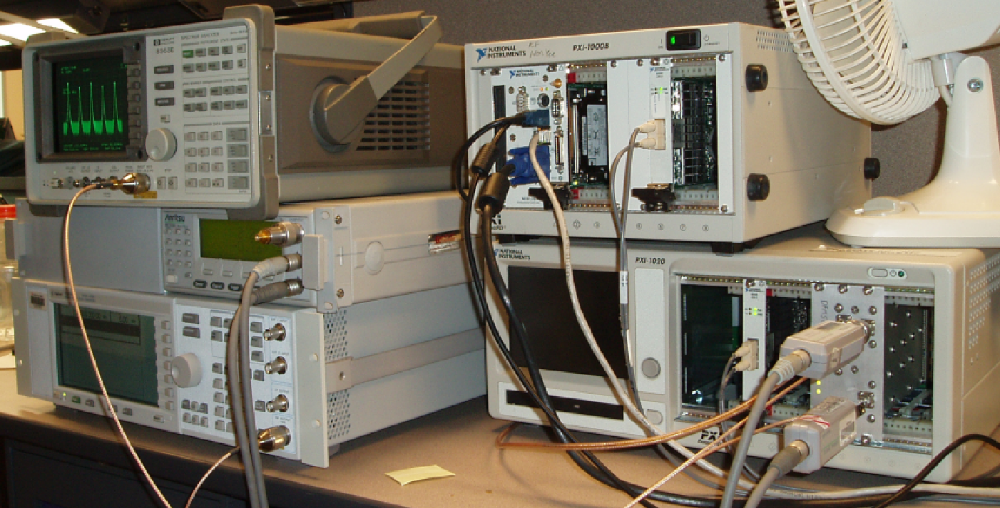

标准仪器的选择基于PXI-5610校准后所需的精度要求。通常，标准仪器的测量精度应优于被校准仪器至少一个数量级，以确保校准的准确性和可靠性。

### PXI-5610 驱动程序  

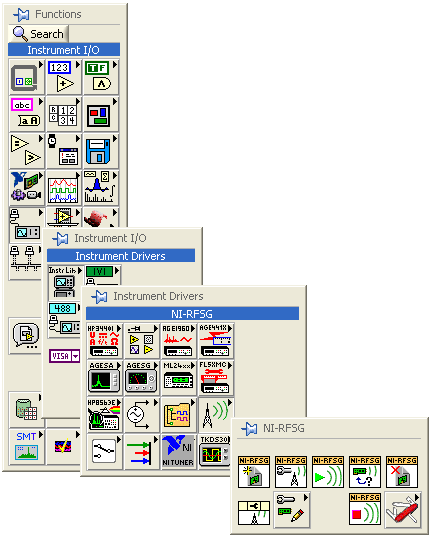  

National Instruments 公司为 PXI-5610 提供了专用驱动程序包 NI-RFSG。  
通过 NI-RFSG 提供的接口 VI（Virtual Instrument），用户可以在 LabVIEW 环境中控制 PXI-5610 的各项参数，例如：  

- 设置输出信号的频率  
- 调整输出功率的衰减倍数  

这些 VI 组件的模块化设计使得 PXI-5610 的控制变得更加灵活，能够方便地集成到自动化校准流程中。  

---

### TestStand 中的校准流程组织  

PXI-5610 的完整校准流程可划分为 12 个主要步骤：  

1. 检验内置时钟频率输出  
2. 检验仪器输出功率（输出频率低于 10 MHz）  
3. 检验仪器输出功率（输出频率高于 10 MHz）  
4. 调整温度漂移功率补偿  
5. 调整内置时钟频率  
6. 调整输入端频率—功率补偿  
7. 调整输出端射频频率—功率补偿（输出频率高于 10 MHz）  
8. 调整输出端射频频率—功率补偿（输出频率低于 10 MHz）  
9. 调整输入输出相位差  
10. 二次检验内置时钟频率输出  
11. 二次检验仪器输出功率（输出频率低于 10 MHz）  
12. 二次检验仪器输出功率（输出频率高于 10 MHz）  

其中：  

- 步骤 1~3 主要用于检验被校准仪器的初始指标  
- 步骤 4~9 负责校准过程中对各项参数的调整  
- 步骤 10~12 则是对校准后的仪器进行二次验证  

由于功率计在检测高频和低频信号时需要使用不同的探头，因此，对于输出频率低于 10 MHz 和高于 10 MHz 的情况，需要分别进行测量。  

在程序设计过程中，每个校准步骤均由 LabVIEW 独立编写相应的 VI，并在 TestStand 中按照预定的执行顺序进行串联。此外，TestStand 还负责管理整个校准过程，包括：  

- 仪器的 初始化、关闭 和 预热  
- 校准数据的 存储与处理  
- 校准结果的 自动对比与分析  

值得注意的是，步骤 1~3 和 步骤 10~12 采用相同的 LabVIEW 测试程序，仅在 TestStand 中分别调用两次，以便对比校准前后的性能变化。  

下图展示了 TestStand 中的校准步骤组织方式：  

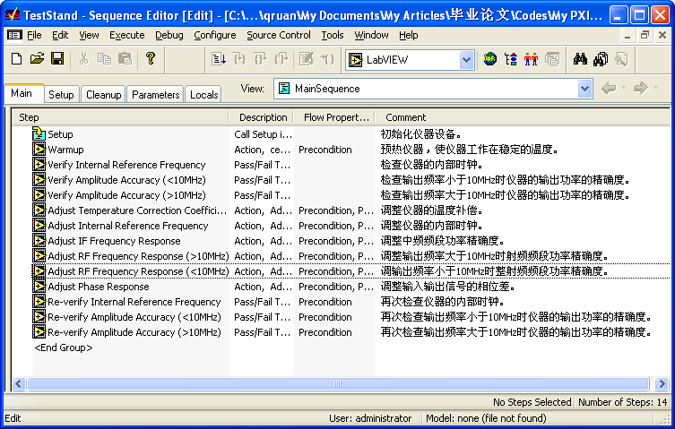  

下图展示了 TestStand 中的参数传递：

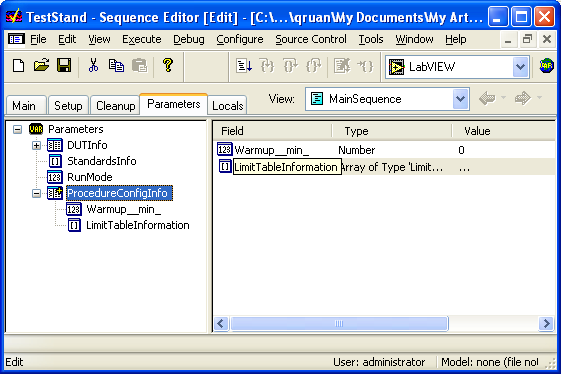  

在 TestStand 中，不同 VI 之间的数据传递主要通过以下两种方式：  

- Locals（局部变量） —— 仅在当前 TestStand 过程（Sequence）内有效，适用于临时存储计算结果或中间变量  
- Parameters（全局变量） —— 可在多个 VI 之间共享，适用于在不同测试步骤间传递校准参数  

这种变量管理机制确保了数据在整个校准流程中的有效性和一致性，提高了 PXI-5610 校准程序的可维护性和可靠性。  

## 检验内置时钟频率输出  

PXI-5610 模块的内置时钟在校准后，其频率应稳定在 10 MHz，并且误差不得超过 ±0.1 Hz。  
为了确保这一精度，所使用的标准仪器必须至少高一个数量级，即精度达到 1 ppb（±1×10⁻⁹）。  

由于普通晶振时钟难以满足这一精度要求，因此本次校准采用 铷钟 作为 高精度时钟基准。  

### 1. 仪器连接方案  

下图展示了检验 PXI-5610 内置时钟频率的仪器连接示意图：  

- 标准频谱仪 用于测量 PXI-5610 的时钟信号  
- 铷钟 作为高精度频率基准，为频谱仪提供参考时钟信号  
- 其他设备 预先连接好，以便后续进行仪器输出功率的检验  

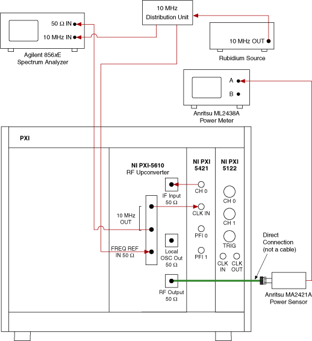  

### 2. 提高测量精度的方法  

一般频谱仪的分辨率通常难以直接达到 0.1 Hz 的精度。然而，我们可以通过 测量 PXI-5610 内置时钟信号的第 11 阶谐波 来 间接提高分辨率：  

- 基波频率：10 MHz  
- 第 11 阶谐波：110 MHz（基波频率的 11 倍）  
- 误差转换关系：  
  - 若 110 MHz 谐波的测量误差 ≤ 1 Hz  
  - 则 10 MHz 基波的误差 ≤ 0.1 Hz  

这种方法利用了 倍频谐波测量 的原理，以较高的频率测量信号，从而间接提升分辨率，使其满足校准要求。  

### 3. LabVIEW 程序实现  

下图展示了 检验 PXI-5610 内置时钟频率输出的 LabVIEW 程序 及其说明：  

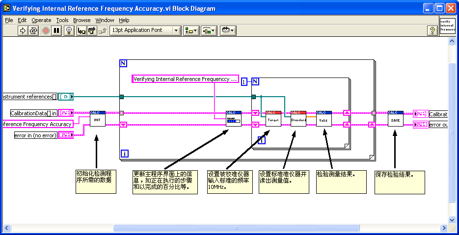  

图 26. 验证内置时钟频率输出的 LabVIEW 程序  

该程序主要实现以下功能：  

1. 从 PXI-5610 读取内置时钟信号  
2. 计算并提取 110 MHz 谐波频率  
3. 与标准频率（110 MHz）进行误差比对  
4. 根据测量结果判断 10 MHz 时钟误差是否符合 ±0.1 Hz 的标准  
5. 记录测量数据，以供后续分析  

通过上述方法，我们能够有效地提高测量精度，确保 PXI-5610 的内置时钟频率满足校准要求。这种 谐波放大测量法 为高精度频率校准提供了一种可靠的技术手段。  

## 检验输出频率小于 10 MHz 时仪器的输出功率精度  

在检验 PXI-5610 在 低于 10 MHz 频率范围 内的输出功率精度时，采用与上图相同的仪器连接方式。  

PXI-5610 与 PXI-5421（信号发生器） 结合使用，可构成 射频信号发生器，其驱动程序为 NI-RFSG。  

### 1. PXI-5610 输出信号控制  

下图展示了 利用 NI-RFSG 控制 PXI-5610 输出信号频率和功率 的 LabVIEW 程序片段。  

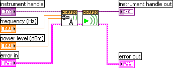  

图 27. 通过 NI-RFSG 控制 PXI-5610 输出信号的 LabVIEW 程序片段  

该程序实现了：  
- 设定 输出频率  
- 设定 输出功率  
- 控制 PXI-5610 进行 信号生成  
- 发送信号至 测试设备  

### 2. LabVIEW 方案设计  

下图展示了 用于检验输出频率小于 10 MHz 时，仪器输出功率精度的 LabVIEW 主程序。  

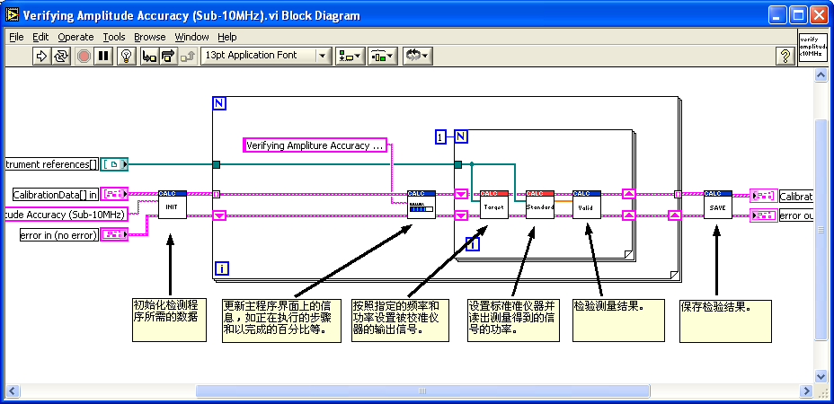  

该程序设计风格 与前述“内置时钟频率验证程序”保持一致，只是测量参数不同，以确保编程的一致性和可维护性。  

### 3. 低频范围测试点选择  

PXI-5610 内置时钟信号为 10 MHz，其输出功率误差受输出信号频率影响。因此，为保证测量精度，需在不同频率下进行多次测量。  

PXI-5610 支持的 最低输出频率 为 250 kHz。因此，在 低于 10 MHz 的范围内，选择以下测试频点进行测量：  

| 频率 (MHz) | 0.25 | 0.5 | 0.75 | 1 | 2 | 3 | 4 | 5 | 6 | 7 | 8 | 9 |  
|------------|------|-----|------|---|---|---|---|---|---|---|---|---|  

LabVIEW 程序采用 循环结构（For Loop），逐步设定不同测试频率，自动执行功率测量，并记录测量数据。  

### 4. 关键测量点总结  

- 采用 PXI-5421 作为信号源，与 PXI-5610 组合生成射频信号  
- 使用 NI-RFSG 进行信号控制，确保频率和功率精确可调  
- 选择 250 kHz ~ 9 MHz 的多个测试点，全面评估 PXI-5610 的低频输出功率精度  
- 使用循环结构进行自动化测试，提高测量效率和一致性  

通过上述方案，可以高效、准确地检验 PXI-5610 在低频范围内的功率输出精度，确保其符合校准要求。  

## 检验输出频率大于 10 MHz 时仪器的输出功率精度  

### 1. 测试方法概述  

检验 PXI-5610 在高于 10 MHz 频率范围内的输出功率精度 采用与 低于 10 MHz 频率范围 相似的方法，但在 硬件和测试参数 上有所不同。  

#### 主要区别：
- 功率探头的选择：射频功率计需要使用 适用于相应频段 的探头，以确保测量精度，如 图 29 所示。  
- 测试范围的扩展：由于 10 MHz 以上是 PXI-5610 的主要工作频段，需要进行更全面的测试，包括：  
  - 不同频率下的功率误差测试  
  - 不同输出功率水平下的误差分析  

### 2. 测试设备连接示意图  

下图展示了 检验输出频率大于 10 MHz 时仪器输出功率精度的测试设备连接方式。  

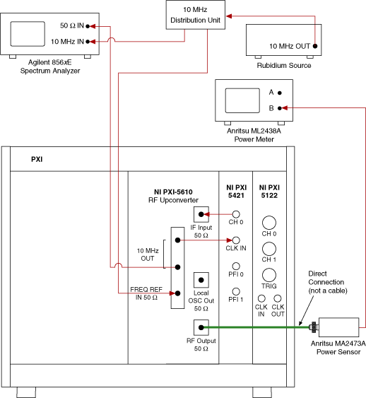  

### 3. 关键测试点选择  

为确保测量的准确性，在 10 MHz 以上频率范围 选取多个 频率测试点，并在 不同功率水平 下进行测量。  

#### 测试策略：
1. 频率范围：测试点从 20 MHz 至 2700 MHz，覆盖 PXI-5610 的典型工作范围。  
2. 功率范围：从 -50 dBm 至 10 dBm，涵盖 PXI-5610 可能的输出功率范围。  
3. 测量次数：
   - 低功率（≤ -40 dBm）：测量误差较大，需 256 次测量取平均值 以提高精度。  
   - 中等功率（-30 dBm ~ -20 dBm）：16 次测量 取平均值。  
   - 较高功率（-10 dBm ~ 10 dBm）：8 次测量 取平均值。  

#### 测试点分布表  

| 序号 | 频率 (MHz) | 功率 (dBm) | 测量次数 |
|----------|--------------|--------------|--------------|
| 1        | 20          | -50         | 256          |
| 2        | 105         | -50         | 256          |
| 3        | 500         | -50         | 256          |
| 4        | 1005        | -50         | 256          |
| 5        | 1500        | -50         | 256          |
| 6        | 2000        | -50         | 256          |
| 7        | 2505        | -50         | 256          |
| 8        | 2700        | -50         | 256          |
| 9        | 20          | -40         | 64           |
| 10       | 105         | -40         | 64           |
| ...      | ...         | ...         | ...          |
| 17       | 20          | -30         | 16           |
| ...      | ...         | ...         | ...          |
| 25       | 20          | -20         | 8            |
| ...      | ...         | ...         | ...          |
| 33       | 20          | -10         | 8            |
| ...      | ...         | ...         | ...          |
| 41       | 20          | 0           | 8            |
| ...      | ...         | ...         | ...          |
| 49       | 20          | 10          | 8            |
| ...      | ...         | ...         | ...          |
| 56       | 2700        | 10          | 8            |

### 4. 关键测试优化措施  

- 使用适当的探头匹配不同频率段，提高测量精度。  
- 采用多次测量取平均值的方法，减少低功率信号测量误差。  
- LabVIEW 结合 TestStand 进行自动化测量，提升测试效率和一致性。  
- 数据自动记录并分析，以生成误差修正曲线，提高仪器的校准准确度。  

## 调整温度漂移功率补偿

PXI-5610的温度漂移功率补偿基于以下公式：  
V = Vo × (Ca + Cb × T)  
其中：  
- V：最终修正后的测量值；  
- Vo：仪器测量的原始值；  
- Ca：温度漂移误差的常量参数；  
- Cb：温度漂移误差的二次参数；  
- T：仪器当前温度（单位：℃）。  

参数 Ca 和 Cb 存储在PXI-5610的只读存储器（ROM）中。在实际使用时，驱动程序会读取这两个参数，计算温度漂移补偿值，并将其与原始测量值 Vo 相加，以消除温度变化引起的误差。

### 调整方法  
调整温度漂移功率补偿的目标是重新测量并更新 Ca 和 Cb 的值。具体步骤如下：  
1. 初始条件设置：启动调整时，确保PXI-5610处于室温状态（约25℃），以建立基准。  
2. 温度变化模拟：随着仪器运行时间延长，温度自然升高。为加速这一过程，可采取以下措施（如图30所示）：  
   - 减少PXI机箱的通风量；  
   - 在PXI-5610相邻插槽放置加热设备（如电阻加热器）。  
   这些方法可显著缩短升温时间，提高校准效率。  
3. 数据采集与分析：在PXI-5610温度逐渐升高的过程中，持续测量其输出功率，记录功率随温度变化的曲线（如图19所示）。  
4. 参数拟合：对采集的功率-温度曲线进行线性拟合，得出新的 Ca 和 Cb 值。  
5. 参数更新：将计算得到的 Ca 和 Cb 写入PXI-5610的ROM，用于后续补偿计算。  

### 硬件与软件实现  
下图展示了调整温度漂移功率补偿的仪器连接示意图，核心设备包括PXI-5610、功率计和温度控制装置。
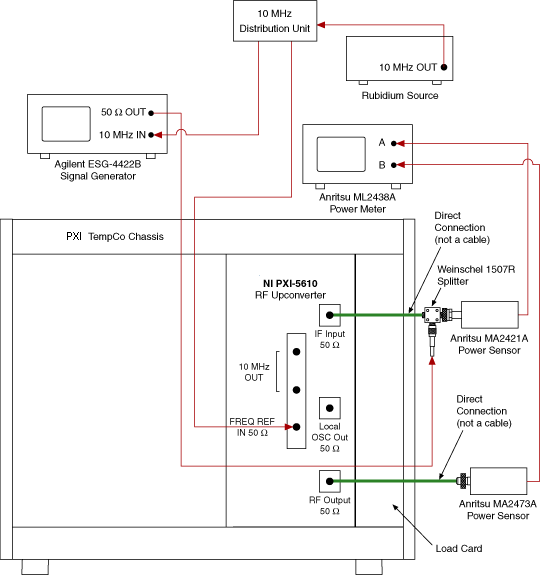

软件实现依赖LabVIEW编程，部分关键程序片段如下所示：  
- 温度控制与数据采集程序  
  该程序通过循环结构实时监测PXI-5610的温度，并调用功率计测量输出功率，生成原始数据点。  
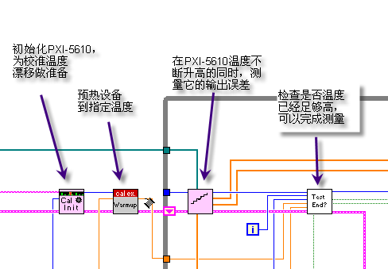
  
  
- 曲线拟合与参数存储程序  
  该程序对采集的数据进行线性拟合，提取 Ca 和 Cb，并通过NI驱动接口将结果写入ROM。  

## 调整内置时钟频率

### 方法概述  
PXI-5610的内置时钟频率调整旨在确保输出频率达到目标值（10 MHz，误差小于0.1 Hz）。其实现过程较为简单，通过软件控制压控晶振（VCXO，Voltage-Controlled Crystal Oscillator）的频率发生电路完成。

### 实现步骤  
1. 初始测量：使用频谱仪测量PXI-5610当前的时钟输出频率。  
2. 寄存器调节：通过软件修改控制VCXO的寄存器值：  
   - 若测得频率高于10 MHz，则减小寄存器值；  
   - 若低于10 MHz，则增大寄存器值。  
3. 迭代优化：重复测量与调整，直到输出频率稳定在10 MHz ± 0.1 Hz范围内。  

### 技术要点  
- 硬件支持：频谱仪需配合高精度时钟源（如铷钟，精度1 ppb），确保测量结果可靠。  
- 软件实现：调整过程由LabVIEW程序自动执行，通过NI驱动接口与PXI-5610通信，实时更新寄存器值。  

改进后的内容避免了原先过于简略的描述，增加了步骤拆分和技术细节，使读者更易理解调整逻辑和实现方式。

## 调整输入端频率-功率补偿

### 方法概述  
调整输入端频率-功率补偿的目标是消除PXI-5610输入端在不同频率下的功率误差。其硬件配置与前文“检验输出频率大于10MHz时仪器输出功率的精确度”相同。

### 实现步骤  
1. 测试条件设置：  
   - 输入信号功率保持恒定（如0 dBm）；  
   - 输入频率范围为5 MHz至25 MHz。  
2. 数据采集：  
   - 以100 kHz为间隔设置测试点（如5 MHz、5.1 MHz、…、25 MHz）；  
   - 使用功率计测量PXI-5610在每个测试点的输出功率。  
3. 曲线拟合：  
   - 根据测量数据绘制频率-功率曲线（如图21所示）；  
   - 采用7阶多项式拟合，生成平滑的补偿曲线。  
4. 参数存储：  
   - 将拟合得到的曲线系数存储至 PXI-5610 的只读存储器（ROM，Read-Only Memory）；  
   - 后续使用时，驱动程序读取这些系数以计算补偿值。  

### 技术要点  
- 硬件连接：如下图所示，PXI-5610 通过射频信号发生器接收输入信号，功率计监测输出功率，需确保探头适用于5 MHz至25 MHz频段。

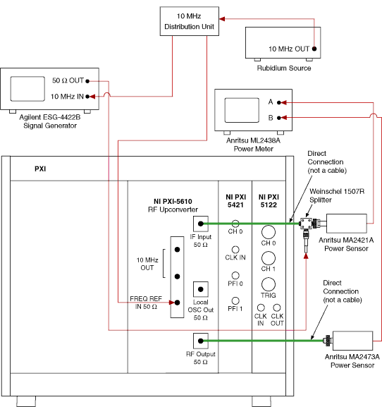

  
- 软件实现：下图展示的 LabVIEW 程序片段负责频率设置、功率测量和曲线拟合：  
  - 输入模块：循环设置测试频率并输出恒定功率信号；  
  - 输出模块：采集功率数据并执行 7 阶拟合，最终保存系数。  
- 与温度补偿的相似性：两者均通过曲线拟合生成补偿参数，但本节针对频率变化而非温度变化。  

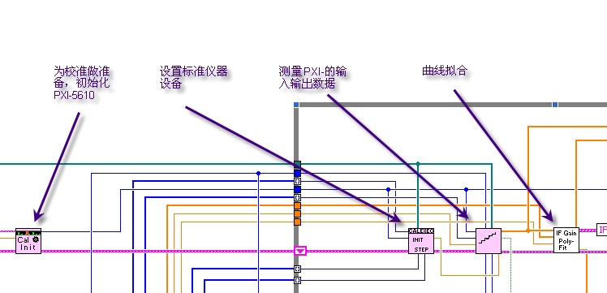

## 调整输出频率大于 10MHz 时输出端射频频率-功率补偿

### 方法概述  
此项调整旨在校准 PXI-5610 在输出频率大于 10 MHz 时的射频频率-功率特性，消除因频率和衰减倍数变化导致的功率误差。其硬件和软件实现与“调整输入端频率-功率补偿”类似，但增加了对不同衰减倍数的补偿考虑。

### 实现步骤  
1. 测试条件设置：  
   - 频率范围：20 MHz至2.8 GHz（PXI-5610主要工作频段）；  
   - 衰减倍数：从0 dB至最大衰减（如30 dB），步进5 dB。  
2. 数据采集：  
   - 在不同频率和衰减组合下测量输出功率（如图35所示）；  
   - 典型测试点包括20 MHz、105 MHz、500 MHz、1 GHz、2 GHz等。  
3. 误差分析与拟合：  
   - 根据测量数据生成频率-功率误差曲线；  
   - 使用5至7阶多项式拟合，计算补偿系数。  
4. 参数存储：将拟合系数写入PXI-5610的只读存储器（ROM），供后续使用。  

### 技术要点  
- 硬件配置：与输入端补偿相同，需使用射频信号发生器和功率计，探头适配高频段（如Anritsu MA2473A，20 MHz至2.8 GHz）。  
- 衰减影响：下图展示了不同频率和衰减倍数下的功率误差，表明高频段误差随衰减增加而放大，需逐级校准。  
- 软件实现：LabVIEW程序通过循环嵌套控制频率和衰减，自动采集并拟合数据。  

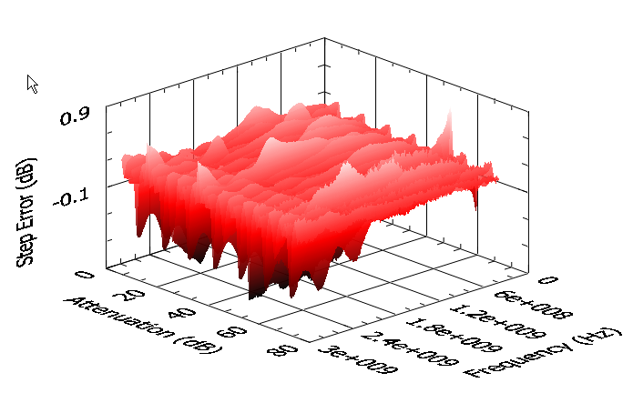

## 调整输出频率小于10MHz时输出端射频频率-功率补偿

### 方法概述  
此项调整与“输出频率大于10 MHz”的校准方法一致，旨在消除低频段（250 kHz至10 MHz）的功率误差。区别在于硬件配置需适配低频信号。

### 实现步骤  
1. 测试条件设置：  
   - 频率范围：250 kHz至10 MHz；  
   - 测试点：250 kHz、500 kHz、1 MHz、5 MHz、10 MHz等。  
2. 数据采集：使用功率计测量各频率点的输出功率。  
3. 误差拟合：采用5阶多项式拟合频率-功率曲线，生成补偿系数。  
4. 参数存储：将系数存入PXI-5610的ROM。  

### 技术要点  
- 硬件差异：如下图所示，需更换功率计探头为低频适配型号（如Anritsu MA2421A，100 kHz至27 MHz），以确保测量精度。  
- 软件一致性：程序逻辑与高频段调整相同，仅调整频率范围和探头参数。  

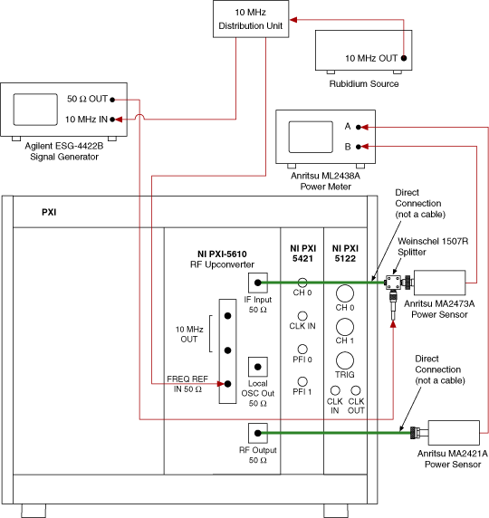

## 调整输入输出相位差

### 方法概述  
PXI-5610 要求输入与输出信号保持相位一致。此项调整通过修改输出相位寄存器值，使输入输出相位差趋于零，方法与“调整内置时钟频率”类似。

### 实现步骤  
1. 初始测量：使用 NI PXI-5122 示波器卡测量输入与输出信号的相位差。  
2. 相位调节：  
   - 通过软件修改 PXI-5610 的相位控制寄存器值；  
   - 若输出相位超前，则减小寄存器值；若滞后，则增大值。  
3. 迭代校准：重复测量与调整，直到相位差小于允许误差（如±1°）。  

### 技术要点  
- 硬件支持：如下图所示，NI PXI-5122 示波器卡通过双通道采集输入输出波形，计算相位差。  
- 软件实现：LabVIEW 程序调用 NI-SCOPE 驱动，实时分析波形并更新寄存器。  
- 精度要求：相位调整需配合高精度时钟源（如 10 MHz 铷钟），确保测量结果稳定。  

  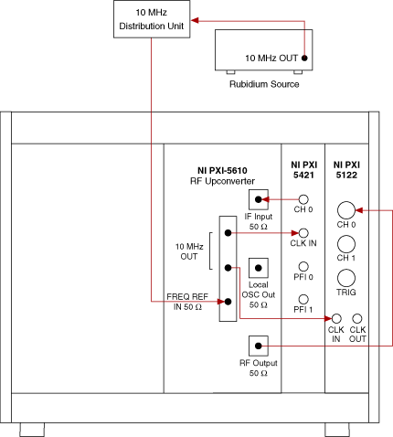

