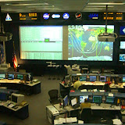

    有几个同事是体育爱好者，于是约了我一道去休斯敦看姚明的比赛。从我这里到休斯断不算太远，开车3个小时就到了。

    姚明的比赛在星期天下午，我们几个人觉得既然来回路上都要6个小时，只看一场球赛太亏了。于是决定周六一早就出发，在休斯敦停留两天，到附近其它的景点参观一下。休斯敦比较出名的景点一个是NASA航天中心，一个是Galveston岛。

    周六一早就起来了，不过我们几个人磨蹭了一会，大约九点钟正式开始上路。到休斯敦我们预定的宾馆差不多正好12点。我们的计划是星期六下午参观NASA，所以宾馆订到离NASA很近的地方。中午在宾馆随便吃了点东西，就直奔NASA。

    NASA里参观的基本都是领着小孩的，像我们专门来看热闹的成年人倒不多。很多人年纪大了，就对这些东西失去兴趣了，我有好多同事参观过NASA后都说很没劲。还好我童心未泯，或者因为从小就对太空充满了向往吧，这次在NASA转了一圈，还是觉得颇为值得的。

    NASA里有一块月亮上的石头，可以让有人摸。于是我赶紧凑过去摸了两下，也算是摸过月亮了。还很多模型，这是我给月球车模型照的相。

    从NASA出来，就差不多该吃晚饭了。大家都没来过休斯敦，于是决定到市中心去找一件饭店吃晚饭。到了市中心才发现，这是个很傻的决定。市中心都是办公楼，没什么居民，又是周末晚上，几乎看不到什么人，有那么几家餐馆也都打烊了。最后还是把车看到郊区，我们宾馆附近吃的Lubbys。

    第二天上午去Galveston岛。这个海滨小岛漂亮的没法用语言形容了，当然是我没法用语言形容，我语文比较差，想表达点什么常常想不出词来。好多小别墅临海而建，楼下就是沙滩。住在这种地方，每天在阳台上看看书，到沙滩上散散步，或者去海里游游泳，日子过得简直太惬意了。尤其是这种日子在美国并不是只有资本家才过得起的，那些别墅里的人，大多数这是美国中产阶级，和我在国内干的事情差不多。但他们过的生活，我在没来美国亲眼目睹之前，是想都想不到的。我们几个人在车里一边嫉妒美国人民的生活竟然如此腐败，一边盼望下次飓风快点吹过来，好让我们这些平时吹不着海风的人也有点优越感:)

    一路上还发现了好多旅馆是面朝大海的。于是大家就后悔，为什么不在岛上订旅馆呢？

    中午，另外几个同事打来电话，说他们到了，在姚餐厅等我们。那几个人专程来看球，所以第二天才来。于是问们开始急匆匆地开始赶回休斯敦市区。

    这是我在姚餐厅门口照的相：

 

    姚明开的餐厅，随然名气大，但里边的饭菜实在是不敢恭维。我一进屋，里边几个同事已经在等了。我望他们桌子上一看，已经有几盘一模一样黑乎乎的菜在那了。于是我就问，咱们这不是到中餐馆来吃饭来了吗，怎么还是按照美国的习惯分盘吃啊？ 他们无奈的一笑，说你仔细看，这儿是六盘不同的菜。我仔细看了看还真是，不过他们的色香味，不论哪一样，不仔细辨别，都还真差不多。

    像我这种不是球迷的中国人，是绝不会再来第二次了。

    赶去球场的路上同样是匆匆忙忙。休斯敦道路状况是比较差的，由于堵车，我们到体育场的时候，球赛已就开始15分钟了。

    这是丰田体育中心，休斯敦火箭队的主场：

   球赛气氛不错，姚明表现的也甚好，只不过火箭队最近太衰了。本来还领先十几分，再快终场的时候被对手追平，然后的加时赛输了两分。

    我不太喜欢体育，所以这次是我头一次现场观看的体育赛事。现在才知道为什么客场作战不利，原来观众们对客场的球队真是一点都不客气。每次敌方得球，观众席上都是一片嘘声。尤其在对方球员罚球的时候，篮板后面的观众全都站起来起哄。还有球迷会的人组织起哄的，谁的起哄声最大可以得到一件T血作奖励。

   球赛结束已经6点多了。于是启程回来。

   这是从丰田体育中心往外看：

 我的休斯敦相册：

[

2006.03 Houston

](http://picasaweb.google.com/ruanqizhen/200603Houston)
