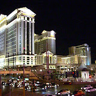

    周末刚去拉斯维加斯玩了一圈。

    我这次去拉斯维加斯非常的仓促，所以准备的不是太好，有很多地方需要借鉴的。首先是订旅馆，我以前听别人说斯维加斯旅馆很便宜，也很好订到所以这次订旅馆订的特别晚。虽然去拉斯维加斯的机票差不多两个月前就定好了，可是我并不是一个对旅游非常有热情的人，一直拖到一个星期前才想起来去订旅馆。结果网上一查，居然所有便宜的旅馆都没有了。天哪，我正好赶上了最火的旅游旺季。结果我能找到的最便宜的旅馆是两天455美金 :'(

    我的计划是在拉斯维加斯停留两晚，周六和周日。这又是一个失算。周末是旅游的高峰，旅馆的价格都跟着涨了，比如我订的旅馆周六是250美金一晚。可是如果我订一个月后工作日，就只要50美金一晚。我的假期不是问题，又不喜欢凑热闹，就应该工作日来的。还有就是两天时间太短了，根本不够。我最想看的是大峡谷。可是后来才发现，大峡谷离拉斯维加斯还是有点远的。开车大概要四个小时，这样两天就来不及去了。所以这次只在拉斯维加斯的Strip转了转。

    不过有遗憾是好事情，这样我可以有理由再去一次 :)

    飞机准备在拉斯维加斯降落的时候，是我所遇到过的最惊险的降落。飞机一直大幅度的振颤。即便是这样，飞机还在胡夫大坝的上空做了了两个大转弯，也许只是为了让乘客在空中欣赏一下它的壮美景色。但是，乘客的紧张心情显然影响的观景兴致，大家一片肃静。直到飞机后轮着陆的那一刻，才听到全飞机的人都长出一口气，大家才有开始说笑了。我想这也许是因为拉斯维加斯处在一片盆地，周围又都是沙漠，气流速度又高又不稳定造成的。

    形容一个地方机会好，叫做“遍地是黄金”。拉斯维加斯虽然没有真的遍地是黄金，但“遍池塘都是美金”。这算一个特色吧，虽然在美国其它城市，已经长在喷水池里见到硬币，但拉斯维加斯这里是我见到的规模最大的。但凡有水池的地方，池底一定堆了厚厚的一层硬币。我当时一直有个邪恶的念头，就是趁人不注意，下去捞点出来，补偿一下我在旅馆租金上的损失。不过为了不给中国人丢脸，最后还是放弃了这个念头。 这让我联想到了无锡的二泉，好多年没去过了。但是小时候的印象还很深刻，游客或许是为了许愿，或许只是想试试二泉水的张力，经常丢硬币到二泉里。真没想到往水力丢硬币这个文化也是跨越国界的。

    拉斯维加斯真是个让我感到亲切的地方，令我想起家乡的不只是硬币，还有路边发小广告的老墨们。走在通往Strip的路上，不断有人把名片大小的小广告塞到你手里，让我觉得仿佛走在上海商务大厦的门口。只不过这里的小广告主要是色情表演方面的，比国内那些飞机票广告诱人多了。

    美国人民很热情的，和陌生人搭话是再平常不过的。当我准备离开拉斯维加斯的时候，一起等车的一个大叔问我：“你赢了钱没？” 我说我对赌博没兴趣，没玩。 他又问我：“泡到靓妞没？” 我说我比较传统，不乱来的。

    他听了之后，十分惋惜的对我说：“你真是白来拉斯维加斯一趟啊！”

我的拉斯维加斯相册：由于我是一个人去的，所以只有风景照，没有自己的照片。

2006.04 Las Vegas

[《生活随笔》](http://ruanqizhen.wordpress.com/essay/)
