这篇文章是我本科的毕业论文，它只是对我实习工作的记录，描述了开发一个IVI驱动程序的全过程，谈不上什么技术含量。

可惜的年头已久，我竟然找不到它的最终版本了，我只从备份光盘里翻出了一个未完成的版本。

以前的很多东西我没有注意保存下来，真是可惜啊！今天想找出一份我以前写的代码，也找不到了。以后我就会把写的东西都放到网上来，以免这为数不多的东西再被遗失了。  
   

* * *

**\[****摘要\]**

在虚拟仪器系统中，仪器驱动程序是连接仪器与用户界面的桥梁，是系统设计的一个关键。IVI驱动程序（Interchangeable Virtual Instrument Driver 可互换性虚拟仪器驱动程序），虽然刚出现不久，但因其性能卓越，IVI驱动程序已成为了驱动程序的发展方向。本文论述了IVI驱动程序的工作原理。并结合实例，讲述了用LabWindows/CVI语言为YOKOGAWA FG200/FG300 系列信号发生器编写IVI驱动程序的全过程。

**关键词**：虚拟仪器、可互换虚拟仪器驱动程序、信号发生器、FG200/FG300、VXI即插即用规范、LabWindows/CVI。

**\[Abstract\]**

In virtual instrument system, the instrument drivers are the bridges between instruments and user interface. It is also the key technique of system design. IVI driver is a new technology in industry science. Because of its excellent performance, IVI already became the direction of driver development. The principle of IVI driver is discussed. And we paid more attention in the implementation of IVI driver for FG200/FG300 series function generators with LabWindows/CVI.

**Key words:** virtual instrument, IVI, interchangeable virtual instrument driver, function generator, FG200/FG300, VXI plug&play specification, LabWindows/CVI.

**第一章** **驱动程序工作原理**

**一、** **驱动程序的发展背景：**

**1、** **测试系统的工作方式：**

在工业生产中，测试过程需要使用到各种各样的仪器。计算机被用来控制这些仪器及生成用户界面。现代的大规模生产线需要用到成百上千的测试仪器，要实现自动化测试必须使用计算机控制这些仪器。

在计算机控制仪器发展的早期，仪器与仪器之间、仪器与计算机之间的接口大多通过GPIB接口总线；编程采用的是BASIC语言的I/O操作语句。每一台仪器都有自己的一套ASCII命令集。测试程序的编写者在编写测试程序前需要熟悉硬件设备和其一大套命令，这对于一般的软件人员来说较为困难。

编程常常成为开发自动检测系统中最耗费时间的意向工作，当检测系统使用到多种不同型号的仪器时，情况会更遭。并且，变成人员还会发现当他们在为一台仪器编写新的应用程序时，需要做大量的重复性工作，浪费严重。

**2、** **解决办法：**

显而易见，如果编程人员在编写程序时，只调用一些例行程序的高层函数，而不需要直接面对低层的函数命令，则开发费用和开发时间都会大大下降。这些可被重复利用的理性函数就是仪器驱动程序。

**二、** **设备驱动程序的发展历史：**

1、**GPIB****接口总线标准。**计算机与仪器之间的接口总线以GPIB（通用并接口总线）最为常见，其它还有RS232、485、VXI等。GPIB总线的雏形是惠普公司（Hewlett Packard）在60年代制定的公司内部总线标准HP-IB。在此基础上，美国国家工程师协会于1975年制定了意在统一接口总线结构的IEEE488接口总线标准。1978年，又对IEEE标准在编码、格式、传输协议方面作了修订，这就是IEEE488.2标准。我们现在开发的GPIB设备驱动程序都必须遵循以上标准。此类标准中的最新版本是于1990年制定的SCPI（Standard Commands for Programmable Instruments）标准。

2、**VXI plug&play****标准的出现。**VXI是一种仪器工业中常见的总线结构，通常我们把采用这种接口总线进行信息传送的集成卡式仪器也称为VXI。由于这种卡式仪器没有用户界面，通常被用来与计算机配合使用。VXI plug&play 标准的产生是为给VXI板卡制造商们提供一个统一的接口标准。后来VXI plug&play 标准被引用到整个仪器及计算机板卡制造业。现在大多数仪器制造商的产品都支持VXI plug&play 标准。

VXI plug&play 标准也为驱动程序的编写提供了固定格式。如驱动程序向仪器发送命令时必须遵守以下步骤：1〉初始化仪器。2〉设置变量参数。3〉设置测量命令。4〉进一步数据分析。5〉关闭进程。

由于使用诸如LabWindows/CVI一类的编程语言可以方便的产生满足VXI plug&play结构框架的驱动程序，VXI plug&play标准的出现极大的推动了现有仪器的发展。

3、**VISA****标准。** VXI plug&play 标准制定了驱动程序的结构框架，但这还不够完全。现在，许多驱动程序的数据类型都采用的是VISA（Virtual Instrument Software Architecture）标准。VISA标准还统一了驱动程序中一部分用户接口函数，这就为设备的互换奠定了基础。

4、**IVI****标准。**VXI标准并不是最新的设备驱动程序标准。IVI（Interchangeable Virtual Instrument）驱动程序标准在此基础上又向前迈进了一步，VIV标准产生的时间是1998年7月。

**三、** **IVI****驱动程序的特点和优点：**

1、**可互换性：** IVI驱动程序完全符合VXI plug&play和VISA标准，是对以上两种标准的发展和完善。“IVI协会”为五大类仪器（数字万用标、示波器、信号发生器、开关、电源）定义了标准属性（Classic attribute）和标准用户接口函数（Classic function）。因此，使用IVI驱动程序的仪器设备在标纯特性范围内可以实现互换。对于每种型号仪器的特独特性能，可以通过非标准属性和非标准用户接口实现。

2、**智能化与状态缓存功能：**IVI驱动程序引入了状态缓存（State Cache）功能。现代设备控制中，影响系统速度提升的主要瓶颈是仪器与计算机间的信息传输速率。VXI p&p标准的驱动程序不存在状态缓存功能，因此，每执行一条测量函数都要对仪器进行一次设置，即便仪器已经设置正常也是如此。而IVI的驱动程序可以自动将仪器状态放入缓冲区，并根据此次状态截断向仪器发送的冗余设置命令。以此优化命令结构，提高系统效率。

3、**模拟功能：**模拟状态指在缺少真实仪器的情况下，IVI驱动程序可以产生一个模拟的输出值，以保证高层程序正常工作。使用模拟功能可以帮助我们自在没有仪器的情况下开发驱动程序、编写、检查测试程序，以及检测新的仪器是否与测试程序匹配。

4、**安全的多线程工作方式：**这使得测试工程师可以充分利用多线程程序的优点。

5、**数据范围检测和状态检测功能：**这些工具减轻了测试程序编写人员的工作量并提高了程序的可靠性。

**四、** **IVI****驱动程序的结构和工作原理：**

1、 IVI驱动程序是建立在由“国际IVI协会”制定的仪器属性模型的基础上的。我们对五大类仪器（数字万用表类、示波器类、信号发生器类、开关类、电源类）分别定义了其属性模型，使其具有可互换性，状态缓存等功能。

仪器设备上的每一个参数设置都对应一条属性。如信号发生器，我么可以把它的输出波形，频率电压等都定义为其属性。IVI驱动程序的“SetAttribute”和“GetAttribute”两个低层函数时对用户开放的。高级用户可以直接在他们的测试程序中设置仪器的某个独立属性。但是，以为在大多数情况下，仪器的各个属性之间是有联系的，IVI驱动程序提供了高层函数来一次性设置一组相关联的几个属性。这些高层函数减轻了用户的任务。

2、 IVI驱动程序的工作过程：

IVI结构的核心是IVI引擎对仪器属性的读写。

IVI驱动程序利用CallBack函数（回调函数）对仪器设置进行读写操作，利用RangTable（取值范围表）核查仪器属性的取值是否合法。IVI引擎会自动选择实际访问RangeTable和CallBack函数。

例如：我们要使用FG300\_ConfigureTriangleSymmetry函数来设置仪器产生的三角波的对称度，并假设其对称度为30(30%)。

当用户调用FG300\_ConfigureTriangleSymmetry函数后，驱动程序和IVI引擎需要作以下工作：

1〉 驱动程序调用Ivi\_SetAttributeViReal64()函数，对属性FG300\_ATTR\_FUNC\_TRIANGLE\_SYMMETRY的值进行设置。同时，SetAttribute函数将会激发IVI引擎。
```
<table cellspacing="0" cellpadding="0"><tbody><tr><td valign="top"><table cellspacing="0" cellpadding="0"><tbody><tr><td width="22">&nbsp;</td></tr><tr><td>&nbsp;</td><td><a href="http://ruanqizhen.wordpress.com/wp-content/uploads/2011/04/clip_image001.gif">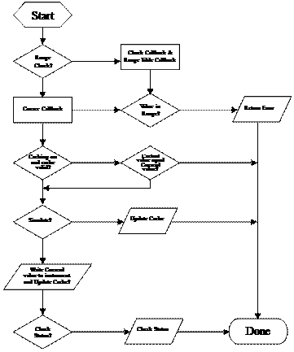</a></td></tr></tbody></table></td></tr></tbody></table>
```
2〉 如果继承属性（Ingerent attribute）FG300\_ATTR\_RANGE\_CHECK的值为VI\_TRUE（值为真，允许值范围检查），IVI引擎则自动调用属性FG300\_ATTR\_FUNC\_TRIANGLE\_SYMMETRY的RangeCheckCallBack函数。检查值30是否在属性的RangTable的允许范围内。如果取值超出范围，SetAttribute函数会结束任务，并将出错代码作为返回值返回。有时，IVI引擎还利用RangeTable把输入值强行转换至某一范围内。

3〉 如购继承属性FG300\_ATTR\_CACHE的值为VI\_TRUE（允许状态缓存），IVI引擎会检查属性FG300\_ATTR\_FUNC\_TRIANGLE\_SYMMETRY的当前值是否就是30。如果是这样，SetAttribute函数立即结束任务，并正常返回。

4〉 如果继承属性FG300\_ATTR\_SIMULATE的职位VI\_TRUE（允许模拟状态），IVI引擎将值30赋给属性FG300\_ATTR\_FUNC\_TRIANGLE\_SYMMETRY后即正常返回，不进行任何I/O操作。

5〉 如果以上情况都不成立，IVI引擎会调用属性FG300\_ATTR\_FUNC\_TRIANGLE\_SYMMETRY的CallBack函数，通过CallBack函数中的I/O操作命令设置值输出至仪器。

6〉 如果继承属性FG300\_ATTR\_QUERY\_INSTR\_STATUS的值为VI\_TRUE（允许状态检查），IVI引擎会调用CheckStatusCallBack函数读取仪器的状态。

**第二章 FG300信号发生器**

**一、** **信号发生器的工作原理：**

**1、** **信号发生器的分类：**

根据信号波形产生的原理可将信号发生器分为以下三类：

1〉 **模拟发生器**（Analog generation）**。**模拟发生器利用积分运算电路和比较运算电路来产生三角波和矩形波信号。正弦波由三角波信号通过一个由二极管和电阻组成的电路来产生。模拟发生器的价格便宜，大多数信号发生器都是采用这种方式工作的。但是模拟发生器的频率精度比较低，而且低频工作状态不稳定。

2〉 **PLL****发生器**（Phase-locked loop generation 锁相环路发生器）。PLL发生器电路包括：（a）一个电压可调的振荡器，用输入电压来调节输出频率；（b）一个可编程可任意设置的分频器；（c）一个基准振荡器；（d）一个低通滤波器；（e）一个相位比较器，用于比较基准振荡器发出的信号波于滤波器输出波形之间的相位差异。

工作时，PLL发生器用相位差异来调节控制电压，使输出频率与基准振荡器经分频器产生的频率保持一致。因此它的频率精度非常高。PLL发生器的缺点是价格高、频率变化缓慢，低频工作状态不稳定。

3〉 **DDS****发生器**（Direct digital synthesis generation 直接数字合成发生器）。DDS发生器把各种样式的波形的数字信息纪录于内存。当用户选定波形与频率，发生器则按照选定的时钟频率将波形数据读出。取出的数据通过D/A转换器转变为模拟信号。由于采用了全数字的方法，DDS发生器已经克服了传统信号发生器的缺点。

**2、** **DDS****信号发生器的工作原理：**

1〉 原理图：
```
<table cellspacing="0" cellpadding="0"><tbody><tr><td valign="top"><p><a href="http://ruanqizhen.wordpress.com/wp-content/uploads/2011/04/clip_image002.gif">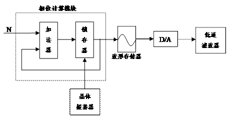</a></p></td></tr></tbody></table>
```
其电路中包括：晶体振荡器，用来产生基准时钟信号；相位运算部分；波形存储区；数/模转换器；低通滤波器。波形存储器存储了样本信号在一个完整周期内的数据。存储单元的地址与相位相对应。

2〉 工作过程：

首先，根据用户选择的频率确定N值。锁存器的输出在第一个时钟周期内也是N，这就是第一次读波形存储器时的地址。锁存器的输出值反馈给加法器，以后每个时钟周期，锁存器的输出都会增加N（2N、3N、4N……）,波形存储器会根据这些地址信号送出波形数据，再由D/A转换器转换成模拟信号。你可以通过改变N值来修改输出频率。
```
<table cellspacing="0" cellpadding="0"><tbody><tr><td valign="top"><p><a href="http://ruanqizhen.wordpress.com/wp-content/uploads/2011/04/clip_image004.gif">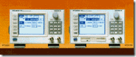</a></p></td></tr></tbody></table>
```
**二、** **FG300****的主要性能指标：**

生产厂家： YOKOGAWA

波形输出：

输出通道数： 2

输出波形： 正弦波、矩形波、三角波、脉冲波、任意波形

输出信号： 连续输出、触发输出、门控输出、直流输出

频率：

频率范围： 正弦波、矩形波： 1μHz – 15 MHz

三角波、脉冲波、任意波形： 1μHz – 200 kHz

分辨率： 1μHz ；九位数字

精度： ±20 PPM

稳定性： ±20 PPM

基准频率： 40.2107 MHz

输出特性：

最大输出电压： ±10 V

幅值调节范围： ±20 Vpp （分辨率：1 mVpp）

幅值精度： ±（0.8%×幅值＋14 mVpp）

幅值频率特性：

正弦波： ≤100 kHz ±0.1 dB

≤1 MHz ±0.2 dB

≤10 MHz ±0.5 dB

≤15 MHz ±1 dB

矩形波、脉冲波(50% duty cycle)：

≤10 kHz ±2%

三角波： ≤10 kHz ±3%

偏移电压范围： ±10V

输出阻抗： 50Ω±1%

输出衰减： 1/1、1/10、1/100

调制特性：

调制方式： 调幅（AM）、双边调幅（DSBAM）、调频（FM）、调相（PM）、偏移调制（Offset Modulation）、脉宽调制（PWM）

调制波波形： 正弦波、矩形波、三角波、脉冲波、任意波形

调制波频率： 1 mHz – 50 Hz

通用特性：

预热时间： 30分钟

工作环境温度： 5○C – 40○C

工作环境湿度： 20% – 80%

电源电压： 100 – 240 V Ac

电源频率： 50 Hz – 60 Hz

功率： 125 W

外形尺寸： 350×213×132 mm （长×宽×高）

重量： 5 kg

**详细资料参见附录。**

**三、** **FG300****的工作原理：**

1、 FG300是DDS类的信号发生器。

2、 信号流程：

1〉 它将信号的波形数据存储在波形存储器中。

2〉 相位的递增计算由一个48bit的相位计算器完成。波形存储器的地址输入至于相位计算器的输出值相对应。

3〉 波形存储器的数字输出信号经过一个12位的D/A转换器，转换为模拟信号。

4〉 模拟信号首先要经过滤波器滤除高频谐波。

5〉 FG300中的方波是由正弦波通入比较锁存器后产生的。

6〉 经滤波后的模拟信号由多路转换器选择输出通道。

7〉 幅值调整和偏移量调整。

8〉 通入放大器和衰减器。

9〉 信号由FG300的连接器输出。

**四、** **编程准备：**

FG300信号发生器采用的是消息型通讯方式（message-based）。就是说，FG300与计算机或控制器之间的通讯采用字符串的方式，我们称这些标准字符为消息（message, MSG）。从控制器发送至仪器的消息成为程序消息（program message）；从仪器发送至控制器的消息成为反馈消息（response message）。

每条程序消息可以由数个程序消息单元组成，

**第三章 LabWindows/CVI开发语言**

**一、** **LabWindows/CVI****开发环境简介**

LabWindows/CVI是一种C语言开发系统。与其它开发系统相比，CVI增添了一个交互式程序开发环境、数据采集函数库、仪器控制工具等工具。同时，LabWindows/CVI包含一整套用来进行数据采集、分析、显示等处理的软件工具。
```
<table cellspacing="0" cellpadding="0"><tbody><tr><td valign="top"><p><a href="http://ruanqizhen.wordpress.com/wp-content/uploads/2011/04/clip_image006.gif">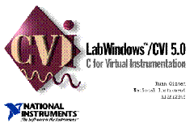</a></p></td></tr></tbody></table>
```
你可以利用CVI的交互式环境编写调试ANSI C语言（美国国家标准C语言），还可以使用LabWindows/CVI自带的库函数以及调用其它的C语言模块、动态链接库函数、C语言库函数、仪器驱动程序等。

CVI最大的优势在于功能强的的函数库。它的函数库包含了对数据处理的每一过程及仪器进行控制的各种函数。具体分类如下：

1〉 数据采集类包括以下函数库：GPIB/IEEE 488.2函数库、数据采集函数库、DAQ卡的IO操作函数库、RS-232函数库、VISA库、VXI库。

2〉 数据分析方面：数据格式转换和标准化函数库、数据分析函数库、高级数据分析函数库。

3〉 数据显示方面有用户界面函数库。

4〉 在网络操作和信息交换方面有四个函数库：动态数据交换（DDE）函数库、信息交换控制协议（TCP）函数库、X Property控件函数库和Active X控件函数库。

仪器控制函数库是CVI特有的，它包括了各种采用GPIB、VXI、和RS-232接口的仪器的驱动程序，例如示波器、万用表等。用户还可以利用CVI全套的驱动程序开发软件工具开发自己的驱动程序。

**二、** **LabWindows/CVI****程序开发过程简介：**

1〉 通开发其它语言的程序一样，在书写程序源代码前，你先要设计好程序个部分的功能，并以文件的形式记录下来。

2〉 LabWindows/CVI是一种在一起操作方面大大增强了的C语言。在使用CVI之前，你一定要熟悉C语言。

3〉 CVI程序的结构。通常，一个CVI程序由以下几部分组成：

Ø 用户界面

Ø 主控程序

Ø 数据采集

Ø 数据分析

4〉 用户界面：使用LabWindows/CVI的用户界面编辑工具可以轻易的制作出精美的交互式用户界面。使用图形化用户界面可以使你的程序更加友好，更加确切的表达出你的程序的功能和用途。因此，我们编写一个CVI程序往往是从事及用户界面开始的。

5〉 程序框架和代码生成：LabWindows/CVI会自动根据设计好的用户界面生成程序框架。这个程序框架内包括用户界面的调用函数（Callback Function）和装载用户界面的主函数（Main Function）。CVI的代码生成器可以大大节约用户编写Windows程序的时间。

6〉 主控程序部分：主控程序用来协调数据采集、数据分析、和用户界面部分的工作，控制程序执行的流程。大部分主控程序部分的程序代码要由用户自己书写，你可以参考LabWindows/CVI软件包中的范例程序。

7〉 数据采集：LabWindows/CVI已经包含有控制GPIB、RS-232和VXI设备的驱动程序和接口函数，用户可直接调用这些函数。

8〉 数据分析。

**第四章 驱动程序开发步骤**

**第一节 整理仪器属性和用户界面函数**

为了确保仪器的可互换性，国际IVI协会为仪器驱动程序的开发制定了一系列的标准。其中一个重要部分就是制定了标准的通用仪器属性和通用高层接口函数。针对信号发生器部分的文件是《IviFgen Class Specification》。

《IviFgen Class Specification》文件包含了信号发生器的最常用功能，绝大多数的信号发生器都支持这些功能。但每台仪器实现这些功能的方法可能是不同的；仪器与计算机之间的通讯方式和指令也存在较大差别。

驱动程序中，基本上每条属性（Attribute）对应一条仪器设置命令。在开始工作前，要熟悉仪器的命令体系和IVI通用属性（Classic Attribute）及用户界面函数(Classic Function)的定义。

首先，要满足文件《IviFgen Class Specification》 中定义的属性和界面函数。

**第二节** **使用仪器驱动程序开发向导创建驱动程序文件：**
```
<table cellspacing="0" cellpadding="0"><tbody><tr><td valign="top"><p><a href="http://ruanqizhen.wordpress.com/wp-content/uploads/2011/04/clip_image008.gif">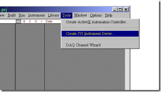</a></p></td></tr></tbody></table>
```
一、 打开LabWindows/CVI的主工作窗口，在“Tools”菜单下选取“Create IVI Instrument Driver”，开始进入驱动程序开发向导。

二、 在“Select an Instrument Driver”对话框中，选取显见驱动程序的信息：
```
<table cellspacing="0" cellpadding="0"><tbody><tr><td valign="top"><p><a href="http://ruanqizhen.wordpress.com/wp-content/uploads/2011/04/clip_image010.gif">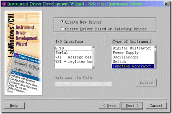</a></p></td></tr></tbody></table>
```
1〉 新建一个驱动程序（Create a new driver）。

2〉 接口中线类型为：GPIB。

3〉 仪器类型为信号发生器（Function Generator）。

按下“Next”键，进行下一步。

三、 在“General Information”对话框中，填写以下信息：

1> 仪器的名称：“TOKOGAWA FG300 Function Generator”;
```
<table cellspacing="0" cellpadding="0"><tbody><tr><td valign="top"><p><a href="http://ruanqizhen.wordpress.com/wp-content/uploads/2011/04/clip_image012.gif">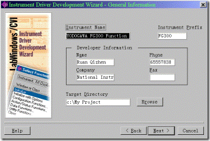</a></p></td></tr></tbody></table>
```
2> 仪器前缀名：“FG300”;

3> 作者姓名及公司等；

4> 程序方在何目录下。

按下Next键，进行下一步。

四、 在General Command Strings 对话框中填写以下信息：
```
<table cellspacing="0" cellpadding="0"><tbody><tr><td valign="top"><p><a href="http://ruanqizhen.wordpress.com/wp-content/uploads/2011/04/clip_image014.gif">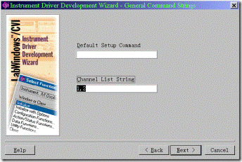</a></p></td></tr></tbody></table>
```
1〉 填写默认的设置命令，FG300可以不需要默认的设置命令。

2〉 列出仪器的通道数，FG300共有两个通道。

按下Next键，进行下一步。

五、 在Stand Operation对话框种选择仪器支持的基本操作。
```
<table cellspacing="0" cellpadding="0"><tbody><tr><td valign="top"><p><a href="http://ruanqizhen.wordpress.com/wp-content/uploads/2011/04/clip_image016.gif">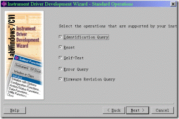</a></p></td></tr></tbody></table>
```
六、 在ID Query对话框中填入仪器用来询问ID号的命令，以及希望得到的返回值。
```
<table cellspacing="0" cellpadding="0"><tbody><tr><td valign="top"><p><a href="http://ruanqizhen.wordpress.com/wp-content/uploads/2011/04/clip_image018.gif">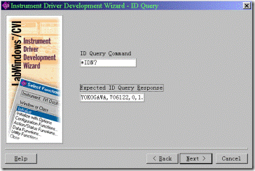</a></p></td></tr></tbody></table>
```
七、 在Reset对话框中填入仪器用来进行重设置的命令。
```
<table cellspacing="0" cellpadding="0"><tbody><tr><td valign="top"><p><a href="http://ruanqizhen.wordpress.com/wp-content/uploads/2011/04/clip_image020.gif">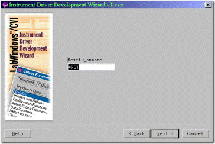</a></p></td></tr></tbody></table>
```
八、 在Self Test对话框中填入以下内容：
```
<table cellspacing="0" cellpadding="0"><tbody><tr><td valign="top"><p><a href="http://ruanqizhen.wordpress.com/wp-content/uploads/2011/04/clip_image022.gif">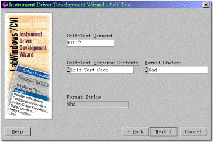</a></p></td></tr></tbody></table>
```
1〉 在自检命令控制栏中填入自检命令:“\*RST?”；

2〉 FG300的自检返回信息中只有状态码；

3〉 选择“%hd”通用符作为格式化模式。
```
<table cellspacing="0" cellpadding="0"><tbody><tr><td valign="top"><p><a href="http://ruanqizhen.wordpress.com/wp-content/uploads/2011/04/clip_image024.gif">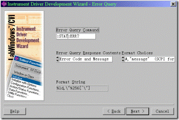</a></p></td></tr></tbody></table>
```
九、 在Error Query对话框中填入以下信息：

1〉 FG300的错误查询命令为：“:STAT:ERR?”；

2〉 FG300的错误查询返回值中即包括错误代码，也包含错误信息。

3〉 选择通配符“%ld,\\”%256\[”\\”\]”作为格式化模式。
```
<table cellspacing="0" cellpadding="0"><tbody><tr><td valign="top"><p><a href="http://ruanqizhen.wordpress.com/wp-content/uploads/2011/04/clip_image026.gif">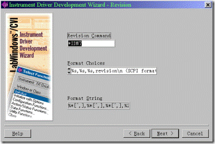</a></p></td></tr></tbody></table>
```
十、 在Revision对话框中填入FG300的版本询问命令：“\*IDN?”；并选用通配符“%x\[^,\],%x\[^,\],%x\[^,\],%256\[^\\n\]”作为返回信息的格式化模式。
```
<table cellspacing="0" cellpadding="0"><tbody><tr><td valign="top"><p><a href="http://ruanqizhen.wordpress.com/wp-content/uploads/2011/04/clip_image028.gif">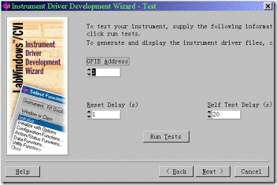</a></p></td></tr></tbody></table>
```
十一、 Test对话框：

如果这台仪器已经连在计算机上，你可以在建立驱动程序前，先测试以下你在前面几个对话框中输入的命令是否正确。

1〉 填入仪器的GPIB地址；

2〉 填入仪器的复位时间和自检时间。

3〉 按下Run Tests键，CVI开始检查仪器。

十二、 按下Next键，CVI就会按前面输入的信息生成该仪器驱动程序的程序框架。

**第三节** **编辑仪器的属性：**
```
<table cellspacing="0" cellpadding="0"><tbody><tr><td valign="top"><p><a href="http://ruanqizhen.wordpress.com/wp-content/uploads/2011/04/clip_image030.gif">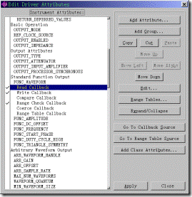</a></p></td></tr></tbody></table>
```
当时用“仪器驱动程序开发向导”生成了驱动程序的框架后，可以直接装入属性编辑器，也可以在将来的任何时候，通过选择Tools菜单中的Edit Instrument Attributes项来调出属性编辑器编辑仪器属性。

一、 制定仪器属性：
```
<table cellspacing="0" cellpadding="0"><tbody><tr><td valign="top"><p><a href="http://ruanqizhen.wordpress.com/wp-content/uploads/2011/04/clip_image032.gif">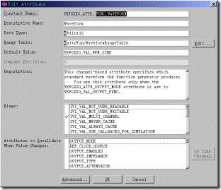</a></p></td></tr></tbody></table>
```
选定你要编辑的属性，按Edit键，或按下Add Attribute添加新的属性，就会进入Edit Attribute对话框。在此对话框内，需要填写或修改以下内容：

1〉 属性的名称；

2〉 属性的描述性名称；

3〉 属性的数据类型；

4〉 属性的取值范围表；

5〉 属性的默认值；

6〉 属性需要达到的精度；

7〉 该实行的简要说明；

8〉 属性的一些特殊标志；

9〉 该属性与其它属性或函数之间的关系。

二、 编写或修改属性的Callback函数。

一个仪器的属性可能会用到六个Callback函数。通常，每个Callback函数的作用如下：

1〉 Read Callback函数，用来读取仪器当前的设置值或数据信息，该函数一般由几个询问仪器设置或数据的命令组成。

2〉 Write Callback函数，用来设置仪器的值或把数据传递给仪器，该函数常由一组设置命令组成。

3〉 Compare Callback函数，用来比较属性的值是否改变。

4〉 Range Check Callback函数，察看属性取值范围表，检查赋给属性的值是否在允许的范围内。

5〉 Coerce Callback函数，把赋给属性的值，按规律转换值一定的范围内。

6〉 Range Table Callback函数，用来为仪器的当前状态选择一个合适的取值范围表。

在“Edit Driver Attribute”对话框中，选择要编辑的函数，按下“Go To Callback Source”键，即可找到Callback函数的源代码进行编辑。

三、 删除无用的属性。

由开发向导生成的驱动程序中，有一些属性在FG300中用不到。在编写驱动程序的过程中，应该删除这些属性。

**第四节** **编辑高层函数。**

1、编辑或创立一个高层函数。
```
<table cellspacing="0" cellpadding="0"><tbody><tr><td valign="top"><p><a href="http://ruanqizhen.wordpress.com/wp-content/uploads/2011/04/clip_image034.gif">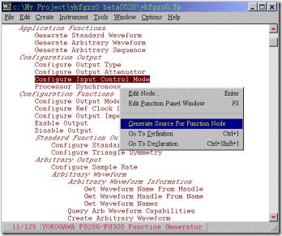</a></p></td></tr></tbody></table>

<table cellspacing="0" cellpadding="0"><tbody><tr><td valign="top"><p><a href="http://ruanqizhen.wordpress.com/wp-content/uploads/2011/04/clip_image036.jpg">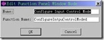</a></p></td></tr></tbody></table>
```
用户在使用仪器时，为完成某一任务，通常需要一次设置一组相关的几个属性；很少需要对某个单个的属性进行设置。因此，IVI驱动程序为用户提供了高层函数，以方便操作。一个高层函数常常由几个设置仪器属性的自函数组成。选择Tools菜单中的“Edit function tree”项，或打开“ykfgxx0.fp”函数面板文件，就会看到驱动程序的函数树列表。我们把函数树中的每一项成为一个结点，每一个结点都对应一个高层函数。修改一个已有的函数或创建一个新的函数可以按以下步骤进行：

1〉 用鼠标右键点击需要修改的结点，或选择Greate菜单中的“Function Panel Window”项创建一个新的结点，就会进入“Edit Node”对话框，此对话框用来编辑结点名及其对应的函数名。

2〉 编辑函数面板。为了方便用户了解和数用一个函数，CVI为每一个函数都设置了一个函数面板。面板中列出了函数的全部参数，并提供了函数及其参数的简要说明。我们同样需要为自己的函数设计一个函数面板，以方便驱动程序的使用者。

3〉 如果选中的结点是新建的，先要用“Generate Source For Function Node”项为函数创建源代码。若源代码已经存在，可直接选择“Go To Definition”想找到函数源代码。

4〉 编写源代码。

**第五节** **建立驱动程序的文档。**

为了更清楚的向用户介绍你的驱动程序，你可以直接利用CVI为你的程序生成两种说明文档，供用户参考。

### 参考文献：

\[1\] [可互换虚拟仪器驱动程序的开发](http://ruanqizhen.wordpress.com/2005/10/27/%E5%8F%AF%E4%BA%92%E6%8D%A2%E8%99%9A%E6%8B%9F%E4%BB%AA%E5%99%A8%E9%A9%B1%E5%8A%A8%E7%A8%8B%E5%BA%8F%E7%9A%84%E5%BC%80%E5%8F%91/)，Qizhen，2005   
    \[2\] [其他相关技术文章](http://ruanqizhen.wordpress.com/technology/)  
    \[3\] [回答一个关于 IVI 仪器驱动程序的问题](http://ruanqizhen.wordpress.com/2007/01/08/%E5%9B%9E%E7%AD%94%E4%B8%80%E4%B8%AA%E5%85%B3%E4%BA%8E-ivi-%E4%BB%AA%E5%99%A8%E9%A9%B1%E5%8A%A8%E7%A8%8B%E5%BA%8F%E7%9A%84%E9%97%AE%E9%A2%98/)
