## 摘要

在虚拟仪器系统中，仪器驱动程序作为连接仪器与用户界面的关键桥梁，对系统设计至关重要。近年来，IVI（Interchangeable Virtual Instrument）驱动程序凭借其优越的性能和灵活性，逐渐成为仪器驱动程序的发展趋势。本文系统阐述了IVI驱动程序的工作原理，并以实例说明如何利用LabWindows/CVI开发环境为YOKOGAWA FG200/FG300系列信号发生器编写IVI驱动程序的全过程。  

**关键词**：虚拟仪器、IVI驱动程序、信号发生器、FG200/FG300、VXI即插即用规范、LabWindows/CVI  

## 第一章 驱动程序工作原理  

### 1.1 驱动程序的发展背景  

#### 1.1.1 测试系统的工作方式  

在工业生产中，测试过程通常涉及多种复杂仪器的使用。通过计算机实现对这些仪器的控制，并生成用户界面，已成为现代化自动测试系统的重要技术手段。随着工业生产规模的扩大，大型生产线往往需要成百上千台测试仪器的协同工作，自动化测试成为实现高效生产的核心需求。  

在计算机控制仪器发展的早期阶段，仪器与计算机之间的通信主要通过GPIB（General Purpose Interface Bus）接口实现。此时，编程语言通常采用BASIC，并通过I/O操作语句完成设备控制。然而，每台仪器都有自己专属的ASCII命令集，程序开发人员在编写测试程序时，需深入了解每台仪器的硬件特性及指令集。这一过程不仅耗时耗力，且对软件开发人员的硬件知识要求较高，增加了开发难度。  

尤其是在测试系统涉及多种型号仪器时，不同设备的接口和命令差异显著，导致开发人员不得不重复编写大量底层代码，极大降低了开发效率。  

#### 1.1.2 面临的挑战  

1. **开发效率低**：编程人员需要为不同仪器编写大量重复性代码，耗费大量时间和资源。  
2. **学习成本高**：开发者需掌握每台仪器的特定指令集，这对缺乏硬件背景的人员极具挑战性。  
3. **系统维护困难**：当仪器型号发生变化或需要扩展系统功能时，原有代码的修改工作繁琐且易引入错误。  

### 1.2 驱动程序的解决方案  

针对上述问题，驱动程序的出现为自动化测试系统的开发带来了革命性改进。通过抽象底层命令，将设备控制封装为高层接口函数，开发人员在编程时仅需调用这些高层函数即可完成仪器的控制，极大降低了开发复杂性。  

1. **模块化设计**：驱动程序将仪器底层命令抽象为统一的接口，开发者无需直接接触底层实现。  
2. **提高复用性**：高层接口函数可以跨不同测试项目重复使用，减少开发时间和成本。  
3. **增强兼容性**：通过支持标准化接口（如IVI和VXI），驱动程序实现了对多种仪器的兼容，便于系统的扩展与维护。  

驱动程序的这一特性使其成为现代自动化测试系统中不可或缺的重要组成部分。  

### 1.2 设备驱动程序的发展历史  

#### 1.2.1 GPIB接口总线标准  

计算机与仪器之间的接口通信，最早以GPIB（General Purpose Interface Bus，通用接口总线）为主。除了GPIB外，RS232、RS485、VXI等接口标准也在不同领域得到了广泛应用。  

GPIB总线的最初版本是惠普公司（Hewlett-Packard）在20世纪60年代制定的内部总线标准HP-IB。基于此，美国国家标准协会（ANSI）在1975年推出了IEEE 488接口总线标准，以统一接口总线的通信结构。随后，在1978年，该标准进一步修订，形成了IEEE 488.2版本，对编码、数据格式以及通信协议进行了规范。  

为进一步简化测试系统的开发，1990年制定了SCPI（Standard Commands for Programmable Instruments，可编程仪器标准命令）标准，提供了统一的仪器控制命令格式，使得开发者能够更加高效地编写GPIB设备驱动程序。  

#### 1.2.2 VXI plug&play标准的出现  

VXI（VME eXtensions for Instrumentation）是一种专为测试和测量系统设计的模块化总线标准，常用于高性能仪器的通信与集成。采用VXI标准的模块化仪器通常不包含用户界面，而是通过与计算机的结合来实现控制与操作。  

为了进一步规范VXI设备的使用，行业引入了VXI plug&play标准，旨在为仪器制造商和板卡制造商提供统一的接口设计框架。此标准后来被推广应用到整个仪器与计算机板卡制造业，成为跨行业支持的主流接口标准。目前，大多数仪器制造商的产品都兼容VXI plug&play标准。  

VXI plug&play标准不仅规范了硬件接口，还为驱动程序的开发提供了固定的编程框架，主要包括以下步骤：  
1. **初始化仪器**：建立设备与驱动程序的通信连接。  
2. **设置变量参数**：定义仪器的运行参数。  
3. **发送测量命令**：向仪器发送操作指令。  
4. **处理返回数据**：完成数据分析和存储。  
5. **关闭进程**：释放资源并结束设备通信。  

通过LabWindows/CVI等高级开发工具，可以便捷地生成符合VXI plug&play标准的驱动程序。该标准的出现，不仅提升了驱动程序开发的效率，也极大促进了仪器工业的发展。  

#### 1.2.3 VISA标准  

尽管VXI plug&play标准在驱动程序的设计框架上做出了重要贡献，但其在数据类型及接口函数上的统一性仍显不足。为解决这一问题，行业推出了VISA（Virtual Instrument Software Architecture，虚拟仪器软件架构）标准。  

VISA标准为驱动程序的部分用户接口函数提供了统一的实现方案，极大简化了不同设备间的通信接口开发。这一标准的核心优势在于其跨平台和多协议支持，使得不同仪器和通信总线的驱动程序能够实现互操作，为设备互换性奠定了基础。  

#### 1.2.4 IVI标准  

IVI（Interchangeable Virtual Instrument，可互换虚拟仪器）标准是设备驱动程序发展的最新阶段，于1998年7月正式发布。相比于VXI标准，IVI标准在以下几个方面进行了进一步拓展和优化：  
1. **高层次抽象接口**：通过统一的编程接口屏蔽底层通信协议的复杂性，使得开发者能够更加专注于应用程序的功能实现。  
2. **增强的设备互换性**：IVI标准通过定义一致的函数命名和接口逻辑，使同类型设备间可以实现无缝替换，而无需修改高层应用程序代码。  
3. **动态加载支持**：IVI驱动程序支持运行时动态加载功能，可以根据实际需求加载相应模块，提高系统的灵活性与资源利用率。  

IVI标准的提出，标志着设备驱动程序在互换性、扩展性和易用性方面达到了新的高度，成为现代仪器驱动开发的主流方向。  

### 1.3 IVI驱动程序的特点与优点  

#### 1.3.1 可互换性  
IVI（Interchangeable Virtual Instrument）驱动程序完全兼容VXI plug&play和VISA标准，并在此基础上进一步扩展和完善。IVI协会为五类主要仪器（数字万用表、示波器、信号发生器、开关和电源）定义了**标准属性**（Classic Attributes）和**标准用户接口函数**（Classic Functions）。通过这些规范，IVI驱动程序在标准功能范围内实现了仪器的高度互换性，无需修改高层应用程序即可更换同类型仪器。  

对于某些仪器的独特特性，IVI驱动程序通过**非标准属性**和**非标准用户接口函数**支持个性化操作，同时保持对核心功能的统一性。这种灵活性显著提高了测试系统的适应性和扩展性。  

#### 1.3.2 智能化与状态缓存功能  
IVI驱动程序引入了**状态缓存**（State Cache）机制，以优化仪器与计算机间的通信效率。传统VXI plug&play驱动程序缺乏状态缓存，每次调用测量函数都会向仪器发送完整的设置命令，即使设备状态未发生变化，也重复执行设置操作，浪费系统资源。  

而IVI驱动程序则通过缓存仪器状态，自动对比当前状态和目标状态，仅发送必要的变更命令，避免冗余通信。这种优化大幅提升了系统效率，尤其在复杂测试场景中效果显著。  

#### 1.3.3 模拟功能  
IVI驱动程序提供**模拟模式**，允许在缺少实际硬件的情况下生成模拟输出值，以支持高层应用程序的正常运行。这一功能具有以下优点：  
- **开发便利性**：在仪器交付前即可进行驱动开发和测试程序编写。  
- **系统兼容性测试**：快速验证新仪器与现有测试程序的适配性。  
- **错误检测**：在无仪器环境下调试代码，提高开发效率。  

#### 1.3.4 安全的多线程支持  
IVI驱动程序为多线程环境设计了完善的支持机制，确保在并发操作中能够安全地访问仪器资源。这一特性使测试工程师能够充分发挥多线程编程的优势，例如实现并行任务执行，提高测试吞吐量和系统响应速度。  

#### 1.3.5 数据范围检测与状态监控  
IVI驱动程序内置了**数据范围检测**与**状态监控**功能，用于实时校验输入数据的有效性和设备运行状态。这些功能的引入不仅减轻了测试程序编写者的负担，还显著提高了测试系统的可靠性与稳定性，减少因数据错误导致的测试故障或设备损坏风险。  

### 1.4 IVI驱动程序的结构和工作原理

#### 1.4.1 IVI驱动程序的属性模型  
IVI驱动程序基于由国际IVI协会制定的**仪器属性模型**，为五大类仪器（数字万用表、示波器、信号发生器、开关、电源）定义了统一的属性体系。这种模型支持仪器的**可互换性**、**状态缓存**等高级功能。  

每个仪器参数均以属性形式表示。例如，在信号发生器中，输出波形、频率、电压等均定义为其属性。IVI驱动程序通过提供**SetAttribute**和**GetAttribute**低层函数，允许用户直接读取和设置单一属性值。对于仪器间属性相关性较强的情况，驱动程序还提供高层函数来批量设置多组相关属性。这种设计既支持高级用户的灵活操作，又显著降低普通用户的开发复杂度。  

#### 1.4.2 IVI驱动程序的工作原理  

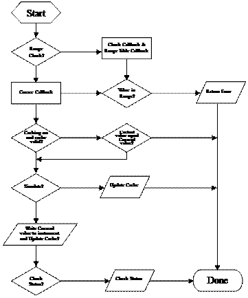

IVI驱动程序的核心是通过**IVI引擎**实现对仪器属性的高效读写。其关键流程包括以下几个步骤：  

1. **属性调用与激活**  
   当用户调用如 `FG300_ConfigureTriangleSymmetry` 的高层函数（用于设置信号发生器的三角波对称性）时，该函数调用底层函数 `Ivi_SetAttributeViReal64`，以设置属性 `FG300_ATTR_FUNC_TRIANGLE_SYMMETRY` 的值，并激发IVI引擎执行后续操作。  

2. **取值范围检查（Range Check）**  
   如果继承属性 `FG300_ATTR_RANGE_CHECK` 的值为 `VI_TRUE`（启用范围检查），IVI引擎调用属性的 `RangeCheckCallBack` 函数，校验输入值是否在属性的合法范围内（由 `RangeTable` 定义）。  
   - 若值超出范围，函数终止并返回错误代码。  
   - 在某些情况下，IVI引擎可能根据配置强制将输入值调整到合法范围内。  

3. **状态缓存检查（State Cache）**  
   如果继承属性 `FG300_ATTR_CACHE` 的值为 `VI_TRUE`（启用状态缓存），IVI引擎会验证当前缓存中的属性值是否已经是目标值。  
   - 若相符，则跳过冗余操作并直接返回结果。  

4. **模拟模式检查（Simulate Mode）**  
   如果继承属性 `FG300_ATTR_SIMULATE` 的值为 `VI_TRUE`（启用模拟模式），IVI引擎直接将目标值存入缓存而不进行任何I/O操作，适用于缺少实际仪器的开发与调试场景。  

5. **属性写入（Callback 操作）**  
   如果上述情况均不成立，IVI引擎调用属性的 `CallBack` 函数，通过实际的I/O命令将目标值设置到仪器。  

6. **状态检查（Query Instrument Status）**  
   若继承属性 `FG300_ATTR_QUERY_INSTR_STATUS` 的值为 `VI_TRUE`（启用状态检查），IVI引擎调用 `CheckStatusCallBack` 函数，读取仪器当前状态以验证设置的成功性。  

#### 1.4.3 具体工作实例  
以调用 `FG300_ConfigureTriangleSymmetry` 函数设置三角波对称性为例，假设设置值为 30（即 30%）：  
1. 调用 `FG300_ConfigureTriangleSymmetry`，触发 `Ivi_SetAttributeViReal64` 函数以设置属性 `FG300_ATTR_FUNC_TRIANGLE_SYMMETRY`。  
2. IVI引擎依次检查是否启用范围检查、状态缓存或模拟模式，并根据配置决定执行路径。  
3. 若所有检查通过，调用 `CallBack` 函数将属性值写入仪器，同时根据配置执行状态检查。  

通过上述流程，IVI驱动程序在灵活性与高效性之间实现了平衡，为测试系统开发人员提供了可靠的工具。  

## 第二章 FG300信号发生器

### 2.1 信号发生器的工作原理

#### 2.1.1 信号发生器的分类  

根据波形生成的原理，信号发生器可分为以下三类：  

1. **模拟信号发生器（Analog Generator）**  
   - **工作原理**：利用积分运算电路和比较运算电路生成三角波与矩形波信号，正弦波通过三角波信号经由二极管和电阻网络的转换获得。  
   - **优点**：成本低，适用于多数常规信号发生需求。  
   - **缺点**：频率精度较低，在低频条件下表现出较大的不稳定性。  

2. **锁相环路（PLL）信号发生器（Phase-Locked Loop Generator）**  
   - **组成电路**：包含电压控制振荡器（Voltage-Controlled Oscillator，VCO）、可编程分频器、基准振荡器、低通滤波器以及相位比较器。  
   - **工作原理**：PLL通过比较基准振荡器输出信号与反馈信号的相位差异调节控制电压，使输出频率与基准频率相匹配。  
   - **优点**：频率精度高，适用于需要高稳定性的场景。  
   - **缺点**：成本较高，频率调整响应速度较慢，在低频状态下性能受限。  

3. **直接数字合成（DDS）信号发生器（Direct Digital Synthesis Generator）**  
   - **工作原理**：将波形样本的数字信息存储于内存中，根据用户选择的波形和频率，以固定时钟频率读取存储的数据，并通过数模转换（D/A）生成模拟信号。  
   - **优点**：采用全数字化方法，克服了传统信号发生器在频率精度和波形稳定性方面的缺陷。  

#### 2.1.2 DDS信号发生器的工作原理  

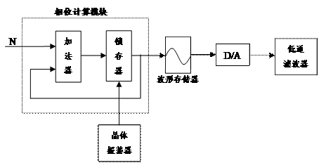

1. **DDS电路结构**  
   DDS信号发生器的核心部件包括：  
   - **晶体振荡器**：提供基准时钟信号。  
   - **相位累加器**：计算波形的相位变化。  
   - **波形存储器**：存储信号波形的单周期样本数据。  
   - **数/模转换器（D/A Converter）**：将数字波形数据转换为模拟信号。  
   - **低通滤波器**：去除D/A转换后信号中的高频成分，确保输出波形平滑。  

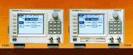

2. **DDS信号发生过程**  

- **步骤 1**：用户选择输出信号的频率 `f_out`，系统计算相位累加器的增量值 `N`，并在晶振基准时钟 `f_clk` 的控制下进行累加。  
- **步骤 2**：相位累加器在每个时钟周期输出一个地址值，指向波形存储器中对应的样本数据。  
- **步骤 3**：波形存储器根据地址信号输出波形数据，D/A 转换器将数字数据转换为对应的模拟信号。  
- **步骤 4**：通过改变相位累加器的增量值 `N`，可以调整波形输出的频率。增大 `N` 时，累加速度加快，波形周期缩短，从而提升输出频率。  

#### 2.1.3 DDS技术优势  
- **频率分辨率高**：由于DDS生成频率是基于数字运算和高精度时钟的，可实现极小频率步进。  
- **输出波形精度高**：内存中的样本数据和数字运算确保了波形的高保真度。  
- **频率切换速度快**：无需调整物理电路即可快速切换频率或波形。  
- **可扩展性强**：通过调整存储器内容，可以支持复杂或自定义波形的生成。  

### 2.2 FG300的主要性能指标  

#### **生产厂家**  
- **品牌**：YOKOGAWA（横河电机）  

#### **波形输出**  
- **输出通道数**：2  
- **支持的波形类型**：  
  - 正弦波  
  - 矩形波  
  - 三角波  
  - 脉冲波  
  - 任意波形  
- **输出信号模式**：  
  - 连续输出  
  - 触发输出  
  - 门控输出  
  - 直流输出  

#### **频率性能**  
- **频率范围**：  
  - **正弦波、矩形波**：1 μHz – 15 MHz  
  - **三角波、脉冲波、任意波形**：1 μHz – 200 kHz  
- **分辨率**：1 μHz（九位数字）  
- **频率精度**：±20 PPM  
- **频率稳定性**：±20 PPM  
- **基准频率**：40.2107 MHz  

#### **输出特性**  
- **最大输出电压**：±10 V  
- **幅值调节范围**：±20 Vpp（分辨率：1 mVpp）  
- **幅值精度**：±（0.8% × 幅值 + 14 mVpp）  
- **幅值频率特性**：  
  - **正弦波**：  
    - ≤100 kHz：±0.1 dB  
    - ≤1 MHz：±0.2 dB  
    - ≤10 MHz：±0.5 dB  
    - ≤15 MHz：±1 dB  
  - **矩形波、脉冲波**（50%占空比）：≤10 kHz：±2%  
  - **三角波**：≤10 kHz：±3%  
- **偏移电压范围**：±10 V  
- **输出阻抗**：50 Ω ±1%  
- **输出衰减**：1/1、1/10、1/100  

#### **调制特性**  
- **调制方式**：  
  - 调幅（AM）  
  - 双边带调幅（DSBAM）  
  - 调频（FM）  
  - 调相（PM）  
  - 偏移调制（Offset Modulation）  
  - 脉宽调制（PWM）  
- **调制波形**：正弦波、矩形波、三角波、脉冲波、任意波形  
- **调制波频率**：1 mHz – 50 Hz  

#### **通用特性**  
- **预热时间**：30 分钟  
- **工作环境**：  
  - **温度范围**：5°C – 40°C  
  - **湿度范围**：20% – 80%  
- **电源要求**：  
  - **电压**：100 – 240 V AC  
  - **频率**：50 Hz – 60 Hz  
  - **功率**：125 W  
- **外形尺寸**：350 × 213 × 132 mm（长 × 宽 × 高）  
- **重量**：5 kg  

### 2.3 FG300的工作原理

FG300是一种基于直接数字合成（DDS）技术的高性能信号发生器，其工作过程如下：  

#### 信号处理流程 
1. **波形数据存储**：  
   FG300将预设的波形数据存储在内置的波形存储器中，支持多种波形类型（正弦波、方波、三角波等）。  

2. **相位递增计算**：  
   - 通过一个48位相位计算器完成相位的递增计算。  
   - 波形存储器的地址与相位计算器的输出值相对应，从而生成对应的波形数据。  

3. **数字信号转换**：  
   - 存储器的数字输出信号通过一个12位的D/A转换器，转变为模拟信号。  

4. **高频谐波滤除**：  
   - 转换后的模拟信号通过滤波器去除高频谐波，确保信号纯净性。  

5. **方波生成**：  
   - FG300中的方波是通过将正弦波信号送入比较器和锁存器生成的。  

6. **通道选择**：  
   - 经滤波后的模拟信号通过多路转换器选择适合的输出通道。  

7. **幅值与偏移调整**：  
   - 模拟信号的幅值和偏移量通过内置调整模块进行精确调节，以满足用户的需求。  

8. **信号放大与衰减**：  
   - 信号经过放大器或衰减器处理，以实现目标输出电平。  

9. **信号输出**：  
   - 最终信号通过FG300的连接器输出至外部设备或负载。  

### 2.4. 编程准备

FG300信号发生器采用**消息型通信方式（message-based communication）**，通过标准化的字符串消息与控制器（如计算机）进行交互。  

#### 消息分类  
1. **程序消息（Program Message）**：  
   - 控制器发送给仪器的消息，用于设置参数或启动特定功能。  

2. **反馈消息（Response Message）**：  
   - 仪器发送回控制器的消息，用于反馈设备状态或测量结果。  

#### 消息结构  
- 每条程序消息可以由多个**消息单元**组成。一个消息单元包含以下部分：  
  - **命令头（Command Header）**：标识操作类型和目标属性，例如设置频率或幅值。  
  - **参数（Parameter）**：为命令提供具体的数值或设置项。  

#### 通信特点  
- **字符串格式**：采用通用的字符串表示形式，便于用户理解和调试。  
- **标准化**：遵循国际通信协议（如SCPI），具备良好的兼容性。  
- **实时性**：支持同步和异步通信模式，满足不同应用场景的需求。  

## 第三章 LabWindows/CVI开发语言  

### 3.1 LabWindows/CVI开发环境简介

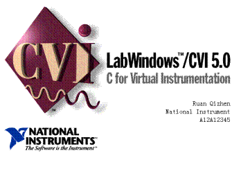

LabWindows/CVI是一种以C语言为基础的开发系统，提供了一个交互式的程序开发环境，专为数据采集与仪器控制设计，广泛应用于测试与测量领域。相较于传统的C语言开发工具，LabWindows/CVI具有以下特点：  

1. **集成开发环境**：  
   提供交互式编程环境，支持代码编写、调试和运行，优化了C语言开发流程。  

2. **丰富的库函数**：  
   CVI内置功能强大的函数库，涵盖数据采集、分析、显示等各个阶段，简化了程序设计。  

3. **仪器控制功能**：  
   包括专用工具和驱动程序，支持多种仪器接口（如GPIB、VXI、RS-232），极大提升了对外部设备的控制能力。  

4. **灵活的兼容性**：  
   可以调用外部C语言模块、动态链接库（DLL）以及LabWindows/CVI特有的仪器驱动程序，实现高度灵活的开发。  

### 3.2 LabWindows/CVI的功能模块  

#### 3.2.1. 数据采集类函数库  
   包含以下关键函数库，用于实现与硬件设备的高效通信：  
   - **GPIB/IEEE 488.2函数库**：支持仪器的通用接口总线协议。  
   - **数据采集函数库**：针对数据采集卡（DAQ卡）提供的接口函数。  
   - **DAQ卡I/O操作函数库**：用于控制和管理数据采集硬件。  
   - **RS-232函数库**：支持串行通信协议。  
   - **VISA库**：提供一种跨平台的虚拟仪器标准接口。  
   - **VXI库**：用于控制基于VXI总线的仪器设备。  

#### 3.2.2 数据分析类函数库  
   LabWindows/CVI在数据处理方面提供了以下工具：  
   - **数据格式转换和标准化函数库**：支持多种数据格式的转换与规范化处理。  
   - **基础数据分析函数库**：涵盖数学运算、统计分析等功能。  
   - **高级数据分析函数库**：提供更复杂的算法，如FFT分析、滤波处理等。  

#### 3.2.3 数据显示类函数库  
   CVI配备了丰富的用户界面开发工具，包括：  
   - **用户界面函数库**：支持图形化界面的设计与交互，用于数据可视化和实时监控。  

#### 3.2.4 网络与信息交换类函数库  
   提供多种通信协议支持，适用于分布式系统和信息交互：  
   - **动态数据交换（DDE）函数库**：实现跨应用程序的数据交换。  
   - **信息交换控制协议（TCP）函数库**：支持基于TCP/IP协议的网络通信。  
   - **X Property控件函数库**：用于访问和修改Windows属性。  
   - **ActiveX控件函数库**：支持ActiveX组件的加载与操作。  

#### 3.2.5 仪器控制类函数库  
   LabWindows/CVI特有的仪器控制库支持多种接口和设备：  
   - 内置支持GPIB、VXI、RS-232等接口的驱动程序。  
   - 提供丰富的现成驱动程序，适配各种常见仪器（如示波器、万用表等）。  
   - 用户可利用LabWindows/CVI的开发工具套件，自定义开发适合特定仪器的驱动程序。  

### 3.3 LabWindows/CVI的优势  

1. **模块化设计**：提供高度分工明确的功能模块，易于快速集成和扩展。  
2. **广泛的硬件支持**：内置驱动支持主流仪器设备，减少开发成本。  
3. **高效的数据处理能力**：内置分析工具和算法库，为复杂的测试与测量提供解决方案。  
4. **友好的开发环境**：通过交互式编程工具和直观的调试界面，提高了开发效率和用户体验。  

### 3.4 LabWindows/CVI程序开发过程简介

LabWindows/CVI的开发过程与其他编程语言类似，但其针对数据采集和仪器控制进行了优化，能够有效提升开发效率和程序性能。以下是开发过程的详细说明：  

#### 3.4.1 程序功能设计 
在编写源代码之前，需要明确程序的功能需求，并设计程序的总体结构。建议将设计方案以文档形式记录下来，包括以下内容：  
- 程序的总体目标和功能说明  
- 各模块的功能划分和相互关系  
- 数据流图或流程图  

#### 3.4.2 LabWindows/CVI的编程基础 
LabWindows/CVI基于ANSI C语言，但在交互性和仪器控制方面进行了增强。因此，开发者在使用CVI之前，应熟悉C语言的基本语法和结构，这为后续开发奠定基础。  

#### 3.4.3 CVI程序的基本结构  
一个典型的CVI程序包含以下主要部分：  
- **用户界面（UI）**：提供与用户交互的图形界面。  
- **主控程序**：协调程序的整体逻辑和模块交互。  
- **数据采集模块**：实现对外部设备的数据获取。  
- **数据分析模块**：对采集的数据进行处理与分析。  

#### 3.4.4 用户界面设计  
LabWindows/CVI的用户界面编辑工具能够轻松制作交互式图形界面，使程序更直观和友好。  
- **UI的功能**：表达程序用途，提供参数设置、数据显示、控制按钮等功能。  
- **设计流程**：从用户界面开始程序开发，根据实际需求确定界面布局，并定义交互元素（如按钮、文本框、图表等）。  

#### 3.4.5 程序框架和代码生成 
LabWindows/CVI能自动根据设计的用户界面生成程序框架，包括以下部分：  
- **回调函数（Callback Functions）**：响应用户界面交互事件的函数。  
- **主函数（Main Function）**：负责初始化用户界面并启动程序的主入口。  

通过代码生成器，开发者可以显著减少编写底层界面调用代码的时间，将更多精力投入到核心功能的开发中。  

#### 3.4.6 主控程序开发  
主控程序是程序的核心部分，负责协调以下模块的工作：  
- **数据采集模块**：调用驱动程序和接口函数实现数据读取。  
- **数据分析模块**：调用分析函数对采集的数据进行处理。  
- **用户界面模块**：控制UI的响应逻辑和交互流程。  

开发者需要根据设计需求手动编写主控程序代码，并可参考LabWindows/CVI自带的示例项目。  

#### 3.4.7 数据采集模块  
LabWindows/CVI为数据采集提供了广泛支持，内置了以下驱动程序和接口函数：  
- **GPIB驱动程序**：实现与GPIB设备的通信。  
- **RS-232驱动程序**：支持串口通信。  
- **VXI驱动程序**：控制基于VXI总线的仪器。  

开发者可以直接调用这些函数完成与外部设备的数据交互。  

#### 3.4.8 数据分析模块  
数据分析是程序开发中的重要部分。LabWindows/CVI提供了强大的数据分析工具，涵盖以下功能：  
- 数据的格式转换和预处理  
- 基本统计分析（如平均值、标准差计算等）  
- 高级分析功能（如频谱分析、滤波等）  

通过结合内置的分析函数库，开发者能够快速完成复杂的信号处理和数据分析任务。  

## 第四章 驱动程序开发步骤

### 4.1 整理仪器属性和用户界面函数

在开发仪器驱动程序时，为了确保不同品牌和型号的仪器可以互换使用，国际IVI协会制定了一系列标准，以规范仪器的控制接口。最为重要的规范之一就是定义了通用的仪器属性和高层接口函数。这些标准定义了如何将不同厂商的仪器功能统一表示和调用。对于信号发生器而言，相关的标准文件为《IviFgen Class Specification》。

#### 4.1.1 《IviFgen Class Specification》概述

《IviFgen Class Specification》文件规定了信号发生器的常见功能，这些功能通常被绝大多数信号发生器所支持。尽管如此，不同仪器在实现这些功能时可能存在差异，包括仪器与计算机之间的通信协议以及具体的指令集。

文件中定义了信号发生器的核心功能，并为开发者提供了统一的接口函数。这些标准化接口函数使得用户无需关心具体仪器的实现细节，只需通过标准的调用方式来控制仪器。

#### 4.1.2 仪器属性与用户界面函数

在驱动程序开发中，仪器的每个设置通常对应一个属性（Attribute）。属性通常表示仪器的一个可配置参数，比如频率、幅度等。而高层函数（Classic Function）则为这些属性提供操作接口，通过这些函数，用户可以方便地获取或设置属性的值。

开发驱动程序时，首先需要理解并熟悉以下内容：
- **仪器的命令体系**：每种仪器都通过一套特定的指令来进行控制。要确保驱动程序能够正确地将用户的请求转换为仪器能够理解的指令。
- **IVI通用属性（Classic Attribute）**：这些属性是IVI标准中定义的，用于描述仪器可配置的各种特性。通过这些属性，用户可以控制仪器的工作状态。
- **用户界面函数（Classic Function）**：这些函数提供了更高层次的接口，简化了用户与仪器的交互。它们隐藏了低层的实现细节，用户只需调用这些函数即可完成各种操作。

#### 4.1.3 确保符合《IviFgen Class Specification》要求

开发驱动程序时，必须确保其实现符合《IviFgen Class Specification》中的要求。这包括：
- **支持标准化的属性和接口**：驱动程序需要支持《IviFgen Class Specification》中定义的属性，并能够正确地处理高层接口函数。
- **实现命令映射**：根据不同仪器的具体实现，开发者需要将通用的IVI属性映射到仪器的实际命令和响应中。
- **确保可互换性**：在设计时要确保，尽管每台仪器的实现方式可能不同，但通过IVI驱动程序，用户仍然可以以相同的方式控制各种品牌和型号的信号发生器。

#### 4.1.4 开发步骤

在实际开发过程中，整理仪器的属性和高层函数通常包括以下步骤：
1. **分析仪器命令体系**：理解仪器支持的基本功能和指令，梳理每个功能所需的属性和命令。
2. **映射标准属性**：将仪器的具体命令映射到IVI标准属性上，以保证兼容性。
3. **实现高层函数**：编写符合《IviFgen Class Specification》的接口函数，确保它们能够处理用户的请求，并与底层命令交互。
4. **测试与验证**：确保驱动程序可以在各种仪器间正常工作，并与计算机系统顺利通信。

### 4.2 使用仪器驱动程序开发向导创建驱动程序文件

#### 4.2.1 启动LabWindows/CVI的驱动程序开发向导

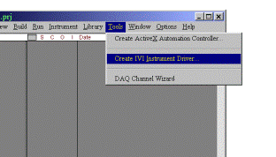

1. 打开LabWindows/CVI主工作窗口，选择“Tools”菜单中的“Create IVI Instrument Driver”选项，启动驱动程序开发向导。

#### 4.2.2 选择仪器驱动程序信息

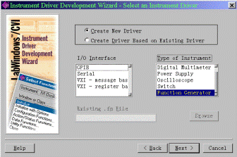

在“Select an Instrument Driver”对话框中，选择相关的驱动程序信息：

1. **新建一个驱动程序**：选择“Create a new driver”选项以创建新的驱动程序文件。
2. **接口类型**：设置接口类型为**GPIB**（General Purpose Interface Bus），这是最常见的仪器通信接口之一。
3. **仪器类型**：选择仪器类型为**信号发生器**（Function Generator）。  
   选择完成后，点击“Next”按钮进入下一步。

#### 4.2.3 填写仪器的基本信息

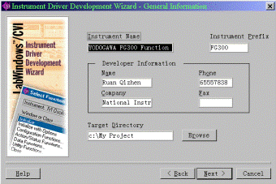

在“General Information”对话框中，填写以下仪器的基本信息：

1. **仪器名称**：“TOKOGAWA FG300 Function Generator”。
2. **仪器前缀名**：“FG300”。
3. **作者姓名及公司信息**：填写开发者的姓名、公司及其他相关信息。
4. **程序存储目录**：指定驱动程序文件存储的目录路径。

点击“Next”按钮继续进行下一步。

#### 4.2.4 填写命令字符串和通道信息

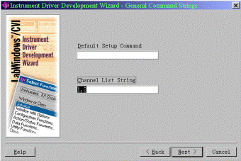

在“General Command Strings”对话框中，填写以下信息：

1. **默认设置命令**：FG300信号发生器可以不需要默认的设置命令，若有特殊需求可根据实际情况进行填写。
2. **通道数**：根据FG300信号发生器的实际情况，填写仪器的通道数，FG300有**两个输出通道**。

完成设置后，点击“Next”按钮进入下一步。

#### 4.2.5 驱动程序文件生成

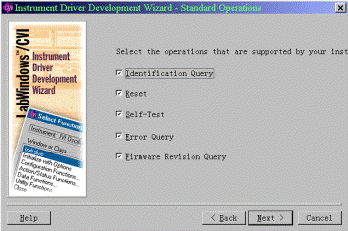

接下来的步骤将继续生成驱动程序的函数接口和其他相关代码。通过向导提供的信息，LabWindows/CVI将自动为用户创建一个适用于指定仪器的IVI驱动程序框架。此框架包括必要的库函数、属性设置、以及与仪器交互所需的其他功能。

### 4.2.6 填写ID查询命令

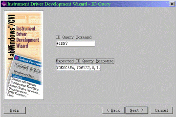

在“ID Query”对话框中，填写用于查询仪器ID号的命令，并指定期望的返回值格式。

- **命令**：填写仪器查询ID号的命令。
- **返回值格式**：根据仪器的返回数据格式，设置所需的返回值类型。

### 4.2.7 填写重置命令

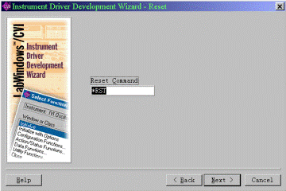

在“Reset”对话框中，填写用于重置仪器的命令。

- **命令**：根据仪器说明书或标准命令规范，填写所需的重置命令。

### 4.2.8 填写自检命令

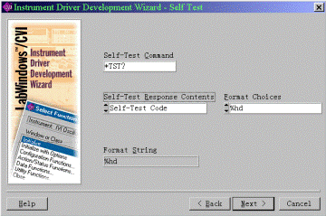

在“Self Test”对话框中，填写自检相关的设置：

1. **自检命令**：在自检命令控制栏中，输入自检命令：`*RST?`。
2. **返回信息**：FG300信号发生器的自检返回信息包含状态码。
3. **格式化模式**：选择通用符 `%hd` 作为格式化模式。

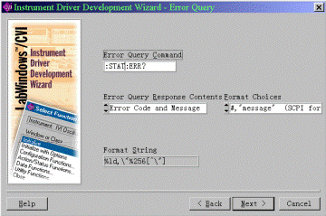

### 4.2.9 填写错误查询命令

在“Error Query”对话框中，填写错误查询命令和返回值的相关设置：

1. **错误查询命令**：FG300的错误查询命令为 `:STAT:ERR?`。
2. **返回值格式**：FG300的错误查询返回值包含错误代码和错误信息。
3. **格式化模式**：选择通配符 `%ld,\ "%256[\"\]` 作为格式化模式。

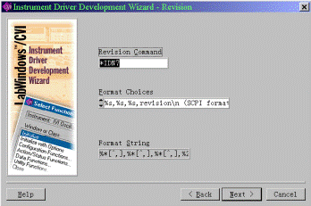

### 4.2.10 填写版本查询命令

在“Revision”对话框中，填写版本查询命令及其格式化模式：

- **命令**：填写FG300的版本查询命令 `*IDN?`。
- **格式化模式**：选用格式化模式 `%x\[^,\],%x\[^,\],%x\[^,\],%256\[^\\n\]`，以匹配仪器的版本信息。

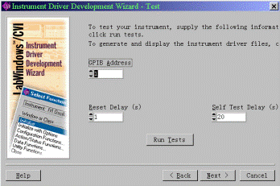

### 4.2.11 测试仪器连接

在“Test”对话框中，测试仪器的连接性和命令是否正常工作：

1. **GPIB地址**：填写仪器的GPIB地址。
2. **复位和自检时间**：填写仪器的复位时间和自检时间。
3. **运行测试**：点击“Run Tests”按钮，LabWindows/CVI将开始检查仪器的连接性和命令响应。

### 4.2.12 完成驱动程序框架生成

点击“Next”按钮，LabWindows/CVI将根据前面输入的所有信息生成适配于FG300的驱动程序框架。这一过程将自动生成包含必要功能的驱动程序代码，包括各种命令、属性设置以及仪器交互功能。

### 4.3 编辑仪器的属性

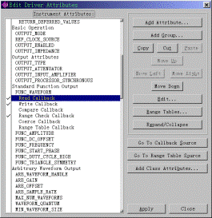

在生成驱动程序框架之后，可以通过**“属性编辑器”**来进一步制定和修改仪器属性。若要访问属性编辑器，可以选择 **Tools** 菜单中的 **Edit Instrument Attributes** 项。

#### 4.3.1 编辑属性的步骤
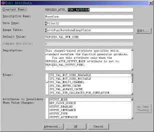

1. **选定属性**：选择需要编辑的属性后，点击 **Edit** 键，或点击 **Add Attribute** 来添加新的属性。这会进入 **Edit Attribute** 对话框。

2. **填写或修改属性内容**：在对话框中，你可以编辑以下内容：
   - **属性名称**：为该属性指定唯一的标识名称。
   - **属性描述**：为属性提供一个简短的描述，帮助理解其作用。
   - **属性的数据类型**：选择适当的数据类型（如整型、浮点型等）。
   - **取值范围**：为属性设置允许的取值范围。
   - **默认值**：指定属性的默认值。
   - **精度要求**：定义该属性需要达到的精度。
   - **属性说明**：简要说明该属性的作用及使用方式。
   - **特殊标志**：标明该属性是否具备特殊处理需求（例如只读、写时更新等）。
   - **属性关系**：如果该属性与其他属性或函数存在依赖关系，可以在此处说明。

#### 4.3.2 编写或修改属性的Callback函数

属性的操作通常需要对应的 **Callback函数**。这些函数负责与仪器进行交互，处理不同的操作需求。每个属性可能涉及到以下六个常见的Callback函数：

1. **Read Callback函数**：用于读取仪器当前的设置或数据。通常包含询问仪器的命令。
2. **Write Callback函数**：用于向仪器发送设置值或数据，通常由设置命令构成。
3. **Compare Callback函数**：用于比较属性的当前值与目标值，判断是否发生变化。
4. **Range Check Callback函数**：检查赋给属性的值是否在允许的取值范围内。
5. **Coerce Callback函数**：将赋给属性的值强制转换至合适的范围内。
6. **Range Table Callback函数**：为仪器当前状态选择最合适的取值范围表。

在 **Edit Driver Attribute** 对话框中，选择需要编辑的 Callback 函数，并点击 **Go To Callback Source** 按钮，即可直接跳转到源代码进行修改和完善。

#### 4.3.3 删除无用的属性

在使用驱动程序开发向导生成的初步驱动程序框架中，可能会包含一些FG300信号发生器不需要的属性。这些多余的属性应该在编写和调试驱动程序时进行删除，以简化代码结构并确保程序高效运行。

### 4.4 编辑或创建高层函数

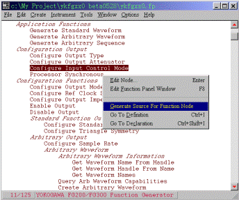

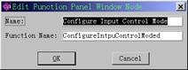

在使用仪器时，用户通常需要一次性设置多个相关的属性，而不是单独设置某个属性。因此，IVI驱动程序提供了高层函数，以便用户能够高效地完成这一任务。一个高层函数通常由多个设置仪器属性的低层函数组成。

要编辑或创建高层函数，用户需要操作 **“Function Tree”**，该树列出了所有的高层函数。每个结点在函数树中代表一个高层函数。可以按以下步骤修改现有函数或创建新函数：

1. **编辑现有结点**：右键点击需要修改的结点，或在 **Create** 菜单中选择 **Function Panel Window**，以创建新的结点。这将进入 **Edit Node** 对话框，在该对话框中可以编辑结点名称及其对应的函数名。
   
2. **设计函数面板**：为了帮助用户更好地理解和使用函数，CVI为每个函数设置了一个函数面板。面板列出了函数的所有参数，并提供了简要说明。我们需要为自己编写的函数设计一个类似的函数面板，以便用户能够轻松理解并使用高层函数。

3. **生成源代码**：如果选中的结点是新创建的，需要选择 **“Generate Source For Function Node”** 为该函数生成源代码。如果源代码已经存在，可以直接选择 **“Go To Definition”** 跳转至源代码进行编辑。

4. **编写源代码**：根据函数的具体需求，编写源代码并将其与结点对应。

### 4.5 创建驱动程序文档

为了便于用户了解和使用驱动程序，CVI为每个程序生成了两种不同的说明文档。这些文档不仅包括程序的基本功能说明，还详细描述了函数的使用方法和参数设置。这些文档可以帮助用户快速上手并确保正确使用驱动程序。

