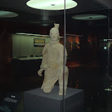

    虽然在西安的工作计划安排的蛮紧张的，但我还是抽出了一上午的时间，和同事一起去了一趟兵马俑。来西安不去看看兵马俑就太遗憾了。虽然在电视上看过无数次了，但是真的看到两千年前的陶像站在眼前，还是被他们一下子震撼住了。对于两千年前的科技而言，这是项多么浩大的工程啊。而且居然史料中没有记载。  
    我给兵马俑们拍了些照片，出门的时候才注意到，这里不须使用闪光灯，我拍照的时候都没注意，真是不好意思。游客们大多开着闪光灯，工作人员也不说提醒一下。

    西安有我几个亲戚，这次去，见到了一个我以前从未见过的远房表妹。临走的前一天晚上，她和她男朋友还特意带我参观的西安的大雁塔。他俩对西安的文化景点了解也不多，说不清大雁塔的历史，不过据我观察，这个塔大概是跟唐僧玄奘有点联系。  
    真正吸引我的还是大雁塔北广场的音乐喷泉，据说这是世界最大的音乐喷泉广场。我本来没计划晚上出来逛的，所以穿的比较少。而西安的晚上还是相当冷的，我们七点多就到了，一直熬到八点半喷泉表演才开始。  
    第一支乐曲《重返心灵花园》，是我最喜欢的曲目之一。看来喷泉的设计师还是比较有品位的。为此我觉得冻了一个多小时还是值得的。在喷泉广场也拍了两张照片，但是当时只有手机，效果差了些。
```
<table style="width:194px;"><tbody><tr><td style="height:194px;" align="middle"><a href="http://picasaweb.google.com/ruanqizhen/200711"></a></td></tr><tr><td style="font-size:11px;font-family:arial,sans-serif;text-align:center;"><a style="font-weight:bold;color:#4d4d4d;text-decoration:none;" href="http://picasaweb.google.com/ruanqizhen/200711">2007.11 西安之行的相册</a></td></tr></tbody></table>
```