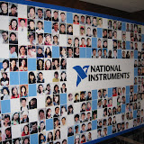

    今年是NI上海分公司成立的第十个年头。昨天，公司在举办了一次隆重的庆典。庆典分两部分：

    下午的活动地点在金茂一楼音乐厅。第一环节，领导讲话。除了上海的大老板，这次还有几位总部的VP特地赶来参加庆典。  
    之后，几位员工代表回顾了自己在公司里的往事以及自己对公司的感受。这一环节的形式颇有点像《艺术人生》。（我从来没看过《艺术人生》这个节目，只是看过朱军和冯巩在春节晚会上的小品。至于小品和真实节目是否有差距就不得而知了）  
    接下来，是新员工展示我们产品。有点类似电视直销节目中，模特托着手机、笔记本等那种感觉。看完本节目，发现公司这两年还真是招了不少帅哥美女啊。  
    再下面是一个展现公司十年发展的小品剧。  
    最后一个环节是颁奖。所有在公司工作超过十年的中国区员工都得到了一个“十年成就”奖杯。我自己也得到了一个“良师益友”奖。这个奖是员工投票选举的，说明我人缘还不错啦:)（要特别感谢投了我票的同事们，谢谢你们的鼓励！）

     第二部分就是晚宴啦，在金茂二楼宴会厅举办。这次晚宴，公司还特地邀请了一些已经离开公司的老员工回来参加。我和大多数老同事都还保持着联系，不过老友重聚还是感触颇多的。

    下面是我的相册。有些照片我和同事的合照，没得到人家授权，不敢公布:)
```
<table style="width:194px;"><tbody><tr><td style="height:194px;" align="center"><a href="http://picasaweb.google.com/ruanqizhen/20080310"></a></td></tr><tr><td style="font-size:11px;font-family:arial,sans-serif;text-align:center;"><a style="font-weight:bold;color:rgb(77,77,77);text-decoration:none;" href="http://picasaweb.google.com/ruanqizhen/20080310">2008.03 公司10周年庆典</a></td></tr></tbody></table>

其他同事的相册：  
    [http://cid-8e722c4178b3fbd7.spaces.live.com/Photos/cns!8E722C4178B3FBD7!340](http://cid-8e722c4178b3fbd7.spaces.live.com/Photos/cns!8E722C4178B3FBD7!340 "http://cid-8e722c4178b3fbd7.spaces.live.com/Photos/cns!8E722C4178B3FBD7!340")  
    [http://cindydoris.spaces.live.com/photos/cns!31B3D9BFA6DFB5B5!1133/](http://cindydoris.spaces.live.com/photos/cns!31B3D9BFA6DFB5B5!1133/ "http://cindydoris.spaces.live.com/photos/cns!31B3D9BFA6DFB5B5!1133/")  
    [http://liudibo.spaces.live.com/photos/cns!ED3FFE7293541AAC!209](http://liudibo.spaces.live.com/photos/cns!ED3FFE7293541AAC!209 "http://liudibo.spaces.live.com/photos/cns!ED3FFE7293541AAC!209")  
   


```