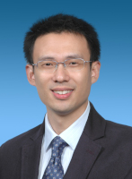

## 动车
    自从铁路开通动车以来，它便成为我短途旅行的首选交通工具。尽管我乘坐动车的次数并不算多，但每次的体验总能带来惊喜。这次从上海到南京的旅程，我们选择了上海直达南京的动车。

火车刚刚驶离上海站，时速便迅速攀升至250公里/小时。上海到南京的铁路全长约280公里，按这一速度推算，一个小时多一点就能到达南京。不得不感叹，如今的铁路运输实在方便快捷。相比十年前，我在南京读书时，从南京到无锡需要坐三个半小时的火车，那时的火车速度甚至比汽车还慢。因此，沪宁高速开通后，我曾经更倾向于选择汽车客运往返南京和无锡。

然而，这次动车的速度却并未完全保持在高水平。一出上海地界，列车速度便降至150公里/小时左右，最终花了整整两个小时才到达南京。与动车之前的T字头直达列车相比，这样的速度提升并不显著，因为T字头列车同样需要两个小时到达南京。

同行的老贺是一位德国朋友，他提到德国的高速列车通常能达到350公里/小时，与磁悬浮列车的速度相差无几。然而，他也指出，磁悬浮列车目前仍面临诸多技术和实用性问题。因此，尽管德国是磁悬浮技术的先驱，至今也未能实现商业化应用。

## 神奇相片

挑选简历时，人力资源部门的同事翻看了一份简历，随即摇头说道：“这个人绝对不行。找工作是人生大事，他连一张好照片都不肯拍，态度太敷衍了。”

我接过简历一看，果然，照片上的小伙子显得毫无精神：头发蓬乱，衣着随意，表情呆滞。既然HR已经下了结论，这份简历自然被放到了一旁。

从几百份简历中挑选出不到十分之一来参加面试，这本身就是一个极其严苛的筛选过程。任何小瑕疵都可能成为淘汰的理由。就像刚才那份简历，面试官很可能会因为照片问题质疑求职者的态度不认真，进而联想到他工作的态度是否也同样敷衍。尽管工程师并不是凭外貌录取，但至少照片应该干净整洁，传递出积极的形象。否则，还不如不附照片。事实上，大多数递交的简历都没有附上照片。

与这种随便对付的照片相反，现在许多求职者的简历照片都经过电脑精心美化。最早将这种服务商业化的是上海的“神奇照相馆”。据说，他们拍摄并处理过的照片，既保留求职者本人的特征，又让照片比真人更具吸引力。从祛除青春痘到调整肤色、脸型甚至表情，每个细节都经过精心雕琢。
    这一服务推出后立刻受到毕业生的热烈欢迎，甚至在上海高校中“无人不知”。他们生意最红火的时候，想拍一张“神奇照片”得提前几个月预约。如今，类似的服务在各地都已普及，南京自然也不例外。尽管如此，我仍习惯将这类服务统称为“神奇相馆”和“神奇相片”。最近，我老婆博士快毕业了，也嚷嚷着要去当地一家神奇相馆给毕业证拍张照呢。

其实，我自己也有一张“神奇相片”，是两个月前公司统一拍摄的。当时，公司特意邀请了两位神奇相馆的摄影师为参加NI Days活动的员工拍宣传照。
    我是公司里著名的小眼睛。有一次，几个同事一起玩“杀人游戏”，大家闭着眼睛的时候，“法官”说：“杀手请睁眼……杀手，你把眼睛睁开啊！”。结果大家忍不住嘿嘿笑出了声，全都知道我是“杀手”了。  
    这次拍照的时候，摄影师也是一个劲的要我瞪大眼睛，同时他又要求我咧开嘴笑。我也不知道我脸上的神经和肌肉是如何搭配的，总之，瞪大眼就咧不开嘴；咧开嘴就瞪不大眼。我在那呲牙咧嘴半天，可是乐坏了了一帮在旁边凑热闹的Marketing小姑娘们。  

最后拿到照片时，我颇有些失望：既不比真人好看，也没有比其他照片更帅。或许是因为我的长相确实“神奇”到无从改善了吧？虽然由于时间冲突未能参加 NI Days，但这张“神奇相片”却成了一个纪念。

## 面试

今年来南京招聘时，宣讲会的参与人数和收到的简历数量比往年都有明显增加。更令人欣喜的是，进入面试的同学整体表现也优于往年。然而，由于地理和资源的限制，我们从南京录取的人数注定会低于上海。这对我而言，始终是个遗憾。在众多表现优秀的候选人中，只能挑选少数人进入下一轮面试，这无疑是一个让人纠结的过程。

这次，我们软件部门的南京面试有些特别。我们安排了两位面试官：我和老贺。老贺是德国人，来中国不到一年，只能用英语与面试者交流。在发面试通知时，就有同学打电话来询问，是由中国面试官还是外国面试官负责。不过，我们在电话中并未明确告知面试官会是谁。估计很多接到通知的同学都会开始琢磨如何用英语自我介绍了。

第二天，我们到达预定的面试教室时，已经有两位同学早早等在那里了。其中一位发现将要由老贺面试他，立刻趴在门边，开始在那捶墙。

老贺的英语带着浓重的德国腔调，我刚认识他时，听他说话也需要集中注意力。能够与他流畅交流的同学，英语水平显然已经相当优秀。幸运的是，现在的学生整体英语能力不错。事实上，老贺面试了十几位同学，只有少数几人无法交流。

相比之下，我显然更受同学们的欢迎。虽然无论被谁面试，最终的结果可能差别不大，但被我面试会轻松许多：至少不用一边组织英文词汇，一边回想自己要说的内容。而且，我一直认为，面试不必搞得像一场紧张的考试，也能筛选出优秀人才。因此，我尽量让面试过程轻松自然，避免让候选人感到为难或尴尬。

每次面试结束前，我都会问候选人是否有任何问题或反馈。有趣的是，这次有两位来自南大的同学提到，面试时间太短了，还没完全展示自己的能力，时间就到了。或许，我们可以考虑适当延长面试时间。硬件组的面试时间比我们长一些。然而，我也认为，在有限的时间内展示自己是一种能力。如果与面试官谈了半小时还无法体现自身优势，再多半小时可能也难有本质性的改变。 

## The Brightest and The Best

这是我们公司的招聘口号：我们寻找“最聪明且最优秀”的学生。尽管我从未深究这句话是否意指“同时最聪明又最优秀”的人，还是分别指“最聪明的”和“最优秀的”两类人，但其核心含义无外乎就是招揽“最好”的人才。不过在实际招聘中，由于“最聪明”相比“最优秀”更容易量化和界定，它往往成为更显著的评判标准。

关于招聘时该选什么样的人，我自己也反复思考过。我认为，一个组织如果全是“最聪明”的人，未必是最优的组合。因为这些人通常希望从事能够最大化体现其个人价值的工作，他们的兴趣和意愿往往高度重叠。这种情况下，很难形成最有效的任务分配方案。

我们可以观察到，学生们参加数学、电子科技等竞赛时，最聪明的几个人通常不会扎堆组队，而是各自领衔不同队伍。这是因为“最聪明”的人之间更倾向于竞争而非合作。在一支成功的竞赛团队中，可能一个人专注于解决核心难题，另一个人负责整理文档，还有人承担琐碎事务。这样的分工协作，反而能带来最佳的团队表现。如果每个人都只专注于技术难题，整体成绩可能会大打折扣。

在一个规模化的组织中，总会存在不同层次的工作需求。有人需要攻克最具挑战性的难题，也有人需要安心从事重复度高、对“聪明才智”要求较低的工作。这两类任务对组织而言同样重要。因此，最佳的招聘策略并不是仅寻找“最聪明”的人，而是录用那些在特定领域具有突出优势的人，并充分发挥其专长。

一个优秀的团队需要多样化的人才组合：有人特别聪明，有人吃苦耐劳，有人细心严谨，有人善于沟通，还有人具备卓越的组织和领导能力。然而，在现实招聘中，大公司的选拔往往层层筛选，只要面试官在任何一轮中发现明显的缺点，候选人可能就会被淘汰。最终被录取的，往往不是那些优点最为突出的“天才”，而是缺点最少、最不容易被挑剔的人。

有一次在宣讲会中，一位同学针对这个口号就行了提问：“很多用人单位都说要找最适合的人，而你们为什么强调要找最优秀的人？”我想，从企业的角度来看，大多数用人单位实际上都希望找到最优秀的人才，只是“优秀”的人才往往对企业的期望也更高。坦率讲，并不是每个企业都具备吸引和留住顶尖人才的条件，这也决定了并非所有公司都敢公开宣称自己要找“最优秀的人”。相比之下，一些企业会更倾向于强调“适合”这个概念，既是为了显得务实，也是为了避免无谓的期待管理。当然，不论哪家公司，在发给应聘失败者的拒信中，都一定会说明：“你未能通过并非因为你不够优秀，而仅仅是因为你与我们企业的需求不完全匹配。”

## 匆忙

这次南京之行安排得异常紧凑，因为我急着回上海收拾行李，几乎没有给自己留出任何游玩的时间。

第一天刚到南京，就立刻投入招聘宣讲会的准备。宣讲内容主要是公司和职位介绍，我已经讲过很多次，但若是再让我讲，还是得花些时间准备。好在这次同行的两位同事非常积极，主动承担了演讲部分，我只需要做些辅助性的杂务，稍微轻松了些。然而，晚上挑选简历的任务却一点也不轻松。一大摞简历反复筛选，看到凌晨一点多才终于把需要面试的名单确定下来。

第二天的安排相对松散些，白天的面试结束后，没有额外的工作任务。几个同事听我介绍南京的主要景点后，决定去总统府西侧的1912街区转转。这个地方和上海的新天地类似，以酒吧和西餐馆为主，是近年来全国许多城市效仿的新型休闲娱乐区。在去的路上，同事给我讲了个笑话：几个月前，他出差大连，想找酒吧放松一下，却发现路边的酒吧门口总有浓妆艳抹的女人，看上去像是提供特殊服务的地方，让他不敢轻易进去。无奈之下，他向巡警询问大连有没有正规的酒吧，巡警回答：“有啊，很多。”当他进一步解释说想找个单纯喝酒聊天的地方时，巡警想了想说：“那就没有了。”
我自己对喧闹的酒吧并无兴趣，于是将他们送到目的地后，便独自回酒店处理邮件。事实证明，提前休息是明智的，因为第三天的行程几乎把我累垮了。

在南京的最后一天，也是最忙碌的一天。早上起床后，先收拾需要寄回上海的行李。由于酒店的商务中心要九点才开门，而我们八点半前就得赶到学校，只能放弃早上退房的计划。然而酒店规定必须在中午前退房，否则会加收费用。于是，我们中午不得不抽时间赶回酒店快递三个纸箱，办理退房手续，再把随身行李寄存在大堂。中午时间紧张，只能随便吃个汉堡应付一下，然后继续下午的面试工作。

下午五点半面试结束后，我们必须赶上七点的返程动车。本以为时间还算宽裕，但不巧的是，这时正值南京出租车司机交班的高峰期，路上的出租车几乎全是空车但不载客。我们在新街口附近等了二十多分钟也没拦到车，不敢再耽误时间，只能决定步行回酒店取行李。

从学校到新街口的这段路，我大学时期走过无数次，但从未像这次走得如此匆忙。老贺迈开大步疾走，我不得不加快步伐才能跟上，步频估计已经接近竞走了。十分钟后，我们到达酒店，我的衬衣已经完全湿透，而穿着西装的老贺却依然神采奕奕，几乎没出汗，让我不得不佩服他的体能。

取了行李后，我们放弃继续打车，直接选择地铁。南京地铁不像上海那么繁忙，从新街口到火车站的距离并不远。最终，我们六点半就赶到了火车站，还有时间快速解决晚餐。候车室里只有两家快餐店——肯德基和永和豆浆。老贺已经连吃两天汉堡，死活不肯再进肯德基，于是我们选择了永和豆浆。虽说永和豆浆在中国人心目中的地位大概相当于肯德基在美国人心中的地位，但对我来说，填饱肚子才是最重要的。老贺趁我点餐时溜出去，不知从哪里买了两罐青岛啤酒。

直到坐上火车，安稳地倚靠在座位上，我们才终于松了一口气。手中有啤酒，身边有朋友。  

## 讨厌坐飞机

接到去南京招聘的任务，我心情非常好。不仅因为南京是我的大学所在城市，也是因为去南京只需要坐火车。相比之下，凡是需要乘飞机的差旅任务总让我感到头疼。虽然我不会因为讨厌飞机就推辞工作，但每次登机前，总是会涌起一丝不安。然而，这篇文章正是在飞机上写的——从南京回来匆匆整理了行李后，我又踏上了另一段旅程。

公司新员工培训有一条关于“Professional”（专业精神）的例子：即便不喜欢乘飞机，若工作需要，依然会毫不犹豫地去做。这让我感到些许安慰，看来讨厌坐飞机的同仁还真不少。

据说这种对飞行的天然抗拒源于人类祖先的遗传记忆——只要双脚离地，就会本能地感到不安。远古时期，人类的祖先栖居在树上，掉下来的经历估计不少，积累了长达几百万年的“心理阴影”，而我显然从遗传里分得了多一些的“份额”。虽然理智上知道飞机事故的概率比中大彩还低，但每当想到即将登机，我还是会不由自主地紧张。坐公交车时，无论司机怎么风驰电掣，我都能淡定自如；可在飞机上，只要稍有颠簸，手脚便开始冒汗。一些乘客一上飞机就喜欢脱鞋，或许也是为了缓解类似的不适感吧。

这种持续的紧张，让这次从上海到旧金山的10个小时飞行显得尤为漫长。比起以往从南京坐近40小时火车回齐齐哈尔，我竟觉得这段旅程更难熬。飞机上最好的放松方式就是睡觉。然而，从上海到旧金山的飞行时间是白天，我几乎无法入睡。相比之下，从旧金山到奥斯汀的航班正好是上海时间的后半夜，我总算可以小憩片刻。真是羡慕那些不论何时何地都能酣然入睡的人。

除了睡觉，我通常会靠看电影消磨时间。然而，飞机上的电影往往选择有限，画质和音效也差强人意。为此，这次我特意带上纸和笔，打算在飞机上写点东西。事实证明，这个决定非常明智。正因为有了这 10 个小时的飞行时间，我得以将这次招聘的点滴记录得格外详尽，也算是为这趟长途飞行找到了一点意义。

