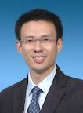

南京招聘之二

    挑选简历的时候，人力资源部门的同事拿起某份简历看了看，摇摇头说：“我绝不会要这个人的。找工作也是人生大事，他都不肯为了简历认认真真拍一张照片。”  
    我接过简历一看，果然，照片上的小伙一副没精打采的模样：头发蓬松、衣服凌乱、表情呆滞。既然人力资源部都发话了，我还有什么好说的呢，这份简历只好靠边站了。

    从几百份简历中挑选出不到十分之一来面试，是个相当苛刻的选取过程，稍有点瑕疵的简历都可能被淘汰。比如，刚才那份简历，面试官从中感觉你找工作的态度不认真，很可能就会怀疑你工作的态度是否也不认真。虽然工程师不是凭相貌录取的，但照片至少也应当干净利索，否则还不如不要照片。实际上，我们收到的大多数简历都没有附照片。

    与随便对付一张照片相反：现在很多同学的简历上的照片是经过电脑美化处理的。最早把这一想法做成产品的是上海的神奇照相馆。据说经他们拍摄处理过的照片与真人对照时，可以一眼就确认他们是同一个人，但照片就是比真人好看得多。在电脑上进行图像处理时，从青春痘到肤色、脸型、表情等，都可以被他们修改、雕琢到最佳状态。  
    这一服务一经推出，就立刻受到了广大毕业生的欢迎，在上海的高校中无人不知。他们生意好的时候，顾客要拍一张神奇照片得提前几个月去排队。现在开办这一业务的远不止一家相馆了，南京显然也有了类似的服务，不过我还是把它们统称为“神奇相馆”和“神奇相片”吧。最近，我老婆博士快毕业了，也正嚷着要去她们那儿的某家神奇相馆给毕业证拍张照呢。

    我自己也有一张神奇相片，是两个月前，公司统一拍的。当时公司特意请了两位神奇相馆的摄影师来公司，为每位参加NI Days活动的员工拍摄宣传用的照片。  
    我是公司里著名的小眼睛。有一次，几个同事一起玩杀人游戏，大家闭着眼睛的时候，“法官”说：“杀手请睁眼……杀手，你把眼睛睁开啊！”。结果大家忍不住嘿嘿笑出了声，全都知道我是“杀手”了。  
    这次拍照的时候，摄影师也是一个劲的要我瞪大眼睛，同时他又要求我咧开嘴笑。我也不知道我脸上的神经和肌肉是如何搭配的，总之，瞪大眼就咧不开嘴；咧开嘴就瞪不大眼。我在那呲牙咧嘴半天，可是乐坏了了一帮在旁边凑热闹的Marketing小姑娘们。  
    最终拿到照片的时候，我感觉也不怎么神奇嘛：既不比我真人好看，也不比我其他的照片更帅。莫非我的尊容实在没法再改了？  
虽然后来由于时间冲突，去不成 NI Days 了，不过我过几天可以把照片传上来，让大家也欣赏一下我的神奇照。
```
<table style="width:auto;"><tbody><tr align="left"><td><a href="http://picasaweb.google.com/lh/photo/jpMwgXKj1XVB3UmqCjx74g"></a></td></tr><tr align="center"><td style="font-family:arial,sans-serif;font-size:11px;"><a href="http://picasaweb.google.com/ruanqizhen/200809">我的神奇照</a></td></tr></tbody></table>

[《生活随笔》目录](mmm2008-07-24_12.50/Blog/cns!1pU-rgQVTuuWM1TX8W8PfmDA!1123.entry)
```