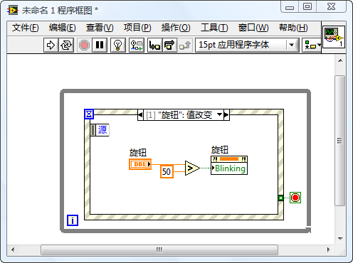
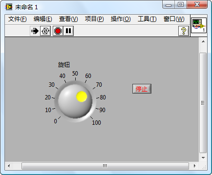

今天在MSN群上看到有人讨论这个属性，于是自己也研究了一下。以前还真没用过这个属性。

设置了闪烁属性后，程序在运行时，控件的颜色会不断变化。比如说一个文本框控件，它的底色会不断的在白色和红色之间切换。控件不停闪烁可以引其别人注意，在程序中，正好可以利用控件的这一特性进行报警。界面上，如果某一控件的值超出了预定范围，让它闪烁起来就可以提醒用户注意了。

  
图3：在LabVIEW选项对话框中的前面板页面上，可以设置闪烁的频率；在颜色页面上可以设置闪烁的颜色

下载示例：[http://bbs.gsdzone.net/showtopic-482.aspx](http://bbs.gsdzone.net/showtopic-482.aspx "http://bbs.gsdzone.net/showtopic-482.aspx")

返回[《我和LabVIEW》补充与注释](mmm2009-09-01_09.47/blog/cns!5852D4F797C53FB6!4402.entry)
