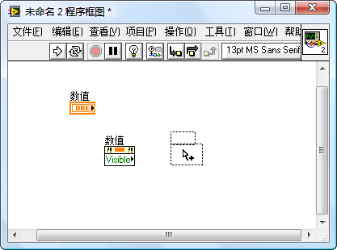
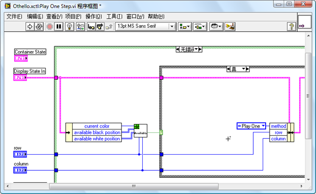
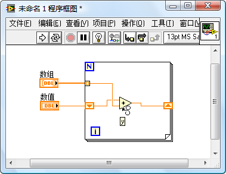

LabVIEW中有众多的快捷键，这些快捷键可以大大加快编程速度。不过记住这些快捷键本身也是个挑战，比如说我吧，我只能记住几个最常用的快捷键，比如 Ctrl+C，Ctrl+V 等。我编程序主要还是依赖鼠标，单一个鼠标应付各种工作还是显得有些吃力的，编程速度可能没有熟练使用快捷键那么迅速。编的程序多了，不经意间就发现了一些鼠标配合Ctrl键的妙用，于是就把最有用的几种用法记录下来了。

#### **复制对象**

在前面板或程序框图上选中一个或多个对象（控件、接线端、函数等），然后拖动鼠标到另一个位置。这时如果按下Ctrl键，光标的箭头旁就会出现一个加号，表示这时的操作变成的复制，而不再是移动对象了。先松开鼠标，再松开Ctrl键，就会在光标的新位置上放置一个选中对象的副本。这种复制对象的方法比使用 Ctrl+C，Ctrl+V 还便捷。这个方法还可以复制一些使用 Ctrl+C，Ctrl+V 无法复制的对象，比如对控件的属性节点和调用节点。

  
图6：交换位置后的程序框图

#### **翻看选择结构、事件结构、层叠式顺序结构的页面**

以选择结构为例：它每次只能显示一个页面，也就是一个条件处理分支。如果需要查看下一分支或上一分支的代码，可以把光标移动到条件结构内部的空白处，按下Ctrl键，然后滚动鼠标滚轮。每滚一下，条件结构就会切换显示一页。
