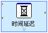

LabVIEW自带的子VI中有一些VI的图标看起来与普通子VI的不太一样，这就是Express VI。大部分Express VI可以在函数选板“Express”中找到。

从函数选板上直接就可以看出哪些VI是Express VI，它们的共同特点是图标周围有一圈浅蓝色的边框。如图1中的“时间延迟”和“已用时间”VI。

   
图2：“时间延迟”Express VI和它的对话框

Express VI的功能强大、使用便捷，但付出的代价是效率较低。应用程序的功能可能比较简单，但是它所调用的Express VI中却包含了大量应用程序根本用不到的功能。这部分功能既占用内存空间，又会影响程序的运行速度。所以，对于效率要求较高的程序，不适合使用Express VI。

返回[《我和LabVIEW》补充与注释](blog/cns!5852D4F797C53FB6!4402.entry)
