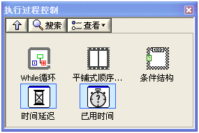
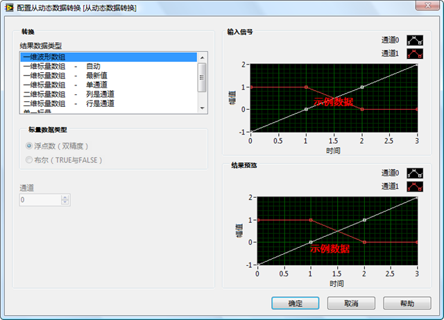
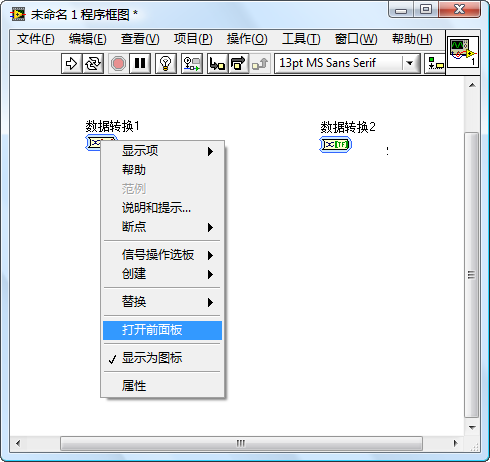
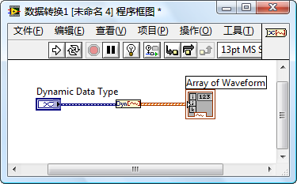
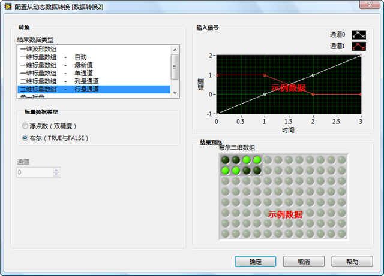
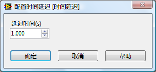
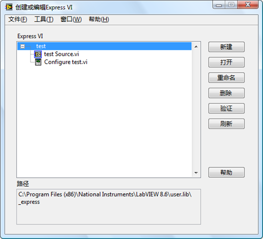
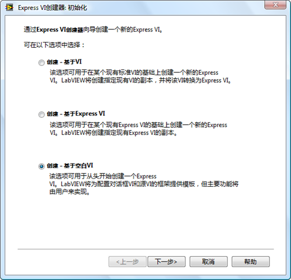
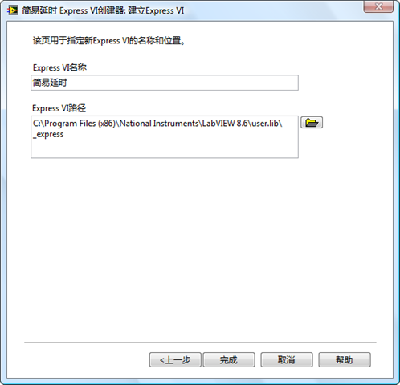

更新内容在： https://lv.qizhen.xyz

## 什么是 Express VI

LabVIEW自带的子VI中有一些VI的图标看起来与普通子VI的不太一样，这就是Express VI。大部分Express VI可以在函数选板“Express”中找到。

从函数选板上直接就可以看出哪些VI是Express VI，它们的共同特点是图标周围有一圈浅蓝色的边框。如图1中的“时间延迟”和“已用时间”VI。

图2：“时间延迟”Express VI和它的对话框

Express VI的功能强大、使用便捷，但付出的代价是效率较低。应用程序的功能可能比较简单，但是它所调用的Express VI中却包含了大量应用程序根本用不到的功能。这部分功能既占用内存空间，又会影响程序的运行速度。所以，对于效率要求较高的程序，不适合使用Express VI。

## 工作原理

普通的子VI有前面板和程序框图。子VI前面板上的控件定义了这个子VI所使用的参数；程序框图上的代码实现了这个子VI的功能。在某个VI程序框图上，双击一个普通子VI的图标，可以打开子VI的前面板；按住Ctrl键再双击子VI的图标可以同时打开它的程序框图。

Express VI 的行为与普通子VI有所不同：在程序框图上双击一个Express VI的图标，弹出的是一个配置对话框。应用软件中的大量普通子VI都是有程序员自己开发的，因此，他需要打开子VI的前面板与程序框图进行编辑。而Express VI通常是LabVIEW或LabVIEW工具包自带的，不需要普通程序员去创建或修改一个Express VI，因此程序员一般也不需要看到它内部的代码。一个Express VI 通常会集成多种功能，因此程序员在使用它时，需要方便的打开Express VI 的配置对话框，根据自己的需要，选则适合的配置参数。

普通的子VI的程序框图等被保存在一个.vi文件中，而你是看不到程序中使用到的某个Express VI的.vi文件的。对于普通子VI来说，不论在应用程序的哪个地方调用它，或是哪个应用程序来调用它，所执行的代码都是相同的，就是保存在.vi文件中的程序框图。对于Express VI来说，却不是这样。程序员可以修改Express VI配置对话框中的内容，配置一旦被改变，Express VI的执行代码也会发生变化。因此，在不同的地方调用同一个Express VI运行的代码却可能是不同的。这也就决定了Express VI的程序框不不能被保存在单一的一个.vi文件中。实际上，Express VI的程序框图是被保存在调用它的VI的.vi文件中的。比如说某个VI名为A，它被保存在A.vi中。A调用了一个Express VI，B。则B的程序框图也被保存在A.vi中。只不过咱们没办法直接看到B的程序框图。

有些Express VI是允许用户查看其程序框图的（有些不提供这一功能）。在一个 Express VI 的右键菜单中选择“打开前面板”，LabVIEW会把Express VI转换成不可配置的普通子VI，这样它就有了可以打开的前面板和程序框图。

以“从动态数据转换”Express VI 为例（函数选板“Express –> 信号操作 –> 从动态数据转换”）。在某一VI的程序框图上放置两个“从动态数据转换”Express VI，分别命名为“数据转换1”和“数据转换2” 。对“数据转换1”Express VI的配置是“结果数据类型”为“一维波形数组”，如图1所示。

图5：“数据转换2”的程序框图

## 优缺点

LabVIEW的相当一部分用户并不是计算机软件相关的专业人士，他们并不擅长编写复杂的程序。因此，LabVIEW也想尽办法，降低编程难度，以满足非计算机专业人士的需求。  
降低编程难度的手段之一，就是使用简单的参数配置来代替复杂的程序逻辑。比如完成某一功能，如果仅仅是某一面板上选择几个参数，肯定要比在程序框图上编写代码来的容易。

为了简化程序员的工作，LabVIEW把测试领域常用的功能集成到了几个功能极为强大的子VI中。子VI的功能越复杂，所需的各类数据就会越多。比如，程序中常会需要产生一个波形数据，LabVIEW为编程者提供了一个产生波形数据的子VI。产生一个波形需要编程者提供很多具体的参数，比如波形的类型、频率、幅值、相位、采样率、采样数等数十个数据。如果以一个普通子VI的方式来提供这些功能，这个VI需要有数十个接线端。这会使得使用它的程序框图显得杂乱无章，降低了程序的可读性。更严重的是，编程者也很难在程序还未运行之前就设计好每个数据具体的值。这样就增加了编程的复杂度。  
而实际上，在用户的程序中，这十几个参数并不需要都是变量，对于一个特定的程序，它可能只需要产生某个固定的波形，或固定的频率、幅值等。程序只需要一些简单的功能，在这种情况下，使用功能复杂的大VI并不能简化程序的开发。  
Express VI正是为了解决这一矛盾而出现的。它为使用者提供了一个配置对话框，VI所需的数据可以在配置界面上直接选择。第一次把Express VI放置在程序框图上或者双击程序框图上的Express VI，就会出现它的配置界面。配置界面上有提示信息，可以帮助编程者选择正确的配置数据。并且有的配置界面带有反馈信息，比如，仿真信号Express VI的配置界面上就包含了“结果预览”。编程者无需运行程序，就可以及时地在此界面观察到所选参数的效果了。

Express VI虽然大大简化了编程的难度，但也有缺陷。Express VI的数量有限，不可能覆盖所有测试程序所需的功能。若程序要求比较特殊，或者使用的是不太常见的仪器、数据采集卡等设备，编程还是离不开普通的子VI来编写程序。

Express VI的另一缺点是效率较一般VI低，Express VI一般功能复杂，而应用程序通常只会用到Express VI功能的一小部分。Express VI其它的功能就浪费掉了，而由于Express VI提供了众多附加功能，它通常体积比一般VI大，运行速度慢。

## 执行代码和配置对话框

除了 LabVIEW 自带的 Express VI，如果编程者愿意，也可以创建自己的 Express VI。在制作 Express VI 前，首先要了解 Express VI 最主要的两个组成部分：执行代码和配置对话框。

把一个 Express VI 放置到程序框图上，或双击一个已经在程序框图上的 Express VI，会打开Express VI的配置对话框。Express VI运行时所需的最常用的参数都可以在配置对话框中设置。以一个最简单的Express VI “时间延迟”为例，我们可以在它的配置对话框上设置让它延时几秒钟。

“时间延迟”Express VI 的执行代码

## 创建 Express VI 的框架

Express VI 有多种创建方式，但是普通用户只有唯一的一条途径来创建Express VI。LabVIEW中自带了一个专用于创建 Express VI 的工具，用户可以使用这一工具创建或修改Express VI。这个工具在LabVIEW的菜单“工具->高级->创建或编辑Express VI”下。

