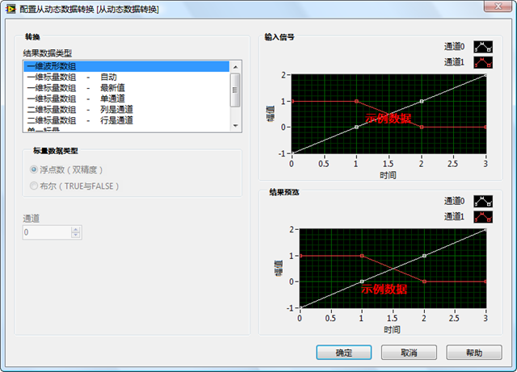
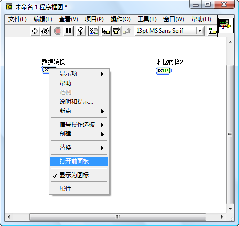
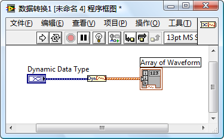
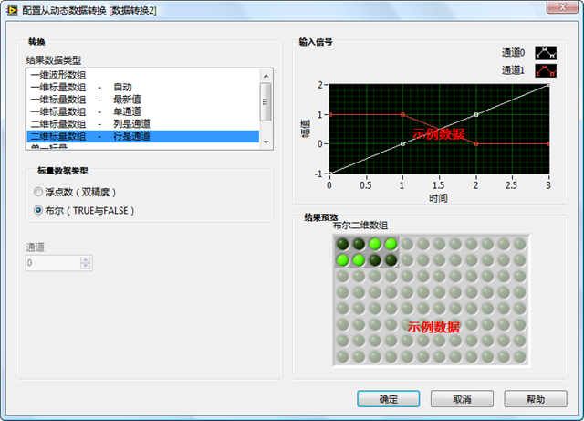

普通的子VI有前面板和程序框图。子VI前面板上的控件定义了这个子VI所使用的参数；程序框图上的代码实现了这个子VI的功能。在某个VI程序框图上，双击一个普通子VI的图标，可以打开子VI的前面板；按住Ctrl键再双击子VI的图标可以同时打开它的程序框图。

Express VI 的行为与普通子VI有所不同：在程序框图上双击一个Express VI的图标，弹出的是一个配置对话框。应用软件中的大量普通子VI都是有程序员自己开发的，因此，他需要打开子VI的前面板与程序框图进行编辑。而Express VI通常是LabVIEW或LabVIEW工具包自带的，不需要普通程序员去创建或修改一个Express VI，因此程序员一般也不需要看到它内部的代码。一个Express VI 通常会集成多种功能，因此程序员在使用它时，需要方便的打开Express VI 的配置对话框，根据自己的需要，选则适合的配置参数。

普通的子VI的程序框图等被保存在一个.vi文件中，而你是看不到程序中使用到的某个Express VI的.vi文件的。对于普通子VI来说，不论在应用程序的哪个地方调用它，或是哪个应用程序来调用它，所执行的代码都是相同的，就是保存在.vi文件中的程序框图。对于Express VI来说，却不是这样。程序员可以修改Express VI配置对话框中的内容，配置一旦被改变，Express VI的执行代码也会发生变化。因此，在不同的地方调用同一个Express VI运行的代码却可能是不同的。这也就决定了Express VI的程序框不不能被保存在单一的一个.vi文件中。实际上，Express VI的程序框图是被保存在调用它的VI的.vi文件中的。比如说某个VI名为A，它被保存在A.vi中。A调用了一个Express VI，B。则B的程序框图也被保存在A.vi中。只不过咱们没办法直接看到B的程序框图。

有些Express VI是允许用户查看其程序框图的（有些不提供这一功能）。在一个 Express VI 的右键菜单中选择“打开前面板”，LabVIEW会把Express VI转换成不可配置的普通子VI，这样它就有了可以打开的前面板和程序框图。

以“从动态数据转换”Express VI 为例（函数选板“Express –> 信号操作 –> 从动态数据转换”）。在某一VI的程序框图上放置两个“从动态数据转换”Express VI，分别命名为“数据转换1”和“数据转换2” 。对“数据转换1”Express VI的配置是“结果数据类型”为“一维波形数组”，如图1所示。

  
图5：“数据转换2”的程序框图

返回[《我和LabVIEW》的补充内容](http://ruanqizhen.spaces.live.com/blog/cns!5852D4F797C53FB6!4402.entry)
