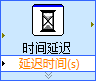
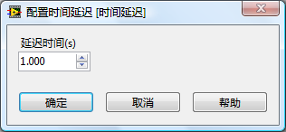

除了 LabVIEW 自带的 Express VI，如果编程者愿意，也可以创建自己的 Express VI。在制作 Express VI 前，首先要了解 Express VI 最主要的两个组成部分：执行代码和配置对话框。

把一个 Express VI 放置到程序框图上，或双击一个已经在程序框图上的 Express VI，会打开Express VI的配置对话框。Express VI运行时所需的最常用的参数都可以在配置对话框中设置。以一个最简单的Express VI “时间延迟”为例，我们可以在它的配置对话框上设置让它延时几秒钟。

  
“时间延迟”Express VI 的执行代码

返回[《我和LabVIEW》的补充内容](http://ruanqizhen.spaces.live.com/blog/cns!5852D4F797C53FB6!4402.entry)
