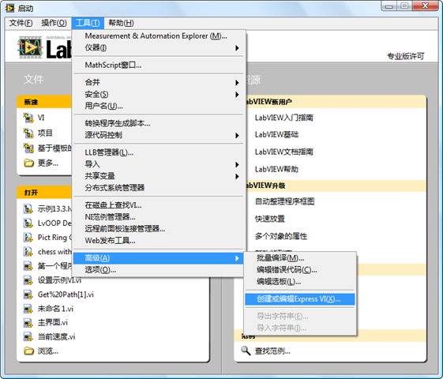
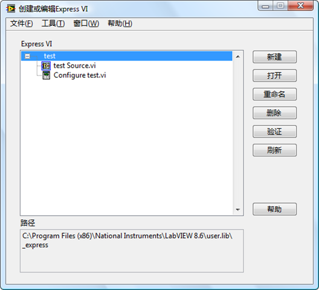
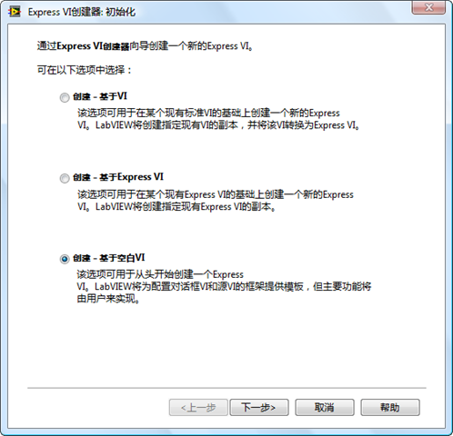
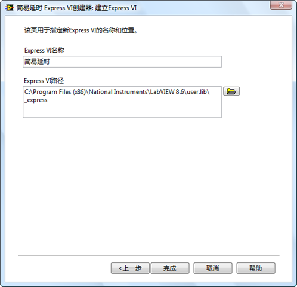

Express VI 有多种创建方式，但是普通用户只有唯一的一条途径来创建Express VI。LabVIEW中自带了一个专用于创建 Express VI 的工具，用户可以使用这一工具创建或修改Express VI。这个工具在LabVIEW的菜单“工具->高级->创建或编辑Express VI”下。

返回[《我和LabVIEW》的补充内容](http://ruanqizhen.spaces.live.com/blog/cns!5852D4F797C53FB6!4402.entry)
