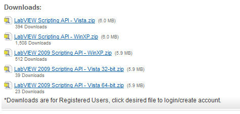

LabVIEW Scripting的高级功能（比如创建新的VI，修改VI程序框图上的程序等）是需要特殊授权的。从2009年8月开始，NI公司将这一授权公开给了所有LabVIEW用户。也就是任何一个LabVIEW用户都可以免费申请获得LabVIEW Scripting的高级功能的使用授权。

取得授权并激活这一功能的方法是：

首先打开 LabVIEW Scripting 的网页，网址（[http://decibel.ni.com/content/docs/DOC-4973](http://decibel.ni.com/content/docs/DOC-4973)），下载 LabVIEW Scripting 的安装包。安装包在页面的最下方。

并且，在使用Property Node和Invoke Node的时候会发现，它们多出了很多新的属性和方法共用户使用。使用这些 LabVIEW Scripting 的高级功能，几乎可以完成所有手工编辑VI可以完成的操作。
