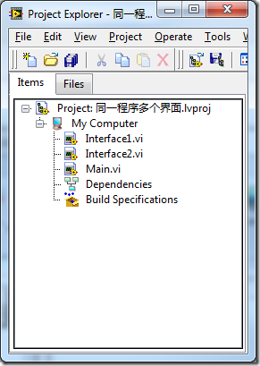
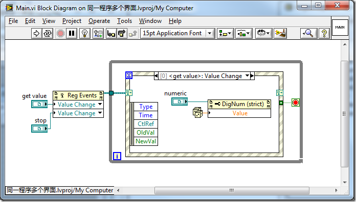
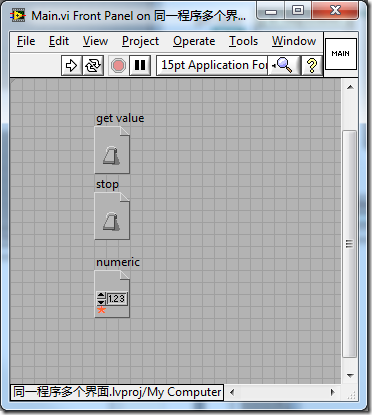
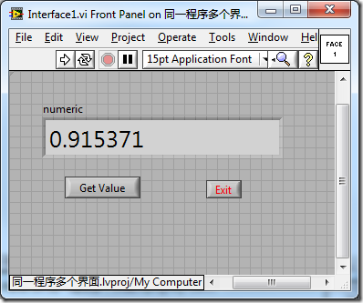
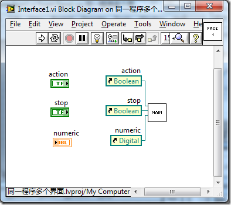
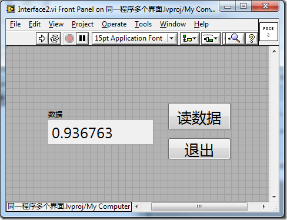
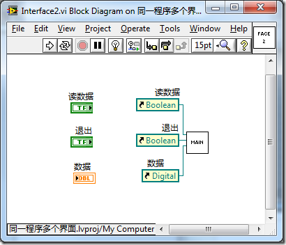

虽然我以前研究过动态注册事件这一功能（3.7.6），但是还没有想到，这个功能有什么实际用途。直到前几天，一个客户向我介绍了他们工作中遇到的困难，我才突然想到，他们的问题恰好可以使用动态注册事件来解决。

他们的问题是这样的：他们开发了一套软件销售给多个用户。用户们对软件功能的需求是一致的，但他们对软件的界面却有各自不同的需求。比如界面的语言、控件的位置、尺寸、颜色等都不同。对于软件开发人员来说，最好的解决方案是程序的代码（程序框图）只有一份，而界面（VI前面板）有多份。常规方法是无法解决这个问题的，因为LabVIEW中每个VI只能对应一个前面板和一个程序框图。 程序中实现界面的那个VI通常是主VI，这个VI中的代码都是比较复杂的。一个程序维护多份功能相同而又复杂的主VI并不是一种优化的方法，发现一个bug，要到每个VI中去改。

动态注册事件的一个用途就是把界面和程序代码完全分离开来。遇到上文客户提出的需求，可以编写多个只有界面的VI，和一个没有界面只有程序框图的VI（这里说的只有界面和只有程序框图，并不是说那个VI真的没有程序框图或界面，只是说它的程序框图或界面特别简单，没有实质内容）。不同界面VI中控件的标签要有统一命名，以便被实现功能那个VI按照控件名来设置或读取控件参数。每个界面上其它的设置，都可以各不相同。界面VI的程序框图需要有一个空循环，以便它可以持续的运行。

程序真正实现功能的那个主VI不需要有界面，它要在后台运行。主程序的主体框架还是传统的循环事件结构。主程序开启后，把界面VI运行起来，需要使用不同的界面，只要在这里修改一下界面VI的路径就可以了。然后，主程序再通过控件的标签得到每一个控件的引用，再把它们注册到事件结构中去。这样一来，主程序就具备了和传统的主VI一样的能力了，读写界面上控件的值，接收控件发出的事件。

这样一来，程序中不再有代码重复的VI，可维护性大大加强。

\------------------------------------------------------------------------

 

2011.3.29 今天应网友要求，给这个设计写了一个示例：

示例由三个VI组成。Main.vi实现软件的功能，Interface1，和Interface2分别是程序两个不同风格的界面。

我为程序设计了一个非常简单的功能，在界面上点一下按钮，就返回一个随机数值。程序的功能是在Main.vi中实现的，它采用的是经典的事件结构。与一般程序不同的是，它没有界面控件，它所捕获的事件都是通过动态注册生成的。

Main.vi的前面板用于把界面VI上控件的引用传递过来。

Interface1.vi，它的前面板就是程序界面：

它的程序框图不需要做任何实质工作，只要把界面上的控件的引用传递给Main.vi就可以了。

Interface2.vi只是与第一种界面风格略有不同：

它的程序框图与前一VI完全相同：

 

通过这种设计，把程序的界面与功能完全分离到了两个不同的VI中。因此，可以方便的只改变程序的界面而又完全不动程序的功能代码部分。

示例程序可以从这里下载：[http://decibel.ni.com/content/docs/DOC-15583](http://decibel.ni.com/content/docs/DOC-15583)
