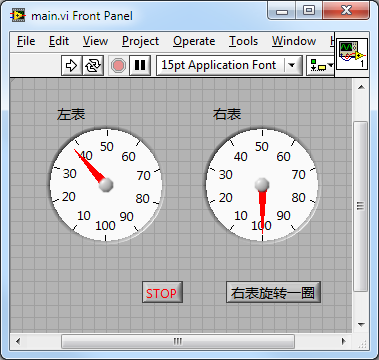
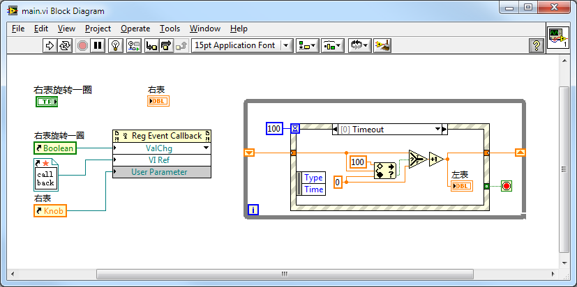

LabVIEW界面程序最常用的结构就是循环事件结构。用事件结构截获用户在界面上对控件的操作，然后做出相应处理。

在文本语言中，常用的事件处理方法与LabVIEW是不同的。文本语言常常使用回调函数来处理界面事件。比如：某个按钮按下时，需要做一个fft运算。那么就写一段函数来完成这个fft运算，再把这个函数与按钮按下事件关联起来。开发语言通常已经做好了对事件的监控，一旦发现按钮按下事件产生了，就去调用与它关联的fft运算函数。这个有开发者编写，被系统调用的函数就叫做回调函数。

LabVIEW也可以采用与文本语言相类似的方法来处理事件：不是在事件结构内处理，而是在程序开始时，就为某事件注册一个回调VI。在回调VI内编写相应代码，一旦事件发生，这段代码就会被执行。

与事件结构相比，回调VI编写起来稍微麻烦一点；但它的好处是，它和主VI是平行运行的。如果事件处理过程比较耗时，把它放在事件结构中会阻塞整个程序，使得程序界面暂时失去响应；而把它放在回调VI中，则不会影响程序其它部分的运行。

比如下面这个例子。程序界面上有两个仪表盘：左面那个始终在运转，每10秒钟旋转一圈；右边那个，由按钮控制，按下按钮才旋转一圈。若把旋转右表这个工作放到事件结构的按钮按下处理分支中去做，它势必会打断左表的旋转，因此，考虑把它放到回调VI中去做。

