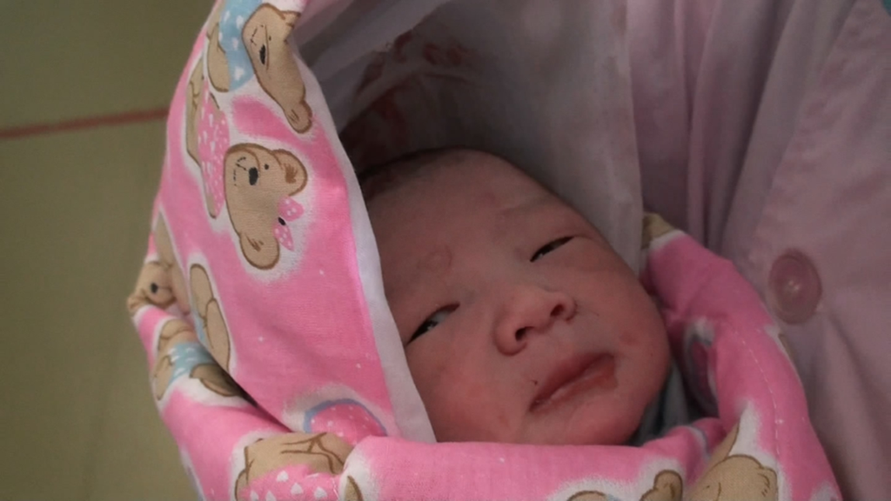
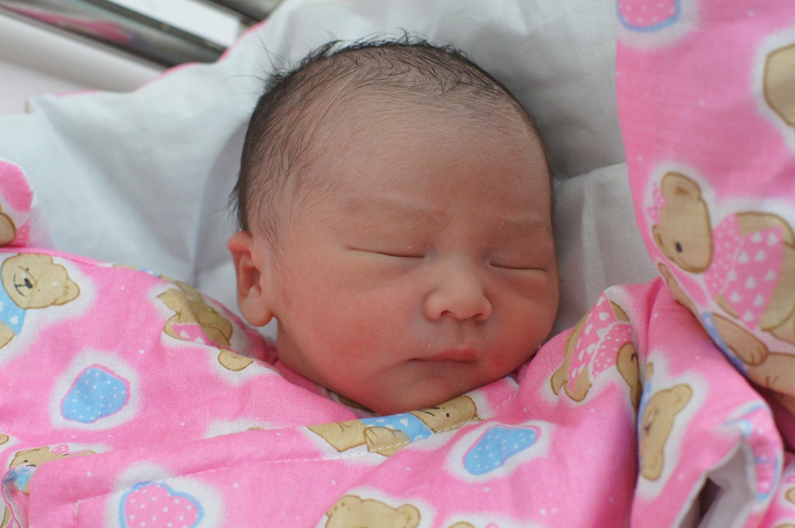

成为爸爸的那一刻，我的内心充满了激动。

2010年12月5日下午，我陪着老婆住进了济南的一家医院，开始了豆豆即将降临的倒计时。然而，病房环境实在让人难以适应。因为近期生产的孕妇特别多，原本计划预订的单人病房已经满了，只能暂时安排在双人间。

同住的是一位刚生产的产妇和她的家人。他们家似乎对卫生并不太讲究，病房里弥漫着一股刺鼻的味道。更糟糕的是，他们坚持按照传统习俗坐月子，窗户一丁点儿也不许开。豆豆妈有些洁癖，闻着这股气味再加上闷热的环境，怎么也睡不着。那天晚上，我陪着她在走廊里散步了好几次，想着怎么才能让她舒心些。

豆豆的生日差点就改期了呢！我们早早就与医院一位颇有名气的医生约好了6号上午进行手术。5号下午，我和豆豆妈住进医院，开始术前准备。一切都按计划进行着，直到晚上11点，当我们已经完成检查、准备就绪，躺在床上准备闭“气”养神时，护士突然推门而入，告诉我们第二天的手术取消了！原来那位医生正在抢救一位情况危急的产妇，手术已经持续到深夜，预计无法按时完成休息，次日上午的手术只能延期。

得知这一消息时，尽管有些意外，但我们也深知，在深夜坚持抢救病人的背后，一定有比我们更需要帮助的生命。于是，我们默默为那位产妇和她的宝宝祈祷，希望一切平安顺利。豆豆妈因为术前禁食，晚饭几乎没怎么吃。我劝她趁着延期的机会吃点东西，但她执意不肯，说还是保险些，留着空腹以防万一。

第二天清晨，想着手术要延期，我便赖在躺椅上没起床。谁知不过一会儿，护士又急匆匆地跑进来，问豆豆妈昨晚有没有吃东西，如果没吃，就赶紧准备进行手术！原来那位敬业的医生在抢救结束后只休息了三个小时，就毅然返回医院，表示自己的状态已经恢复，可以按照原计划进行手术了。

这一意外的调整让我们措手不及，但也对这位医生的职业精神充满感激。我立刻拨通电话，把消息告诉豆豆的爷爷、奶奶、姥姥和姥爷，让他们赶紧动身来医院迎接豆豆的到来！

豆豆妈被安排在上午第二批手术，手术时间定在10点左右。9点钟，护士就来到病房，熟练地为豆豆妈换上手术衣，将她小心翼翼地移到移动床上。9点半，我们陪着豆豆妈一路推到手术室门口。手术室内不允许家属陪同，我们只能站在外面，怀着紧张而期待的心情等待着。

手术室外的走廊里挤满了同样等待新生命降临的家人们。每当手术室的大门轻轻打开，人群总是立刻围上前去，满怀希望地探望，生怕错过自己的宝贝。因为大多数产妇都安排在早上第一批手术，豆豆妈这一批人数相对较少。到了十点半，当手术室的大门再度打开时，我的心一下子提了起来——果然，这次是我们的豆豆！

护士怀抱着豆豆走出来，他被小心地裹在一条红色花布棉被里，看起来小小的，柔软得像一团云。奶奶和姥姥看到他的一瞬间，立刻开心得赞不绝口：“豆豆长得这么漂亮！”可事实上，此时的豆豆还没来得及洗澡，小脸上还带着些出生时的痕迹，脏兮兮的模样也让人觉得无比可爱。

我用相机记录下了豆豆从手术室出来的全过程，这是属于我们全家的珍贵回忆。下图便是录像中的一个截图，捕捉到豆豆第一次睁眼看老爸的瞬间：

接下来，护士带着豆豆去洗澡，奶奶和姥姥也一路跟了过去。我则留在手术室门外等待豆豆妈。大约半小时后，豆豆妈终于被推了出来。她虽然面色苍白，却露出了轻松又满足的笑容。我们把她推到单人病房时，豆豆已经洗好澡，香喷喷地等着我们了。

洗干净了的豆豆长得真漂亮:) 下面这幅图这是豆豆平生的第一张照片：

豆豆出生的录像：[http://v.youku.com/v\_show/id\_XMjQyMjI3Nzk2.html](http://v.youku.com/v_show/id_XMjQyMjI3Nzk2.html)
