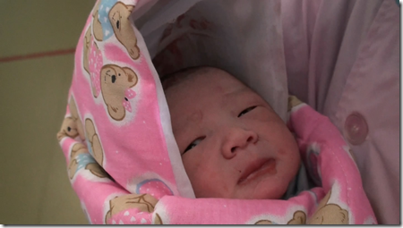
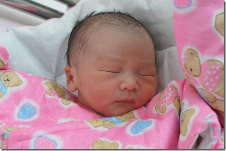

当爸爸的心情是非常激动的。

手术前一天（2010年12月5日）下午，我陪老婆住进了济南的一家医院。病房环境不是太好，我们第一个晚上都几乎没有睡觉。本来打算预订一间单人病房的，但是没有想到，这段时间生孩子的孕妇太多，单人间没有了。我们只能先住进双人间，等第二天单人间有空了，再换进去。 双人间病房同住的是一位已生产的产妇和她的家人。他们家不很讲究讲卫生，以至于一进病房我们就闻到一股刺鼻的异味。并且她们家是按照中国传统习惯在坐月子的：捂得严严实实的，还强烈反对不允许我们通风换气，哪怕把我们病床旁的窗户开一丁点儿小缝也不行。豆豆妈本来就有点洁癖，住进这样一间病房，难受得无法睡觉。整个晚上，我陪着她到走廊里去散步了好几次。

豆豆的生日差点变了呢。我们早就和那个医院的一位有点名气的医生约定在6号上午做手术。 5号下午，我们住进医院做术前准备工作。晚上11点，准备工作早都做好了，我和豆豆妈躺在床上闭气养神的时候，护士突然冲进来通知我们，明天的手术取消了，豆豆妈可以吃饭喝水了。因为那位医生还在抢救一位情况危急的产妇，手术到那时还没完，估计一夜都没时间睡觉，第二天上午的手术只能延期。深更半夜做手术一定是情况非常危急的病人，我们只能默默祝福她。豆豆妈晚饭都没怎么吃，我劝她吃点东西，可豆豆妈就是不肯吃，豆豆妈还留了一手。 心想反正不用动手术了，第二天早晨我就赖在躺椅上没起来。可没一会儿，一个护士跑进来问我：孕妇昨晚吃了东西没，如果没吃，赶紧准备好进行手术。原来手术医生昨晚回家睡了三个小时就又回医院了，她说精神已经恢复了，可以按原计划进行手术-真是位敬业的医生啊。我赶紧打电话通知豆豆的爷爷、奶奶、姥姥、姥爷，让他们快到医院来迎接豆豆。 豆豆妈是上午第二批进行手术的，手术在10点左右开始。护士9点就进病房来，帮豆豆妈换好衣服，抬到了移动床上。9点半左右，我们推着豆豆妈去手术室，手术室不许家属进入，我们只能等在大门外。手术室大门外站满了焦急等待新生命的家长们，每当大门一开，马上就会有许多人围过去，看看是不是自家的小宝出来了。 大多数产妇都是一大早第一批做的手术，豆豆妈同时进手术室的产妇没几个。所以当十点半手术室大门再次打开的时候，我马上就意识到，是我们的豆豆出来了。豆豆被护士裹在一个红色的花布棉被里抱了出来。豆豆的奶奶和姥姥一见到他，就开始夸奖：豆豆咋长得这么漂亮呢。 其实，这时候的豆豆还没有洗澡，脸上脏兮兮的。

我把豆豆从产房出来的全过程都录下来了。下图是录像中的一幅截图：豆豆第一次看见老爸。

护士接下来带豆豆去洗澡，他的奶奶和姥姥于是就跟着护士一起去看豆豆洗澡去了，我继续留在手术室门外等豆豆妈。我们又等了大半个小时，豆豆妈才被推出来。等我们把豆豆妈推到新的单人间病房的时候，豆豆已经洗好澡在等我们了。

洗干净了的豆豆长得真漂亮:) 下面这幅图这是豆豆平生的第一张照片：

豆豆出生的录像：[http://v.youku.com/v\_show/id\_XMjQyMjI3Nzk2.html](http://v.youku.com/v_show/id_XMjQyMjI3Nzk2.html)
