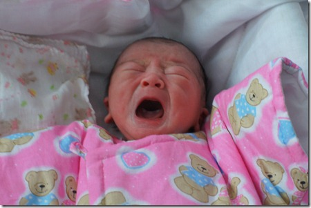

豆豆妈为了生豆豆可是遭了不少罪。怀孕期间豆豆就不老实，经常把妈妈肚子踢歪。但比起分娩以及之后的几天，这都不算什么。

豆豆妈在产前最后一次产检时，医生说豆豆很健康，胎位也正，可以等待顺产。但是，豆豆妈一是担心豆豆个头太大（当时医生估重说超过7斤），二是担心自己体力不够，最终还是决定剖腹产把他生出来。考虑到反正是要动手术，就不必要等到预产期了，就约定了一个医生方便的时间动手术，于是豆豆提早了5天来到人世。 从后来的情况看，豆豆妈的决定是非常正确的。手术后，医生告诉她，她的羊水已经浑浊，胎儿脐带扭转40周，绕颈两圈，并且豆豆妈的子宫壁极其脆弱，稍稍一碰就出血。剖腹产的难度非常大，如果真的等到顺产，恐怕大人小孩都有危险。 豆豆妈在手术过程中没少失血，血压最低时已经降到30多了。豆豆妈本来脸色非常红润，可是从手术室推出来的时候，脸色煞白，没有一点血色。我看见了都觉得难过。

手术过后，医生给了一个止疼泵，可以持续三四天缓慢的往静脉里注入止疼药。但是，豆豆妈的静脉滞留针第二天就出了问题，麻药打不进去，护士只好把止疼泵撤掉了。突然失去了麻药，刀口以及药物引起的宫缩都使得豆豆妈剧疼无比，害得她哼哼了一整夜。

剖腹产手术毕竟还是有麻药的，豆豆妈一直坚强忍耐着。不幸的是，她后来又遇到了严重的涨奶。由于没有麻药的帮助，很多遇到同样问题的产妇都说开奶比分娩要疼得多。开奶师来按摩的时候，豆豆妈再也忍不住了，掐着我的胳膊哗哗流眼泪，眼皮肿成了桃子。

希望豆豆长大后看到他出生的过程，会理解妈妈的辛苦。

