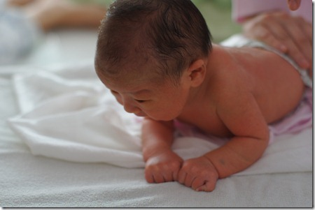

豆豆妈在怀孕期间吃的相当不错，可是自己居然一点都没长胖，所有营养全给了豆豆和他的小房子。离预产期还有一个半月的时候，豆豆妈去产检估重。医生就说胎儿已经超过六斤了。吓得豆豆妈赶紧控制饭量，并且打定了主意要 剖腹产。产前一星期，医生隔着妈妈肚皮摸了摸豆豆，说超过7斤。 豆豆生下来的时候果然不小：体重七斤三两（3.65kg），身高54cm，双顶径97mm，所有指标都是偏上的。产后的第四天，我抱着豆豆去游泳，别的家长还以为我们豆豆是生了个把月的呢。游泳房的桌子上，光不刺溜躺上一排小宝，豆豆明显比别人大一圈。

营养好精神就好，大多数小宝被抱出产房的时候都在睡觉，豆豆却是睁着眼睛出来的。头一次接触外面的花花世界，豆豆的小眼都不够用了，张望了两个多小时才开始睡下。

豆豆不但精神好，体力也好。豆豆妈刚感觉到胎动不久，就发现豆豆特别爱动。一般，胎动超过每小时三五次就算正常了，豆豆每小时动个三五十次都不成问题。每次产检，豆豆的胎位都不一样：有时躺着，有时坐着。出生前两个星期，豆豆的脑袋入了盆，总算是转不上来了。可没想到，豆豆还会继续侧着转身。临出生的前一晚，护士给豆豆妈测胎心，豆豆的心跳还在妈妈肚子右侧呢；等第二天临生产的时候，豆豆的心跳就转到妈妈肚子左边去了。豆豆出生时，脐带扭转40周，据医生说，看上去像根麻花。就算豆豆在妈妈肚子里只朝一个方向转圈，也要翻40个跟头呢。

豆豆力气大的不得了。一般刚生出来的小宝都抬不动脑袋，可豆豆一出来就能挺起脑袋了。一天，护士来给豆豆洗澡的时候，他正在发脾气。护士把他翻过来趴在按摩桌上，豆豆居然俩胳膊肘一顶，就把上半身给支起来了，接着又抬起头往前拱了两下。护士姐姐差点没拽住他，急忙对我说，快给豆豆拍个照。她还没见过哪个小宝力气这么大呢。可惜，等我把相机、镜头从包里掏出来装到一起，豆豆已经没力气了。我就只拍到了一张耷拉脑袋的照片。 豆豆还会用挺脑袋的方式抗议没吃饱。豆豆饭量极大，出生才一个星期就能喝100ml以上的奶了。每次喝完奶，我会把他的头靠在我肩上给他拍奶嗝。如果饱了，豆豆会非常温顺地把头搭在我肩上。否则，他会把脑袋挺起来左右摇晃，这意味着没吃够。吃不饱饭，豆豆绝不睡觉，若是再不给他加奶，一会他就会哇哇大哭。

豆豆的哭声非常响亮，有天半夜，他在病房里哭，尽管房门关着，一个楼层有着几十间病房，声音还是传到了护士台那里。小护士以为出了什么严重情况呢，跑进来一看，原来是豆豆饿了。

小宝还是壮一点占便宜。豆豆的强壮给他带来了两大优势：一是可爱，尤其是新生儿，瘦了容易皱巴、显黑，白白胖胖的才讨人爱。再有就是吃奶有优势啦，其他小宝裹不动的奶，豆豆却可以吃到嘴。

