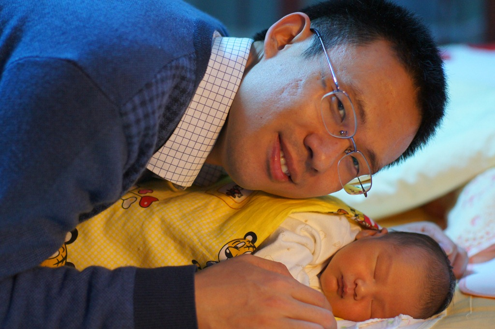

起名也是需要灵感的，有时灵光一现，就想到了一个满意的名字。

豆豆妈没有多有幽默感，唯独喜欢憨豆。每次看憨豆的表演，都笑得前仰后合。作为憨豆的粉丝，在我们还没有开始计划生小宝的时候，就已经决定给将来的小宝起名叫豆豆了。

如果豆豆是女孩，那么他的大名就也早就起好的。

然而，我们对于男豆豆的大名始终都没有啥灵感，总觉得男孩的名字更难取。怀孕期间，我们一直不知道豆豆的性别，所以一直都在惦记着起男孩名这件事。有一段时间，我不论看见个什么东西就在前面加上一个阮字，看读起来顺不顺嘴。比如，那会我正在研究硬盘阵列（RAID），于是就叨咕叨咕“阮瑞德”。总体来说，大多数念出来的东西都得很拗口，不靠谱。

有一天，打开电信的账单，看到了它的广告，于是念了一下“阮天翼”。咦，这个还挺顺嘴的呢。于是我就跟老婆说，咱们豆豆叫“添翼”吧，豆豆属虎，正是“如虎添翼”。豆豆妈也觉得添翼读起来不错，唯一不满意的是这两个字都笔画太多。等豆豆上了小学，考试时候，等别人交了卷，他的名字还没写完呢。

后来，再跟豆豆的爷爷、奶奶、外公、外婆商量，他们觉得这个发音不错，但文字上，“天翼”更好一些。我也觉得“天空的翅膀”或者“天使之翼”感觉上比“填上一对翅膀”更加优美。加之没有更好的选择，就这样豆豆最终定名为“阮天翼”了。

我当初给豆豆起名的时候，定了几个原则：

- 有所含义
- 使用常见字
- 没有重名

按照这三个原则，我和老婆对“阮恩仪”这个女名还都比较满意；而“阮天翼”毕竟是硬想出来名字，相对勉强一些：

- “天翼”是希望豆豆将来远走高飞，勉强算有意义吧。
- “天”和“翼”虽是常见字，但笔画分布很不平衡，手写起来恐怕很难写漂亮。
- 若取名“阮添翼”，还可以满足没有重名的原则。但“阮天翼”已经有人使用了。上Google一搜，搜到好几个。不过我后来还是觉得“天翼”的含义更好一些，于是就放弃了没有重名这一原则了。

另外一个让我有些犹豫的问题是，电信这个叫做“天翼”的服务品牌在中国家喻户晓。我现在就盼着电信杆快倒闭，免得将来豆豆上学的时候，被同学起个“宽带”、“3G”之类的外号。

