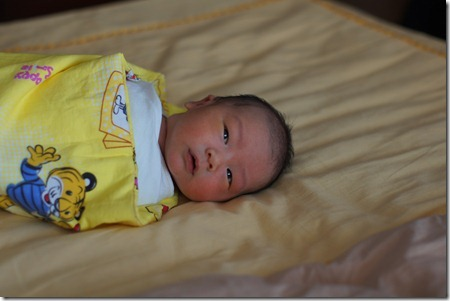
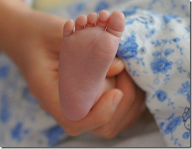

不论哪家生了小宝，总免不了比较一下小宝到底像爸爸多还是像妈妈多。我们也一样，虽然豆豆还太小，有些特征看不出，但有些特征已经可以明显区分出来了。

先说人身上最传神的器官-眼睛。豆豆长了一双小眼睛，还总是眯成一条缝。别人都说像我，毕竟豆豆妈的眼睛，一个有我三个大。不过，我觉得也不能这么早下结论，还要观察观察再说。我现在的同事朋友都很难想象，我小时候也是双眼皮大眼睛的，后来不知怎么的，就长成现在的双眼睛大眼皮了。豆豆现在的眼睛恐怕还不及我生出来的时候大呢。豆豆妈正好相反：豆豆妈小时候是单眼皮，后来眼睛越长越大，还变成了双眼皮。

豆豆的耳朵像妈妈。豆豆和豆豆妈都有个大耳垂，我没有。

我和豆豆妈的鼻子，嘴巴，都没什么特点。说豆豆像谁都可以。

豆豆的身高随他妈，比较长。豆豆出生时，身长54cm，算比较长得了。正常婴儿一般是50cm，豆豆妈当年刚生下来有57cm呢。

豆豆的大手大脚随爸爸。豆豆的脚丫一眼看过去，就觉得比其它小宝大很多。豆豆刚出生，我就量了一下，竟然有9厘米长。豆豆的一个小姐姐，四个月大了，脚丫才长到9厘米。

豆豆特能吃，吃不饱就哭，这点像爸爸。据我妈说，我小时候喝奶，能比别人多喝一倍的量。豆豆也差不多。但和我不同，我消化功能不好，虽然吃得多，但长不胖。豆豆消化可好了，他出生的第二个星期，一个星期就长了一斤。我们都担心他会过胖，打算让他节食了。

