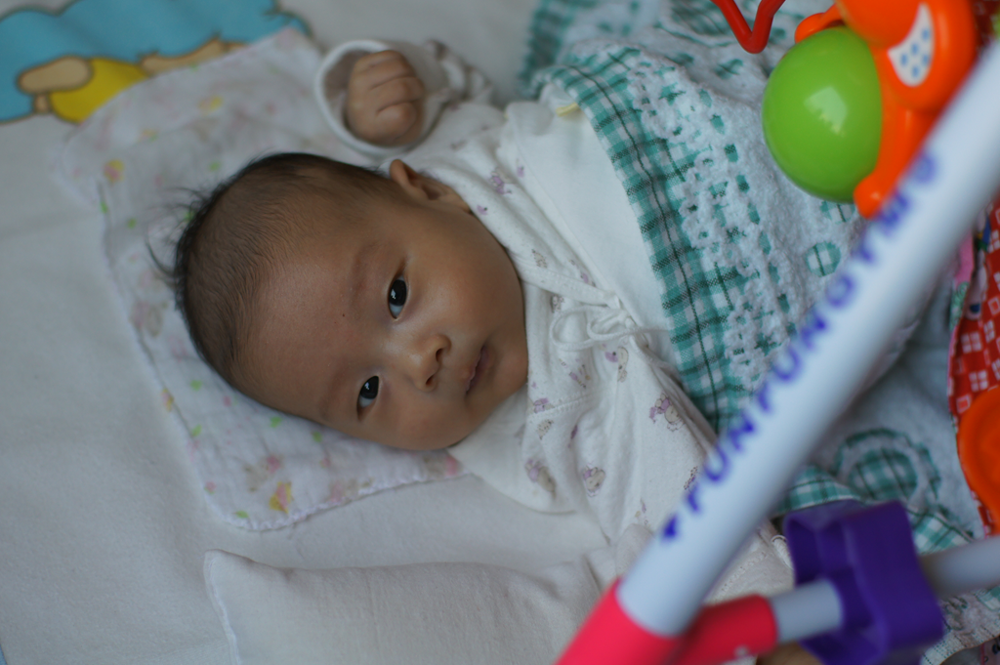

大年初一，豆豆出生整两个月。不过按照中国传统的虚岁算法，豆豆今天都两岁了。

豆豆两个月来长的飞快，昨天用自家不太精准的称和尺子量了一下，豆豆现在体重13斤多，身长62cm，脚丫长10cm。

豆豆最近学会和人说话了。每天早上，吃饱睡足之后，是豆豆最最乖的时候，他可以自己玩玩具或者跟人聊天好长一段时间都不发脾气。豆豆最近特喜欢聊天，每天早上姥姥，姥爷对着他说话，他就像听懂了一样，哼哼哈哈得回应着。今天，豆豆学会了清晰的发出“哎”音。早上，我陪他说话的时候，对他哎哎的叫，他就学我，声音还越叫越大。最后“哎”一声，姥姥在厨房里都听见了，赶忙跑出来看豆豆说话。

豆豆今天还头一次学会了玩玩具，前两天别人送了一个婴儿玩具，就是一个玩偶，吊在婴儿床上，碰一下能出声的那种。我昨天给豆豆把玩具装上了，不过他明显对玩具没啥兴趣，只是手刨脚蹬的时候偶尔会碰到玩具，发出几声清脆的音乐。今天，豆豆自己玩的时候突然意识到了这个诀窍，于是他就会盯着玩偶看，然后伸手打它一下，听声，等声音没了，再打它一下。

豆豆最近也养成了一个坏习惯：睡觉必须被抱着睡，一旦放到床上，他一会就会醒来。我观察了一下，主要原因是豆豆睡觉很不老实，睡着睡着，就会突然一惊，手脚都突然张开。如果有人抱着，他的手脚活动幅度受限，可能不会影响到睡眠。就算一下子醒了，看见有人抱着他，他也会继续安心睡觉。但如果是他自己躺在床上，手脚突然一动，整个身子也会一颤，他自己就把自己给吓醒了。昨晚到处都是鞭炮声，我就怕响声吓到他，抱着他睡了一晚上，尤其是接近0点那会，我干脆抱着他躲进了全家隔音最好的地方-厕所里去，在里面猫了大半个小时才出来。

