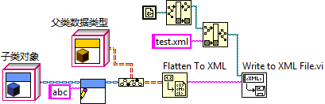
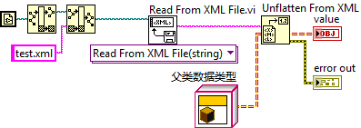
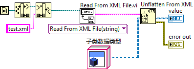
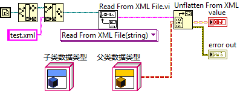

https://labview.qizhen.xyz/

前一段时间，一个同事的程序出了问题。他在程序中把一个LVClass类型的数据转换成XML格式，再保存成文件。但是从文件中把数据转回成LVClass时，却出了问题：在调用“Unflatten XML”这个函数时，程序有时出错，有时又不出错。他的程序中使用了大量的LVClass，并且它们之间有着复杂的继承与包含关系，以至于花了两三天的事件，才找出问题所在。其实是个简单的问题，只是在设计程序时他没有意识到。

我做了一个简化的程序，可以重现这个问题：

首先，给一个子类的对象设置一些数据。然后把它当做父类类型的数据，平化成XML文本，存盘：

关闭LabVIEW，然后重新打开LabVIEW。再编写一个反向程序，把XML数据转换成父类类型的数据：

发现Unflatten From XML函数返回一个错误，value中是一个空的数据。

错误产生原因如下：在把子类数据转换成父类数据类型，这个类型虽然是父类的，但其数据仍然是子类的。再转换成XML格式，XML格式中记录的仍然是子类的数据。

在反向过程中，Unflatten From XML拿到的数据是子类的，但它企图转换时，却发现内存中没有子类的类型信息，因此它也就不知道如何转换这个数据，所以报错。

如果这个程序稍微改动一下，把XML数据直接转换成子类的数据，就不会出错了：

实际上，子类的数据总是可以用父类来表示的。因此这个XML数据亦可以直接被转换成父类的类型，但前提是，一定要保证子类的类型别家在到内存中去了。只要在程序中放置一个子类的对象，自然就可以把子类加载至内存。像下面这个程序就可以正常工作：

这个实验反映出两个问题：

1. 把XML中的内容如果是属于某个LVClass类型的数据，把这些数据转换回LVClass数据时，那个LVClass一定要已经存在于内存才行。
2. 在之前的一篇文章“[LvClass 的一个效率问题](http://ruanqizhen.wordpress.com/2010/09/08/lvclass-%e7%9a%84%e4%b8%80%e4%b8%aa%e6%95%88%e7%8e%87%e9%97%ae%e9%a2%98/)”中提到过：当子类被加载如内存时，它所有的父类也会被加载入内存。但反过来并不成立。因为一个类有哪些父类是确定的，父类的地址就记录在子类中。但一个类并不知道他会有多少子类，任何人都可以从它派生出不同的子类来，因此它在装入内存时，不可能把自己的子类也都装进来。
