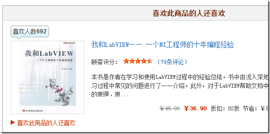

我还是比较关心自己的书的销量的，所以是不是会跟编辑联系一下，问他卖了多少了。不过这个绝对的销量数字对于我来说意义不大，我更希望看到这本书与同类型书籍的比较结果。也许LabVIEW读者的总数并不多，但是如果我的书比其它的LabVIEW书更受欢迎我就心满意足了。

查看印刷数是一个方法，比如打开我的书能够看到它是第二次印刷，印数5000~10000，销售数量肯定也就介于这个数字之间。

更精确一点的可以去看网上书店的用户留言，对同一类书来说，买书者和留言者的比例可能差不多。但也不精确啦，如果一本书特别好或者特别不好，肯定会比那些中规中矩的书吸引到更多的留言数量。

前一阵子，发现当当网给每本书还多设置了一个参数：“喜欢人数”。我一直在琢磨，当当凭什么判定有多少用户喜欢一本书呢？我跟踪观察了一段时间，觉得最有可能的是所谓“喜欢人数”就是这本书的买家数量。这大概是最能体现销量的参数了。

