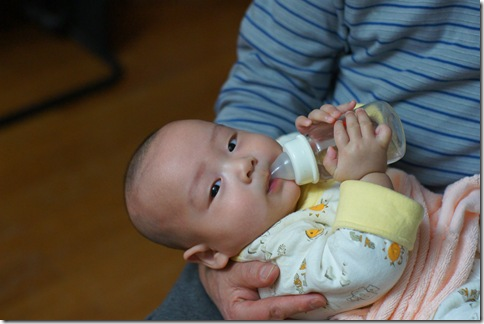
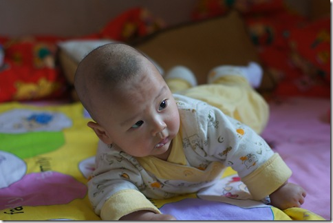
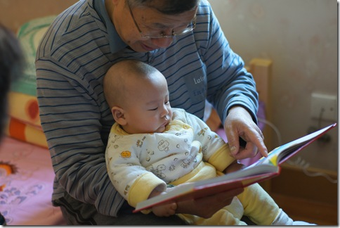

昨晚不到10点上床睡觉，凌晨3点多的时候被豆豆的哭声吵醒，起来帮老婆给豆豆喂奶。我看了一下表，跟老婆说：“豆豆今天真乖啊，一觉睡了这么长时间。”老婆说：“豆豆12点的时候醒过一次啊，是你起来把豆豆抱给我的，你忘了？”我还真是完完全全想不起来我曾经起来过了，难道我刚才是梦游起来抱豆豆的？

豆豆这两天又学会了不少新本领。

豆豆会自己抱着奶瓶啦： 

豆豆学会了翻身，今天自己一使劲，就趴过来了： 

豆豆还很爱“看书”呢： 

我昨天剃头了，结果一回家就被豆豆发现了。他一看见我的“光头”就哈哈大笑，他不知道，他自己才是真正的光头呢:D 视频：[http://v.youku.com/v\_playlist/f5520621o1p8.html](http://v.youku.com/v_playlist/f5520621o1p8.html)
