https://labview.qizhen.xyz/

LabVIEW自带的数据结构只有数组和队列。多数情况下，这两种数据结构足够开发者使用了。但是，我平时使用C++和C#语言更多一些，所以编写程序时常常会想到使用其它编程语言中常见的数据结构比如链表（List）、树（Tree）等。

LabVIEW中也可以编程实现这些数据结构，一个比较直观易懂的编程方法是基于LabVIEW中的类和引用来实现各类数据结构。我在《我和LabVIEW》一书的第13.3.5节中介绍了一个简单的链表容器的实现方法，它是基于LvClass编写的，数据流驱动的一种容器。但是正如我在书中提到的，它虽然和有一些和文本编程语言中的链表相类似的地方，但本质并不相同。文本编程语言中的链表，树等数据结构离不开引用（或指针），节点之间是通过引用来相互关联的。LabVIEW可以为数据创建引用，因此也可以方便的实现与文本语言中功能相同的数据结构。

这里插一段，介绍一下数据结构和数据容器的关系，我自己理解是这样的：数据结构侧重于数据的存储方式，比如如何排序；数据结构在加上与此结构相关的操作方法，比如添加删除数据等方法，就构成了一个数据容器。脱离了操作方法，单纯的数据结构用处非常有限。因此，我文章中在提到数据结构或者数据容器时，指的都是同一回事：数据结构和相关的方法。

为了介绍如何在LabVIEW中实现一个数据结构，我打算以双向链表为例，讲解一下如何编写它。

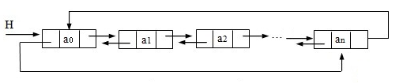

双向链表中每个节点都会记录上一个节点和下一个节点的位置。因此，在双向链表中，可以从一个节点直接跳转到它的上一个或下一个节点上去，也就是正向或反向遍历整个链表。可以直观的想到，使用LvClass实现这样的节点，只要为这个节点创建一个类ListNode，并且这个类有两个成员变量，它们的类型都是ListNode的引用，分别用于指向前一个和后一个节点就可以了：

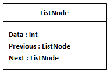

这样的设计在文本编程语言中是没有问题的，但在LabVIEW中行不通。其它编程语言中，程序运行时，才会对类的对象进行初始化。LabVIEW中，VI一打开，它上面的控件和常量就需要被初始化了。某个对象在初始化时，它的成员变量也要被初始化，若它的成员变量的类型还是这个类，这以初始化的过程就陷入了死锁：类需要它的成员变量先初始化；它成员变量需要这个类先初始化。

基于同样的原因，一个类的成员变量的数据类型也不可以是这个类的子类：子类初始化需要先对它的父类进行初始化。但是，一个类的成员变量的数据类型可以是这个类的父类：父类在初始化的时候，不需要理会它的任何子类。

既然父类初始化时，不依赖于子类的初始化；而子类的对象又可以被当做父类的类型来保存，咱们就可以利用这一特性在LabVIEW中实现可以数据结构的节点了。只不过LabVIEW实现链表的节点要多一个步骤：我们需要为ListNode类再定义一个父类ListNodeVirtual。这个父类不做任何实质性的工作，它仅用于保存相邻节点的引用。

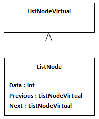

以上两个类是针对链表节点的双向链表本身也需要做成一个类：DoubleLinkedList类，这个类中封装有链表的属性和方法。比如它需要一个指向链表表头的引用，需要有为链表添加删除数据的方法，为遍历链表中的数据，还需要有一个迭代器……

作为演示，我只实现了链表的几个简单功能。演示程序工程结构如下：

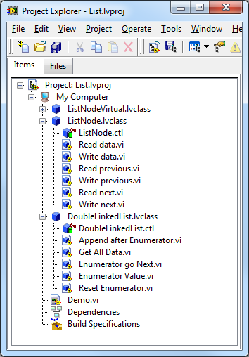

ListNode的成员变量包括一个数据，和两个指向前后节点的引用：

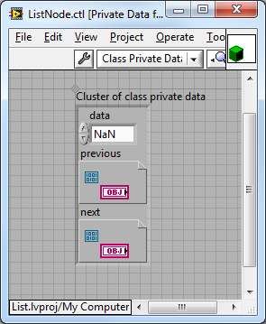

DoubleLinkedList类的成员变量包括指向链表头节点的引用，迭代器指向的节点的引用，并记录了链表长度

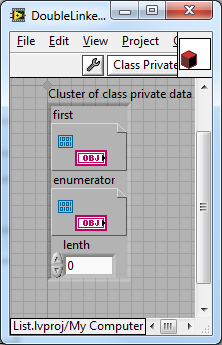

下面看一下链表中几个主要方法是如何实现的。

首先是Append after Enumerator.vi这个方法，它是链表里最复杂的一个方法。它的输入是链表中一个新的节点，它把这个新节点添加在链表迭代器指向的那个节点的后面。

在给链表添加数据时，会遇到两种情况。首先，这个链表是一个空链表，那么被添加的节点就是这个链表的首节点，链表的迭代器也应当指向这一唯一的节点。

我设计的这个链表是一个环状链表。当链表中只有一个节点的时候，这个链表的上一个和下一个节点都是它自己。

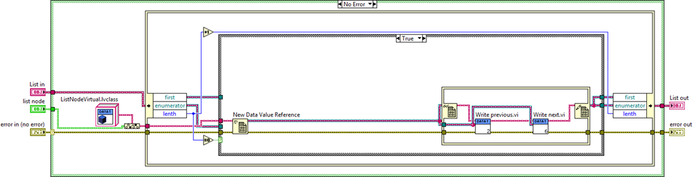

如果链表不是空的，就把新节点插在迭代器指向的节点的后面。因此：

新节点的前一节点指向的应当是迭代器指向的那个节点；新节点的后一节点是迭代器指向节点原来的后一节点。迭代器指向节点的新的后一节点应当是这个新节点；原来迭代器的后一节点的前一节点也应当换成这个新的节点。最后，我把迭代器也指向了这个新的节点，这样连续添加新节点时，它们会按照先后顺序插入链表。

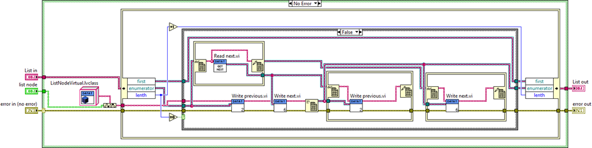

我的演示程序还用到了其它几个方法。

Reset Enumerator.vi 负责把迭代器复位，也就是指向链表的头节点：

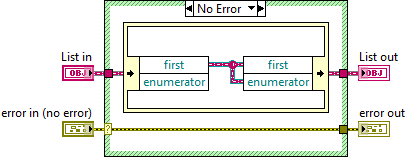

Enumerator go Next.vi 用于让迭代器向后移动一个节点：

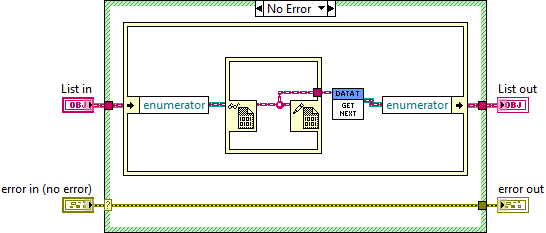

Enumerator Value.vi 返回迭代器指向的那个节点：

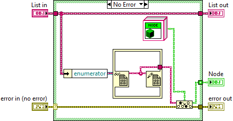

使用这几个方法就可以搭建出一个简单的演示程序来看一下链表如何工作了。下面这个演示程序中，分两部分：第一部分是左面那个循环，每次循环迭代就会创建出一个新的ListNode对象，它的数值是当前迭代的次数；右半部分使用链表的迭代器遍历链表中的节点。在这个演示程序中，迭代器移动次数比链表长度多了两次，因为链表是环状的，转着圈访问，链表中的头两个元素会被读出两遍。

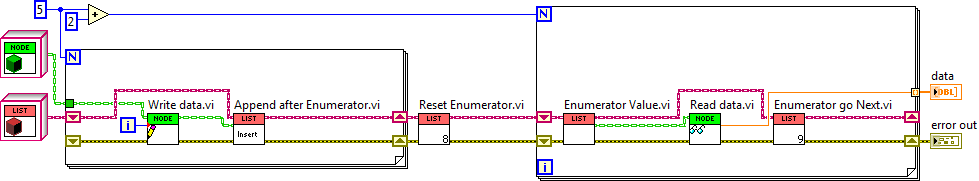

程序运行后，data显示了迭代器每一步所指向的节点的值：

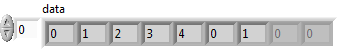

示例程序下载：[https://decibel.ni.com/content/docs/DOC-16236](https://decibel.ni.com/content/docs/DOC-16236)
