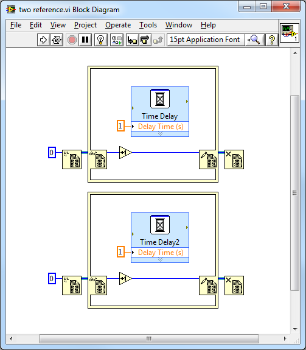
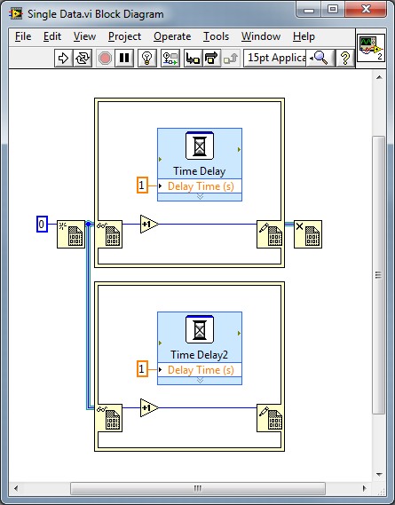
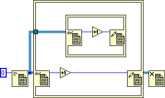

https://labview.qizhen.xyz/

LabVIEW中的引用经常需要和“In Place Element Structure”配合使用。In Place Element Structure 对一个引用的数据进行处理时，为了保证多线程安全，它会锁住引用指向的数据；其它线程若需对同一数据做操作，必须能这个In Place Element Structure中所有代码执行完毕才可，这样就避免了多线程读写同一内存数据所产生的竞争问题。

举例来说，下面这段程序的执行时间是1秒：

而下面这段程序的执行时间则是2秒：

因为第二段程序中的两个In Place Element Structure必须顺序执行。

有了“锁住”这个操作，就有不小心造成死锁的可能。比如对于同一数据的引用，千万不能嵌套使用In Place Element Structure，否则就会死锁：

在上面这个示例中，程序运行至内层的In Place Element Structure，就会停在这里等外层In Place Element Structure运行结束，释放它锁住的数据；而对于外层In Place Element Structure来说，它内部的全部代码要运行结束，它才结束。因而它们相互等待，造成了死锁。
