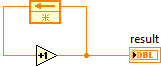
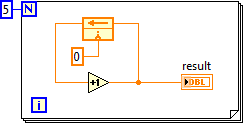
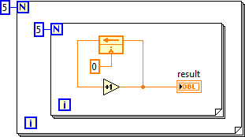
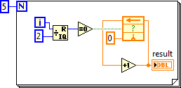
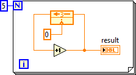
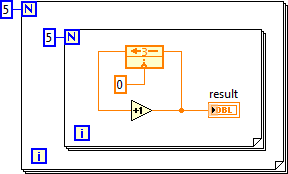
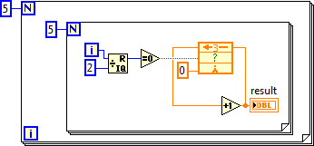

https://labview.qizhen.xyz/

反馈节点和移位寄存器相比，他们的功能与本质是完全相同的。反馈节点的优点在于它不需要从循环的边框上去连数据线，因此可以把程序写的更简洁美观，尤其是控制或电子行业的工程师，他们本身很熟悉反馈的概念，可以直观理解这一节点的用途。但是由于反馈节点实际依赖于循环结构，而他们之间又没有数据线相连，使用反馈节点可能一不小心就把逻辑写错。

下图是一个简单的使用了反馈节点的程序代码，它的运行结果是什么？

但从这个程序我们是无法判断运行结果的，因为我们既不知道反馈节点的初始状态，也不知道它运行了几次。给定了这两个条件我们才能推算程序的运行结果，比如下图中的程序，运行结果是5。

那么下面这个程序运行结果是几呢？

如果出现循环嵌套的情况，反馈节点是针对于包含它的每一层循环结构的。它相当于在每一层循环结构上都建立一对移位寄存器，然后把它们串联起来。因此，上图程序运行的结果是25。

特别值得注意的是，反馈节点与循环结构不一定要放在同一个VI里。比如上上图里那个简单程序，当它作为子VI的时候，运行整个程序，result输出的值可能不是5，初始化的值就是不起作用。这个很可能是因为这个子VI的某个上层VI中还有循环结构，而这个循环结构能够影响它里面非常深层的子VI中的反馈节点。

运用下面的技巧可以让反馈节点变得更难以捉摸，如果你诚心想让人看不懂你的程序，不妨试试。

反馈节点有个使能输入端，右键点击反馈节点，选“Show Enable Terminal”可以显示出这个输入。它的输入为真时，反馈节点正常工作；输入为假时，反馈节点并不拿新的数据，而是把上一次得数据返回回来。大家猜下面这个程序运行结果是啥？

反馈节点只有在i为偶数时才工作，因此程序是在统计0~4中有几个偶数，结果为3。

移位寄存器出了可以可以返回上一次迭代的数据，还可以返回上n次迭代数据。反馈节点也有类似功能。右键点击反馈节点，打开它的属性配置对话框，在Configuration中可以选择Delay的次数，比如咱们设置延迟3次，那么反馈节点每3次迭代才把数据反馈一次。比如下面这个程序，result控件在程序的5次迭代中分别返回值1、1、1、2、2……，其运行结果是2。

那么多层循环会对延迟有什么样的影响呢？

在上图的程序中，result总共经历25次迭代。在这个多层嵌套的循环中，带延迟的反馈节点依然是每隔3次迭代（最里层循环的迭代）返回一次反馈数据。每次迭代返回的数据分别是：1、1、1、2、2、2、3、3、3、4、4、4、5、5、5、6、6、6、7、7、7、8、8、8、9。也就是最终结果为9。

最后大家猜一下下面这个程序的运行结果是几？

