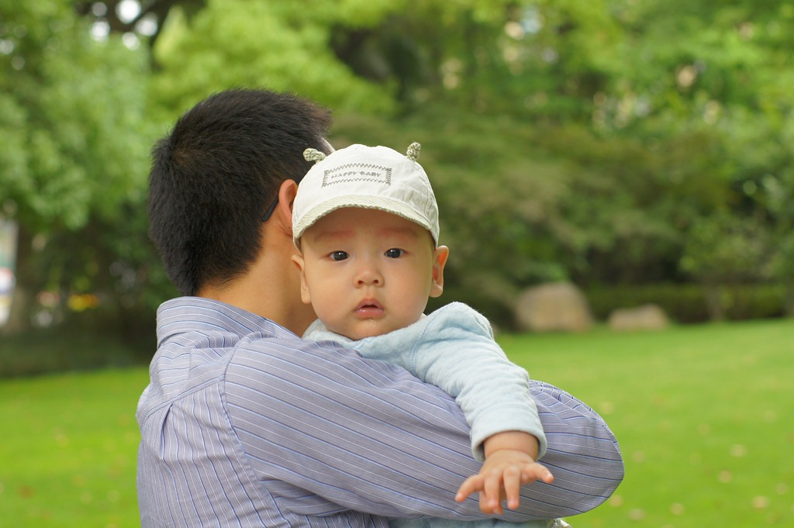
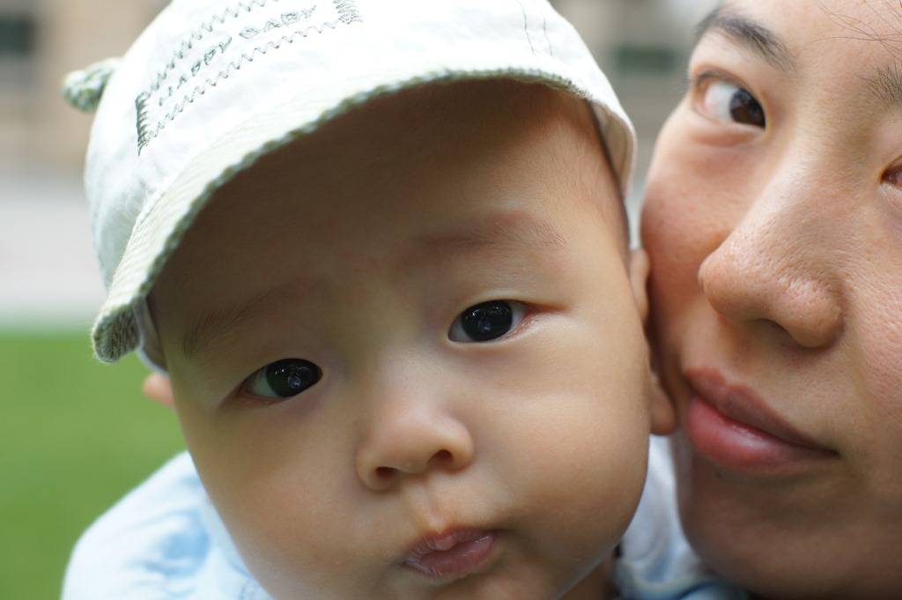

# 五个半月大的豆豆

豆豆已经学会倒着爬啦！自从学会翻身以后，他就一直努力地想往前爬，无奈年纪太小，四肢不太听使唤。小家伙满身力气，却不知道该怎么使。常常是两只小手死命往床上一撑，小胸脯挺得高高的，自己跟自己较劲，不一会儿小脸就憋得通红。

后来，豆豆似乎明白了，光靠蛮力是没用的。他有时候会突然松手，整个人扑在床上，然后再撑起来看看自己有没有移动位置。大约两个星期前，他掌握了“原地打转”的本领：以肚皮为支点，两只手交替向左或右划拉，几下子就能来个 180 度大转身。

最近，豆豆又学会了后退：先把两只小手收回胸前，然后向身体前上方一推，肚皮就顺势向脚的方向滑过去了。这一招效率还挺高，我们全家不得不提高安全警戒级别，生怕他促溜一下从床上滑下来。

这是豆豆在床上练习爬行的样子： 

豆豆还很“善于管理”，已经给家里每个人都分配了“岗位”：爷爷负责抱他散步，奶奶责抱陪睡，妈妈管饭，爸爸陪玩。他如果想干什么，就会主动找那个“对应”的人。比如饿了，就会朝妈妈露出一个谄媚的笑容；要是没胃口，看见妈妈反而立刻把头一扭，好像她挡了他的风景似的。周末，豆豆午觉醒来，发现奶奶不在身边，立刻小脸一拉，一副不高兴的样子。我和豆豆妈只好抱着他出门“转移注意力”，顺便还拍了几张外景照。

豆豆和爸爸： 

豆豆和妈妈的大头贴： 

豆豆特别喜欢别人逗他玩，一玩起来就会嘎嘎嘎地大笑，像个小疯子似的。他对游戏的“要求”也不低，得不断换新花样才行。第一次玩“骑大马”、“躲猫猫”、“举高高”时，都笑得前仰后合；第二次笑得少了；第三次要是还玩，就直接面无表情地“抗议”。我们全家早已用尽浑身解数，现在已经黔驴技穷了。

爸爸使出各种招数逗豆豆：[http://v.youku.com/v\_playlist/f5520621o1p11.html](http://v.youku.com/v_playlist/f5520621o1p11.html)

豆豆晚上还是要吃着奶睡觉，白天倒是可以抱着他哄哄就睡了。哄他睡之前，他是一定要哼哼唧唧的才行。有时候能哼哼四五分钟才睡着，也不知道他这是表示高兴？表示不满？还是自己哄自己睡呢？

豆豆哼哼唧唧的睡觉：[http://v.youku.com/v\_playlist/f5520621o1p13.html](http://v.youku.com/v_playlist/f5520621o1p13.html "http://v.youku.com/v_playlist/f5520621o1p13.html")

豆豆满五个月的时候开始添辅食。现在他主要吃的辅食只有配方米粉和苹果，他可爱吃这两样东西了。开始吃苹果的时候，我只给他刮一些汁，看他爱吃，就又刮了些末给他。现在我每天还会给他削一个苹果块，放在他嘴里咬。别看豆豆没牙，吃奶的劲可不是白练的。苹果块被他咬的嘎吱嘎吱响，一会就啃出两个大坑来。

豆豆在啃爸爸吃剩的苹果核： 

豆豆吃米糊：[http://v.youku.com/v\_playlist/f5520621o1p14.html](http://v.youku.com/v_playlist/f5520621o1p14.html "http://v.youku.com/v_playlist/f5520621o1p14.html")
