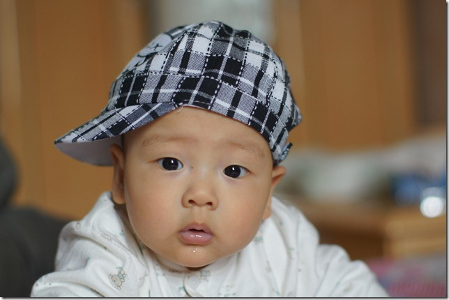
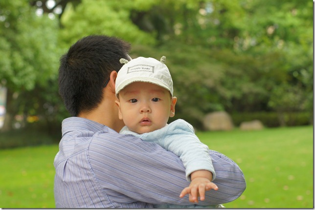
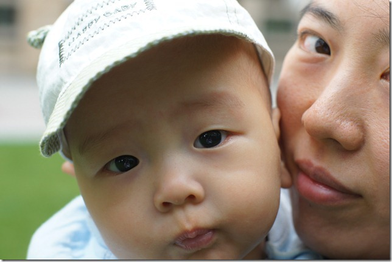
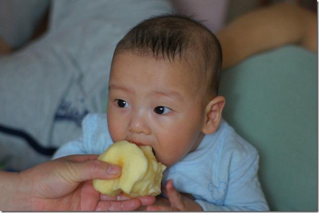

学会倒着爬了。豆豆自从学会了翻身，就一直努力往前爬，无奈年纪太小，腿脚根本不听使唤。可怜豆豆一把子力气，不知道往那里用才好。豆豆常常把手拼命往床上撑，胸脯挺得老高，自己跟自己较劲，一会脸就憋的通红了。后来豆豆就不用蛮力了，反正不好使。他有时候会突然一松手，身子扑到在床上，然后再撑起来看看挪了地方没。两个星期前，豆豆学会了原地打转：把肚子作为支点，两只手交错向左或右倒腾，几下子就能来个180度大转弯。最近，豆豆又学会了后退了：两只手先缩到胸前，然后他身体的前上方用力一推，他的肚皮就会朝脚的方向一划。他这一招效率还挺高，我们全家不得不对他提高了安全警戒级别，生怕他自己促溜一下掉到床下去。

这是豆豆在床上爬呢： 

豆豆给家里每人个都分了工：爷爷是抱他散步的；奶奶是陪着睡觉的；妈妈是用来吃饭的；爸爸是陪玩的。想干某件事了，就去找特定的人。比如说饿了，就会对着妈妈来一个十分谄媚的笑容；不饿的时候，看见妈妈，立刻把头一扭，就好像挡了他的视线一样。周末，豆豆睡午觉醒来，发现奶奶居然不在家陪睡，立刻就不高兴了。我和豆豆妈只好抱着他出门去玩，分散一下注意力，顺便给豆豆拍了几张外景照。

豆豆和爸爸： 

豆豆和妈妈的大头贴： 

豆豆喜欢别人逗他玩，一玩起来就嘎嘎嘎嘎笑得像个小疯子。他对游戏的要求还挺高呢，一定要换着花样才行。头一次玩骑大马、藏猫猫、举高高等的时候，他都乐的哈哈的；可是第二次再来就兴趣不大了；第三次还玩，就面无表情表示不满了。我们一家人早已使出浑身解数，现在都黔驴技穷了。

爸爸使出各种招数逗豆豆：[http://v.youku.com/v\_playlist/f5520621o1p11.html](http://v.youku.com/v_playlist/f5520621o1p11.html)

豆豆晚上还是要吃着奶睡觉，白天倒是可以抱着他哄哄就睡了。哄他睡之前，他是一定要哼哼唧唧的才行。有时候能哼哼四五分钟才睡着，也不知道他这是表示高兴？表示不满？还是自己哄自己睡呢？

豆豆哼哼唧唧的睡觉：[http://v.youku.com/v\_playlist/f5520621o1p13.html](http://v.youku.com/v_playlist/f5520621o1p13.html "http://v.youku.com/v_playlist/f5520621o1p13.html")

豆豆满五个月的时候开始添辅食。现在他主要吃的辅食只有配方米粉和苹果，他可爱吃这两样东西了。开始吃苹果的时候，我只给他刮一些汁，看他爱吃，就又刮了些末给他。现在我每天还会给他削一个苹果块，放在他嘴里咬。别看豆豆没牙，吃奶的劲可不是白练的。苹果块被他咬的嘎吱嘎吱响，一会就嗑出两个大坑来。

豆豆在啃爸爸吃剩的苹果核： 

豆豆吃米糊：[http://v.youku.com/v\_playlist/f5520621o1p14.html](http://v.youku.com/v_playlist/f5520621o1p14.html "http://v.youku.com/v_playlist/f5520621o1p14.html")
