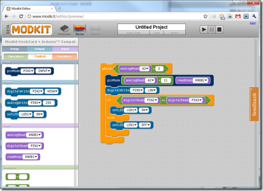

目前，像LabVIEW这样功能强大，比较通用的图形化编程语言可能绝无仅有的。但市面上，比较小型的，针对特定应用的图形化编程语言却五花八门，随处可见。今天同事又给我介绍了一款，叫做Modkit，官方网站：[http://www.modk.it](http://www.modk.it "http://www.modk.it") （河蟹们访问需翻墙）。

这款编程语言是基于Web的，也就是打开了网页就可以直接开始编程，不需安装额外软件。这一点与NI去年发布的 [LabVIEW Web UI Builder](http://ruanqizhen.wordpress.com/2011/08/23/labview-web-ui-builder/) 相类似。区别在于LabVIEW Web UI Builder 是基于Silverlight的，而 Modkit 据我观察，没有使用任何插件，很可能基于HTML5标准编写的。

如果可以选择，我个人会倾向于使用HTML标准开发程序，而不是使用Silverlight。目前来说，开发Silverlight程序的确比开发HTML5程序要容易。但是，Silverlight只是微软一个无足轻重的产品，随时可以被抛弃；而HTML标准却是w3c组织最核心的产品，又有一干顶尖厂商的支持。从长远来看，HTML可能更会被广泛采用。

回头再说 Modkit 这个产品，同为图形化编程语言，它的风格与LabVIEW迥然不同。我觉得它的设计最有两点的地方就是把编程序搞得像玩拼图游戏一样：

它的每个程序模块是一个拼图（或者叫积木）模块，搭在一起形成一个完整程序。它的模块之间不需连接数据线，贴在一起就行。

图形化编程语言可能都免不了模仿一些已有的概念。比如Modkit模仿拼贴画、LabVIEW模仿电路图、VEE模仿流程图。想不起来，对于一个任何背景知识的人来说，拼贴画最易入门。

Modkit 使用颜色来区分不同种类的模块，比如：蓝色表示对硬件进行配置；紫色表示数据输入输出通道；绿色表示运算模块；橘黄色用于流程控制。

用拼图的形状来保证数据类型安全。有的拼图块是方的（数值数据），有的拼图块带个卡口（执行模块），有的拼图块两侧带尖的（表示逻辑数据）。插槽也是有形状的，这样，只有形状匹配的积木才能放进相应的插槽。这和拼图的理念完全一致。

看，这就是我编的一小段简单程序： 

Modkit是专用来对Arduino这款硬件进行编程的。这种针对特定硬件设计的编程语言，最大优势就是效率高。我在和LabVIEW用户聊天时，听到的一类比较多的抱怨就是LabVIEW太大了，包含了各种他们不需要的功能，拖累的他们的程序爬都爬不动。

单从用户的角度来考虑，把LabVIEW的功能分离开来，搞出一系列针对特定硬件的精简版本来，会更利于使用。我得理想情况是：为每个硬件设备都安装一个基于Web的LabVIEW编程服务，这样用户只要使用浏览器打开一个硬件设备，就可以直接为它编写程序了。不过从商业利益考虑，这件事只能是硬件厂商自己去做了。
