周末公司组织去普陀山旅游。周五晚上从吴淞码头出发，第二天一早驶达普陀山。我们很不幸，因为周六正赶上台风袭击，整天都在下雨，而我们只能穿着雨衣打着伞游玩了。

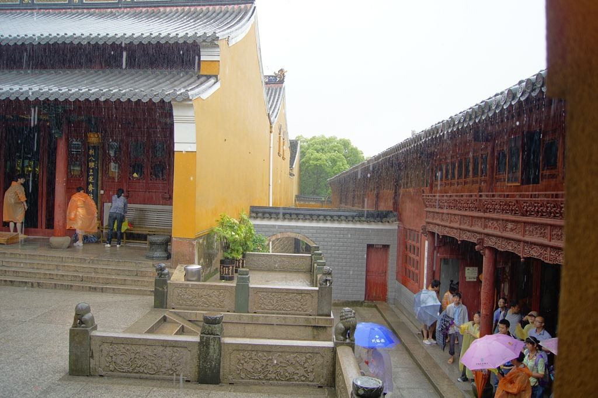

不过台风也带来了意外的好处：由于短途的渡船都已停航，来参观的游客比较稀少，不会因为太过拥挤而影响旅游的心情。

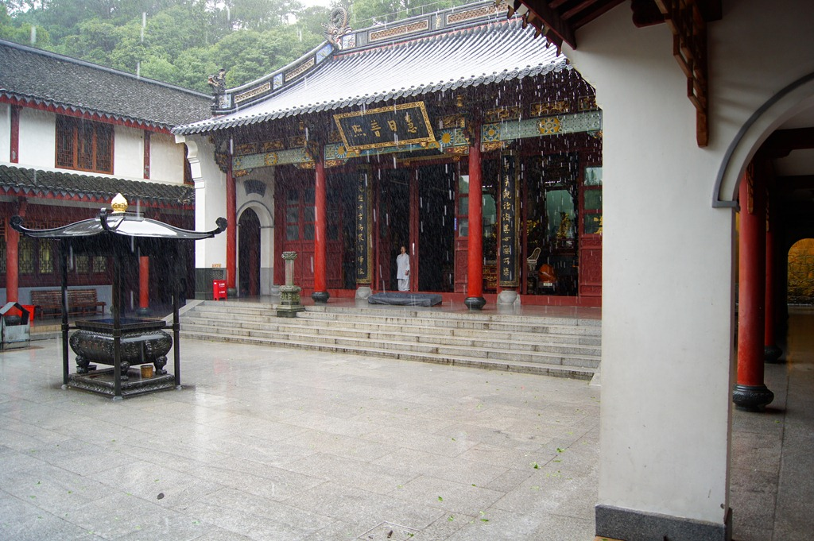

普陀山这里自然风光很有限，所谓旅游就是看庙。我对烧香拜佛不感兴趣，所以我很少进入室内，每到一处就在庙外面练练摄影。

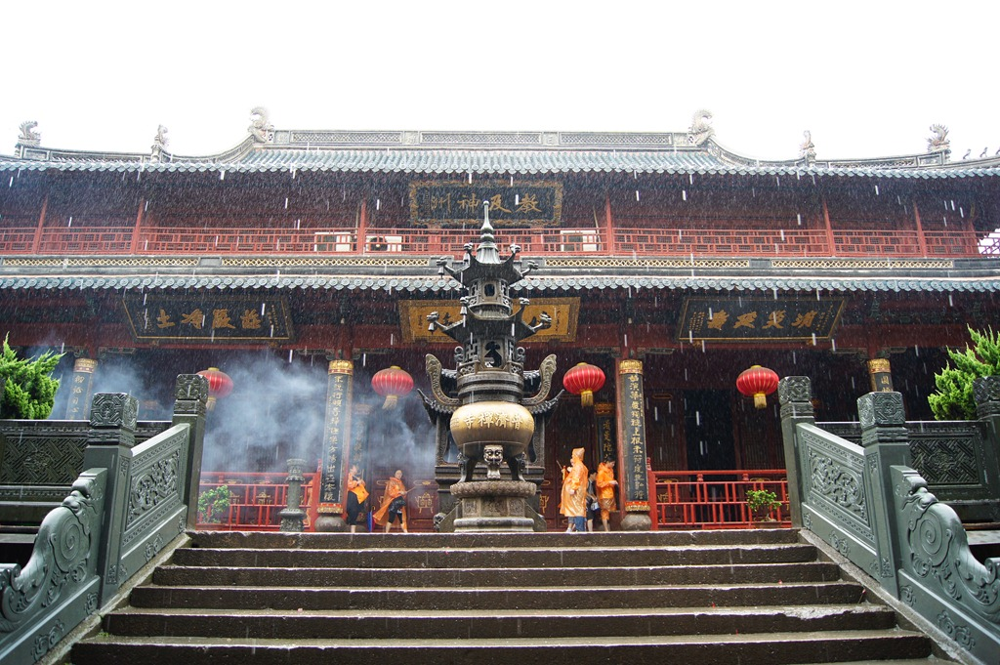

有些庙宇藏在深山里，安闲宁静。

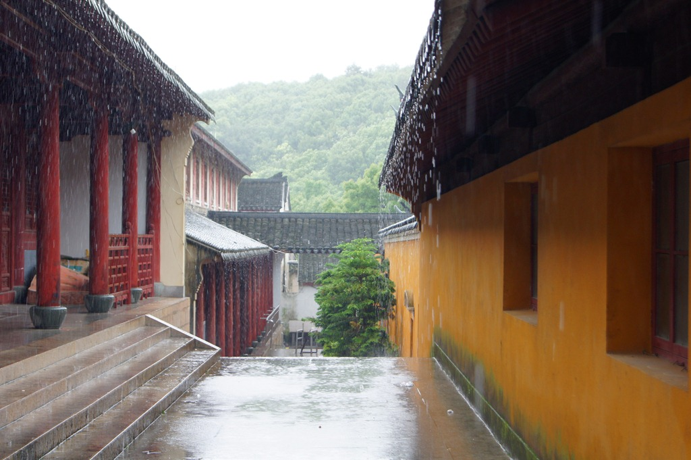

有些寺庙临海而建，惊涛拍岸，颇有气势。

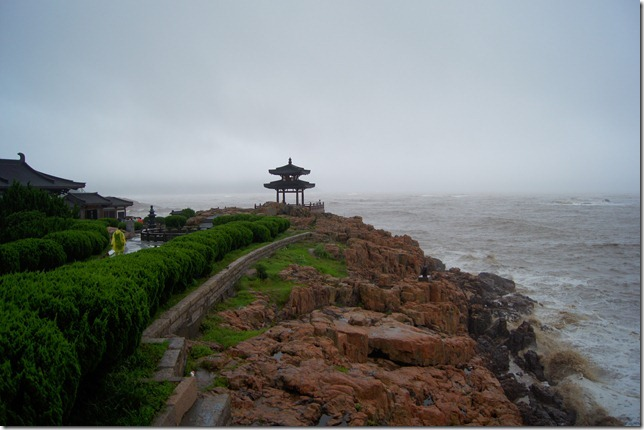

岛上最显眼的还是这尊铜制观音像，还没去参观她的时候，远远的就看到了。

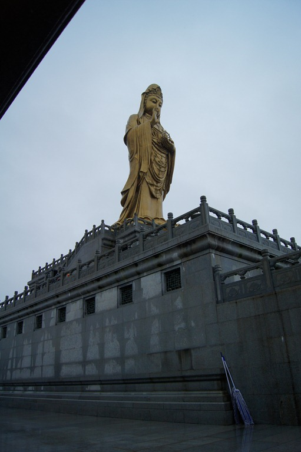

台风只持续了一天就过去了，天气突然就从狂风暴雨转为风和日丽。

第二天的行程还是以看庙为主，首先去的是岛上规格最高的那座寺庙（庙太多，名字都没记住）。果然富丽堂皇，远远看去，和宫殿也可媲美。

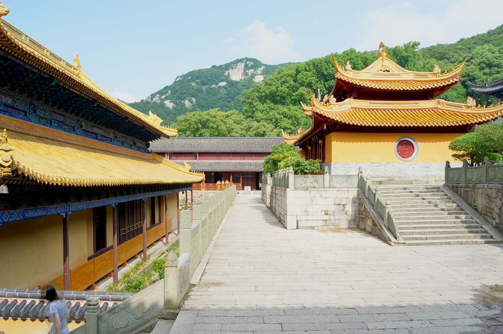

除去寺庙，我们玩的唯一一处景点是千步沙，景色不错，唯一缺憾是海不够蓝。

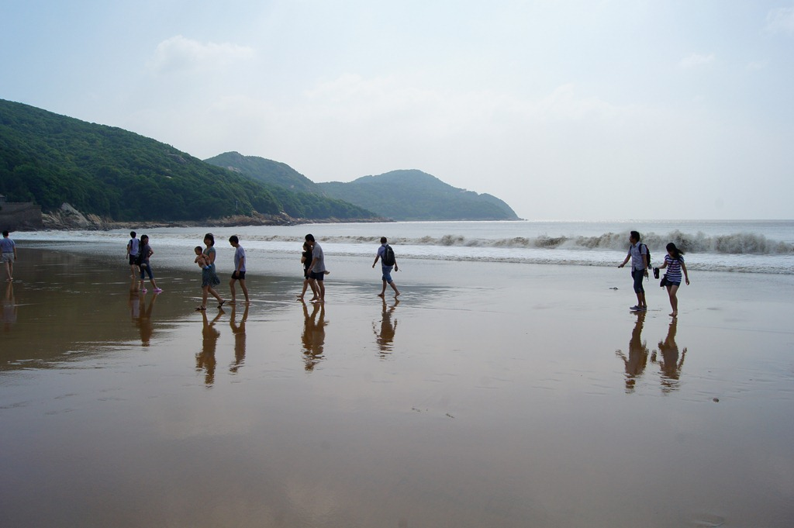

我借用大家看庙的时间，脱离队伍去周围走了走，岛上颇有点幽静的田园气息，要是能生活在这里就爽了。

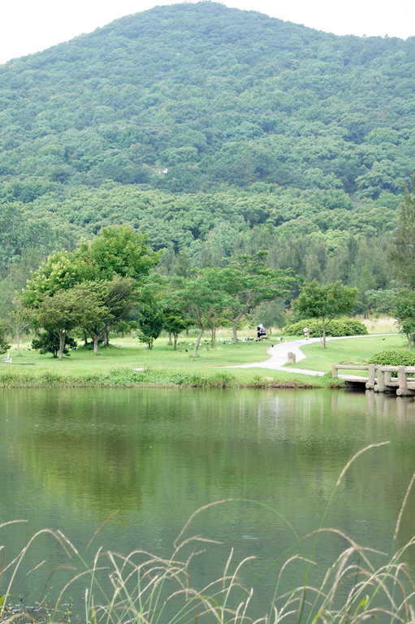

行程的最后一站是岛上最高的那座寺庙。寺庙都是大同小异的，然而登山途中的风光还是值得一看的。

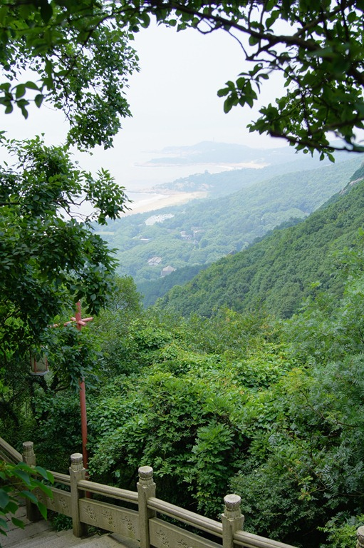

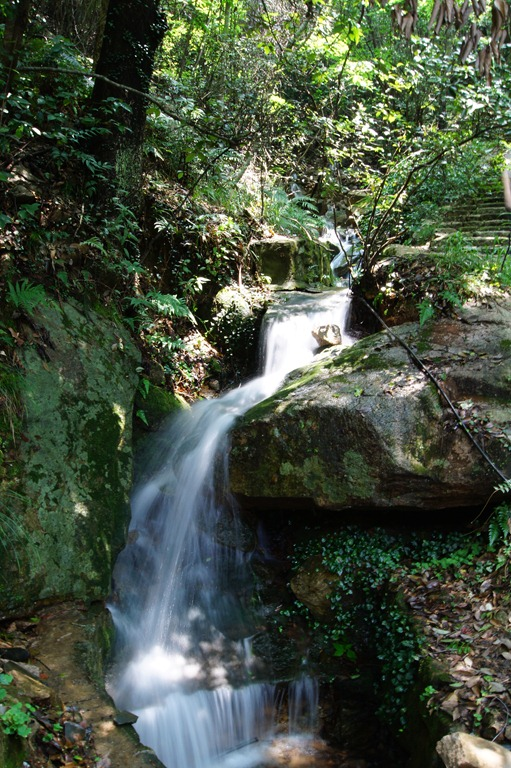
