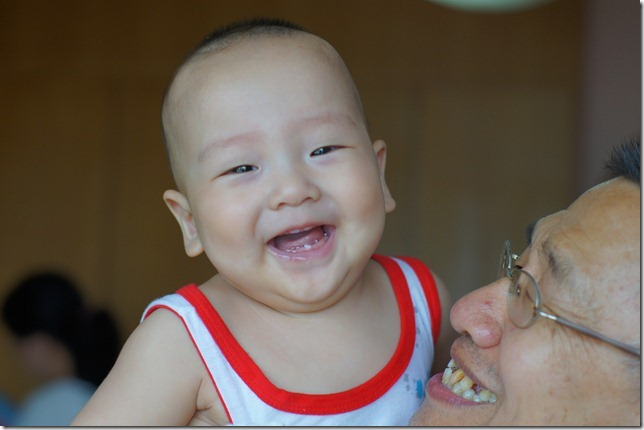
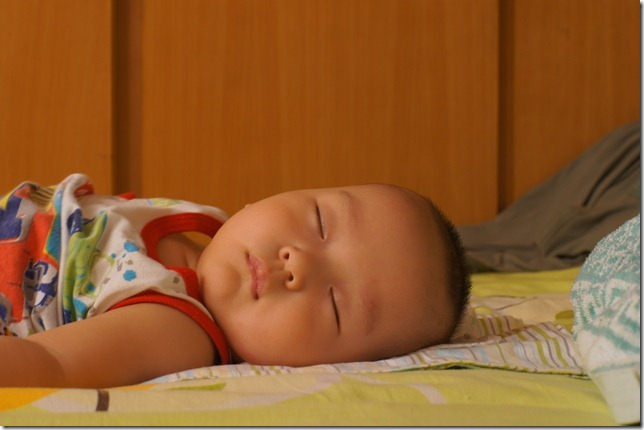
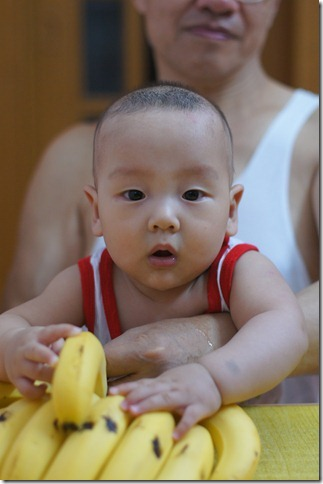

再过几天豆豆就满七个月了，他的第四颗牙也终于长出来了。

豆豆淘的要命，不睡觉的时候，浑身乱动，没有一刻停歇的。不过睡着的时候，还是蛮安静的:)

今天，我试着把豆豆快速举起来再放下再举起来，玩了几次。哪知道他一下子就喜欢上这个新玩法：一听见“高高”两个字就兴奋，整天搂着我的脖子，不停的撅起他的小屁股表示还要玩。但是据说小宝不适合剧烈晃动，我也不敢跟他玩的太疯。

豆豆现在的主要辅食是米粉和蒸熟了的香蕉。香蕉蒸熟以后闻起来酸溜溜的，我看着就没食欲，豆豆却视若珍馐。所以家里总少不了摆着几串香蕉。

