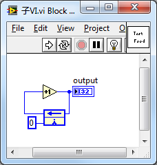
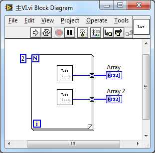
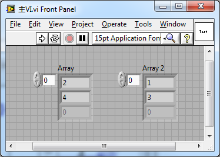
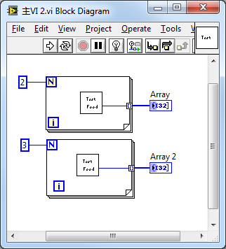
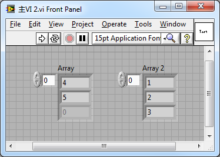

今天又想到一个问题，于是编程序验证了一下。如果一个包含反馈节点的VI在主VI中有多个调用实例，那么它们之间是共享一个移位寄存器呢，还是每个实例有自己的移位寄存器呢？

这是子VI：  

这是主VI：  

程序运行结果如下：  

看来它们是分享了同一个移位寄存器。

甚至子VI在不同的循环中被调用，它们也还是共用同一个顶层移位寄存器。比如下图这个程序：  

运行结果：  

只有把子VI设置成为每个实例都生成副本的[可重入运行方式](http://ruanqizhen.wordpress.com/2006/07/19/%E5%A6%82%E4%BD%95%E4%BD%BF%E7%94%A8-vi-%E7%9A%84%E9%87%8D%E5%85%A5%E5%B1%9E%E6%80%A7%EF%BC%88reentrant%EF%BC%89/)时，不同的子VI实例才会有独立的移位寄存器。

之前介绍的反馈节点内容：[http://ruanqizhen.wordpress.com/2008/08/20/循环结构的反馈节点](http://ruanqizhen.wordpress.com/2008/08/20/循环结构的反馈节点)，[http://ruanqizhen.wordpress.com/2011/05/22/反馈节点](http://ruanqizhen.wordpress.com/2011/05/22/)。
