更新内容：  https://labview.qizhen.xyz/

程序的界面应该有多大呢？如果程序可能会被很多用户使用，就难免会运行在各类尺寸的屏幕上。如果界面太大，小尺寸的显示屏就无法完全显示；如果界面太小，对于大显示屏来说又是一种浪费。从用户体验的角度考虑，最好程序的界面尺寸是可调的，用户可以选择适合自己的任意尺寸。

程序界面尺寸发生变化，界面上的控件也必须随之调整。控件跟随界面尺寸变化有两种方式：

一种是控件尺寸需要跟随调整的。数据量较大的控件，比如波形显示控件，表格，大文本框等，常常需要调整尺寸以获得尽量大的显示区域。

而有些控件的尺寸最好是固定的，比如按钮，选择框等控件。它们虽然不需要调整尺寸，但是当界面尺寸变化时，它们的位置可能需要调整以获得最佳界面布局。

我打算接下来几天比较一下各种动态调整界面布局的方法，帮助程序员选择最适合当前程序的方法。

## 窗格和分隔栏

每个VI有一个前面板（Panel），每个前面板又可以是由多个窗格（Pane）组成的。默认情况下，比如新建一个VI，这个VI的前面板就是有单个一个窗格组成的。由于大多数情况，每个面板只有一个窗格，以至于很多人都忽略了窗格的存在。但是在编程时，一定要意识到：LabVIEW程序中的控件是摆放在窗格上，而不是前面板上的；窗格才是摆放在前面板上的。

使用分隔栏可以在前面板上分割出更多的窗格来。分隔栏在控件选板“\[xx风格\]->Containers”中。分隔栏有横竖之分，可以把原有的方块按照不同方向分成两块。控件无论被放在哪个窗格里，对程序功能都没有影响，只对程序外观有影响。

当前面板的大小改变时，分隔栏也可以跟着移动。在分隔栏的鼠标右键菜单中可以设置一个状态栏跟随面板的哪个边沿一起移动，或者是按比例移动。

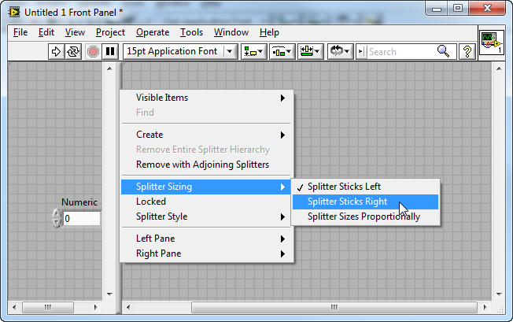

在分隔栏的右键菜单最后两项用来设置分隔栏两侧窗格的一些属性。比如，界面划分成窗格后通常不需要显示窗格内的拖动条，在这里可以在这里找到相应设置的子菜单禁止其显示。

在分隔栏的属性也可以通过程序在运行状态下通过程序来设置。它算然不像控件那样在程序框图上有个接线端，但却仍然可以使用右键菜单创建它的属性节点和调用节点。有了这些属性和方法，就可以在程序中调整分隔栏的位置等属性了。比如下面这段程序可以从左到右挪动上图状态栏的位置。

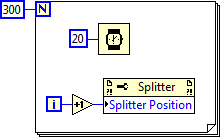

在程序运行时，用户仍然可以再界面上移动分隔栏。若不希望用户改变分隔栏位置，可以在分隔栏的右键菜单中选中“Lock”，这样分隔栏的位置就被锁定了。

分隔栏没有隐藏属性。若希望程序运行时看不到分隔栏，可以通过改变分隔栏颜色来达到“隐藏”的目的。首先，把分隔栏的风格改为经典“Classic”，然后把它的颜色染成与程序框图相同，这样就程序运行时就看不到分割栏了。顺便提一句，分隔栏两侧的窗格是可以有不同背景色的。

窗格也是没有隐藏属性的。在程序运行时需要隐藏某个窗格，只要调整它周围分隔栏的位置，把这个窗格缩起来就行了。

## 编程调整控件的位置尺寸等属性

在我自己编写过的VI中，用作界面的并不多：一个项目中，可能只有几个VI的界面需要显示给用户看，其它几百个VI都只用得到程序框图。由于涉及界面的VI并不多，但凡需要调整界面尺寸的，我都是使用了在程序中动态调整控件的尺寸与位置的方法。当程序接收到PaneSize这一事件后，根据新的界面的尺寸，重新计算每个控件的位置和大小。

比如下面这个程序界面包含一个波形图控件和一个停止按钮。

当用户改变界面尺寸时，我们希望停止按钮始终停靠在界面右下角，而波形图控件则撑满剩下的界面空间。这些变化都可以通过编程来设置，示例程序如下：

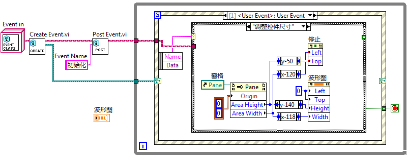

使用编程的方式使控件布局符合变化的界面尺寸，其优点是调整精确稳定。有些控件，比如仪表盘控件，只能通过这种编程的方式才能准确调整其大小。编程的缺点是较为繁琐。对于比较简单的界面，可以考虑使用分隔栏帮助界面布局，省去编程的繁琐。

## 等比例改变所有控件的尺寸

如果界面简单，只有一个窗格，当界面尺寸变化时，界面所有控件都可以按比例调整自身大小，则只要在VI属性中设置一条“按窗口大小缩放所有控件尺寸”就可以了。

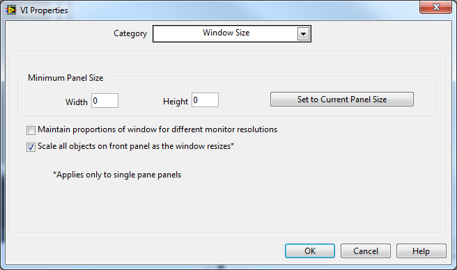

这样设置之后的效果是整个界面按比例缩放，所有的控件都一同变化。但是它并不太精确，反复调整界面尺寸几次，再回复到最初的大小，可能会发现有些控件尺寸有少许改变。这是因为前面板的尺寸和控件的尺寸都只能是整数，这样每次调整界面后，控件与前面板尺寸的比例都会有所变化。也就是说每次界面调整都会引入误差，累积误差还是比较明显的。

## 仅改变一个主控件的尺寸

大多数程序界面上，只需要有一个能够缩放的控件撑满屏幕就可以了，其它控件没必要调整，只要他们的布局不乱就好。

比如对于有一个波形图控件和一个停止按钮控件组成的界面，我们只需要波形图随界面尺寸的调整而变化。那么我们只要在这个控件右键菜单中选中它的“随方格缩放”属性就可以了。每个界面方格只能有一个控件被设置成随方格缩放。

被设置成这一属性的控件四个边沿的延长线都被深色标注出来了。当界面尺寸被调整时，控件四边到相应的VI前面板四边的距离是不变的，只有被这个四条深色实现包裹出来的矩形区域的尺寸会随界面一起变化。这样一来，可以保证程序的主控件随界面尺寸变化，而其它的控件位置保持稳定。

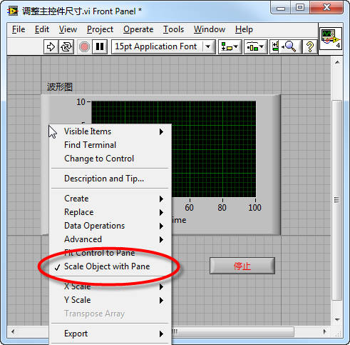

若主控件有多个，比如说界面上有两个同等重要的波形控件，那么只要把两个主控件Group在一起。由多个控件绑成的组，在外观布局上的行为属性与单个的控件是类似的。把这个组设为“随窗格缩放”，组里的控件就都可以随界面尺寸一起变化了。

当界面尺寸发生变化，上图中的“开始”和“停止”按钮之间的距离也会变动，因为他们一个靠近边界线左端，另一个靠近右端。若需要这两个按钮的相对距离保持不变，也把它们绑成一组就可以了。

## 借助分隔栏调整控件的位置与尺寸

对于比较复杂的界面，借助于分隔栏同样可以不编程就调整控件的尺寸和位置。我们用下面这样一个比较复杂的界面为例：

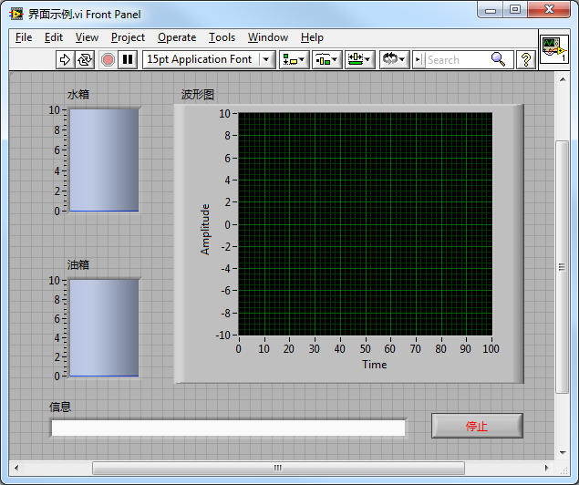

这个界面包含五个控件，假设界面要求如下：水箱、油箱、波形图三个控件需按比例随界面尺寸调整，但他们三个控件之间的距离，以及它们距离界面边框的距离不能变化；信息框的长度随界面调整，但高度不变；停止按钮尺寸保持不变，且始终在界面右下角。

我们可以使用分隔栏来定位每个控件的位置。我为了方便在编辑时调整控件尺寸，以及确保控件尺寸和位置在多次调整界面大小后仍然准确，设置了较多的分隔栏。原则是让每个需调整尺寸的控件都有一个可以撑满的窗格。 之后，在控件的右键菜单中选择“Fit Control to Pane”，让它们的尺寸始终与窗格保持一致。

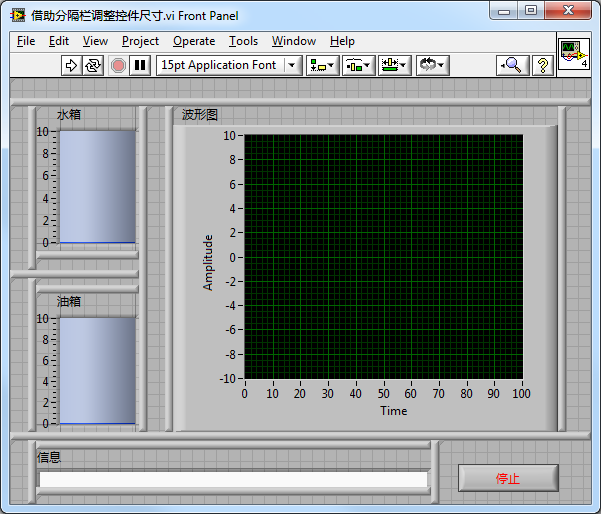

水箱、油箱、波形图、信息四个控件都需要设置为撑满窗格，而停止按钮由于大小不变，不需要有此设置。

我做的例子是比较极端的情况，一般来说不设置这么多分隔栏也可以，只要能保持每个窗格内只有一个跟随界面调整的控件就可以了。

界面上各个控件变化方式不同，全在于分隔栏对齐方式的设置。下图是分隔栏对齐方式的设置：

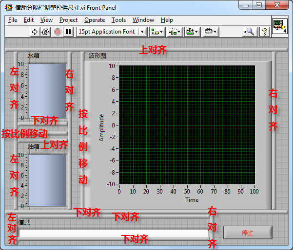

实际用户的界面一般不会希望显示这么多的分隔栏，可以参考前文介绍的分隔栏隐藏方法将其隐藏。

## 一些注意事项

**有些控件不能改变尺寸**

LabVIEW中并非所有的控件都大小可调。大多数尺寸固定的控件都是用来给子VI输入输出参数的，不会用到用户界面上。但也有一些会用于界面，尤其是一些系统风格的控件，比如单选框、复选框控件等。

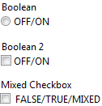

**有些控件必须保持长宽比**

大多数LabVIEW控件可以分别设置它们的高度和宽度。但有一些控件，比如仪表盘、旋钮等，它们的形状是固定的，只能是正圆。也就是无论大小如何，长宽始终保持一比一。

对于这样的控件是不能使用“Scale Object with Pane”，“Fit Control to Pane”的，LabVIEW对于这类控件大小的自动调整存在bug。对于它们，只能使用编程的方式调整尺寸。

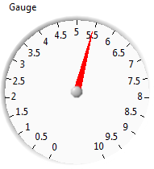

**界面最小尺寸**

无论采用哪种方式调整界面布局，最好都为界面设置一个最小尺寸。因为任何控件都不可能无限小，所以整个界面缩的太小对于用户也是没有意义的。

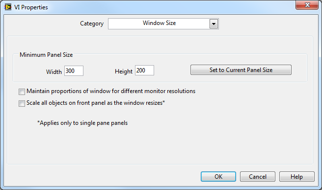
