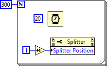

每个VI有一个前面板（Panel），每个前面板又可以是由多个窗格（Pane）组成的。默认情况下，比如新建一个VI，这个VI的前面板就是有单个一个窗格组成的。由于大多数情况，每个面板只有一个窗格，以至于很多人都忽略了窗格的存在。但是在编程时，一定要意识到：LabVIEW程序中的控件是摆放在窗格上，而不是前面板上的；窗格才是摆放在前面板上的。

使用分隔栏可以在前面板上分割出更多的窗格来。分隔栏在控件选板“\[xx风格\]->Containers”中。分隔栏有横竖之分，可以把原有的方块按照不同方向分成两块。控件无论被放在哪个窗格里，对程序功能都没有影响，只对程序外观有影响。

当前面板的大小改变时，分隔栏也可以跟着移动。在分隔栏的鼠标右键菜单中可以设置一个状态栏跟随面板的哪个边沿一起移动，或者是按比例移动。

在分隔栏的右键菜单最后两项用来设置分隔栏两侧窗格的一些属性。比如，界面划分成窗格后通常不需要显示窗格内的拖动条，在这里可以在这里找到相应设置的子菜单禁止其显示。

在分隔栏的属性也可以通过程序在运行状态下通过程序来设置。它算然不像控件那样在程序框图上有个接线端，但却仍然可以使用右键菜单创建它的属性节点和调用节点。有了这些属性和方法，就可以在程序中调整分隔栏的位置等属性了。比如下面这段程序可以从左到右挪动上图状态栏的位置。

在程序运行时，用户仍然可以再界面上移动分隔栏。若不希望用户改变分隔栏位置，可以在分隔栏的右键菜单中选中“Lock”，这样分隔栏的位置就被锁定了。

分隔栏没有隐藏属性。若希望程序运行时看不到分隔栏，可以通过改变分隔栏颜色来达到“隐藏”的目的。首先，把分隔栏的风格改为经典“Classic”，然后把它的颜色染成与程序框图相同，这样就程序运行时就看不到分割栏了。顺便提一句，分隔栏两侧的窗格是可以有不同背景色的。

窗格也是没有隐藏属性的。在程序运行时需要隐藏某个窗格，只要调整它周围分隔栏的位置，把这个窗格缩起来就行了。
