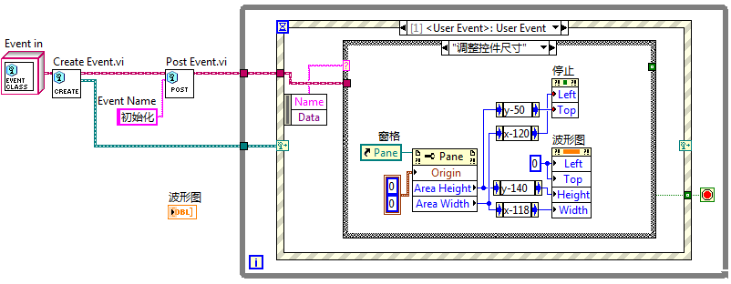

https://labview.qizhen.xyz/

在我自己编写过的VI中，用作界面的并不多：一个项目中，可能只有几个VI的界面需要显示给用户看，其它几百个VI都只用得到程序框图。由于涉及界面的VI并不多，但凡需要调整界面尺寸的，我都是使用了在程序中动态调整控件的尺寸与位置的方法。当程序接收到PaneSize这一事件后，根据新的界面的尺寸，重新计算每个控件的位置和大小。

比如下面这个程序界面包含一个波形图控件和一个停止按钮。

当用户改变界面尺寸时，我们希望停止按钮始终停靠在界面右下角，而波形图控件则撑满剩下的界面空间。这些变化都可以通过编程来设置，示例程序如下：

使用编程的方式使控件布局符合变化的界面尺寸，其优点是调整精确稳定。有些控件，比如仪表盘控件，只能通过这种编程的方式才能准确调整其大小。编程的缺点是较为繁琐。对于比较简单的界面，可以考虑使用分隔栏帮助界面布局，省去编程的繁琐。
