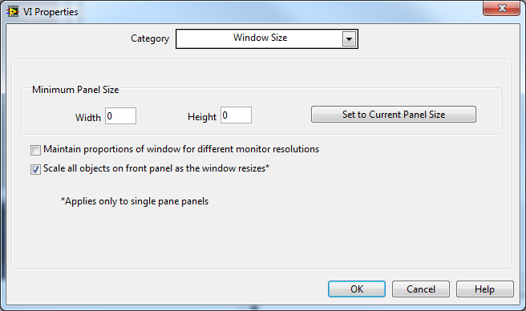

https://labview.qizhen.xyz/

如果界面简单，只有一个窗格，当界面尺寸变化时，界面所有控件都可以按比例调整自身大小，则只要在VI属性中设置一条“按窗口大小缩放所有控件尺寸”就可以了。

这样设置之后的效果是整个界面按比例缩放，所有的控件都一同变化。但是它并不太精确，反复调整界面尺寸几次，再回复到最初的大小，可能会发现有些控件尺寸有少许改变。这是因为前面板的尺寸和控件的尺寸都只能是整数，这样每次调整界面后，控件与前面板尺寸的比例都会有所变化。也就是说每次界面调整都会引入误差，累积误差还是比较明显的。
