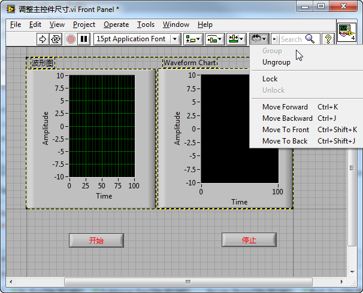

https://labview.qizhen.xyz/

大多数程序界面上，只需要有一个能够缩放的控件撑满屏幕就可以了，其它控件没必要调整，只要他们的布局不乱就好。

比如对于有一个波形图控件和一个停止按钮控件组成的界面，我们只需要波形图随界面尺寸的调整而变化。那么我们只要在这个控件右键菜单中选中它的“随方格缩放”属性就可以了。每个界面方格只能有一个控件被设置成随方格缩放。

被设置成这一属性的控件四个边沿的延长线都被深色标注出来了。当界面尺寸被调整时，控件四边到相应的VI前面板四边的距离是不变的，只有被这个四条深色实现包裹出来的矩形区域的尺寸会随界面一起变化。这样一来，可以保证程序的主控件随界面尺寸变化，而其它的控件位置保持稳定。

若主控件有多个，比如说界面上有两个同等重要的波形控件，那么只要把两个主控件Group在一起。由多个控件绑成的组，在外观布局上的行为属性与单个的控件是类似的。把这个组设为“随窗格缩放”，组里的控件就都可以随界面尺寸一起变化了。

当界面尺寸发生变化，上图中的“开始”和“停止”按钮之间的距离也会变动，因为他们一个靠近边界线左端，另一个靠近右端。若需要这两个按钮的相对距离保持不变，也把它们绑成一组就可以了。
