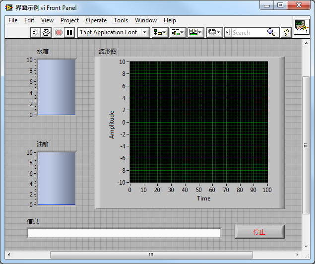
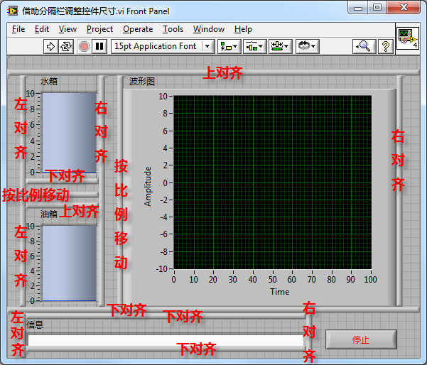

[https://labview.qizhen.xyz/](https://labview.qizhen.xyz/)

对于比较复杂的界面，借助于分隔栏同样可以不编程就调整控件的尺寸和位置。我们用下面这样一个比较复杂的界面为例：

这个界面包含五个控件，假设界面要求如下：水箱、油箱、波形图三个控件需按比例随界面尺寸调整，但他们三个控件之间的距离，以及它们距离界面边框的距离不能变化；信息框的长度随界面调整，但高度不变；停止按钮尺寸保持不变，且始终在界面右下角。

我们可以使用分隔栏来定位每个控件的位置。我为了方便在编辑时调整控件尺寸，以及确保控件尺寸和位置在多次调整界面大小后仍然准确，设置了较多的分隔栏。原则是让每个需调整尺寸的控件都有一个可以撑满的窗格。 之后，在控件的右键菜单中选择“Fit Control to Pane”，让它们的尺寸始终与窗格保持一致。

水箱、油箱、波形图、信息四个控件都需要设置为撑满窗格，而停止按钮由于大小不变，不需要有此设置。

我做的例子是比较极端的情况，一般来说不设置这么多分隔栏也可以，只要能保持每个窗格内只有一个跟随界面调整的控件就可以了。

界面上各个控件变化方式不同，全在于分隔栏对齐方式的设置。下图是分隔栏对齐方式的设置：

实际用户的界面一般不会希望显示这么多的分隔栏，可以参考前文介绍的[分隔栏隐藏](http://ruanqizhen.wordpress.com/2011/07/19/%E8%AE%BE%E8%AE%A1%E5%8F%AF%E8%B0%83%E8%8A%82%E5%A4%A7%E5%B0%8F%E7%9A%84%E7%A8%8B%E5%BA%8F%E7%95%8C%E9%9D%A22-%E7%AA%97%E6%A0%BC%E5%92%8C%E5%88%86%E9%9A%94%E6%A0%8F/)方法将其隐藏。
