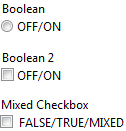
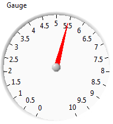
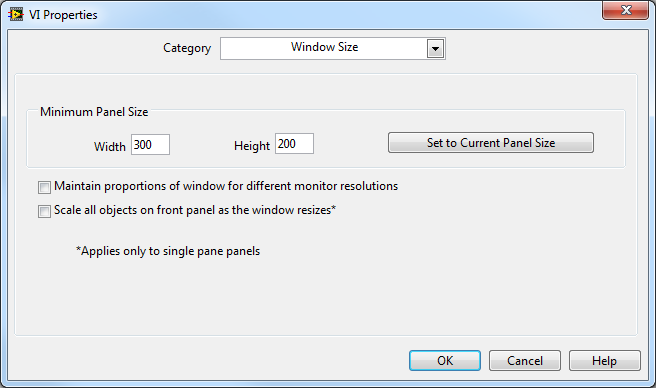

[https://labview.qizhen.xyz/](https://labview.qizhen.xyz/)

**有些控件不能改变尺寸**

LabVIEW中并非所有的控件都大小可调。大多数尺寸固定的控件都是用来给子VI输入输出参数的，不会用到用户界面上。但也有一些会用于界面，尤其是一些系统风格的控件，比如单选框、复选框控件等。

**有些控件必须保持长宽比**

大多数LabVIEW控件可以分别设置它们的高度和宽度。但有一些控件，比如仪表盘、旋钮等，它们的形状是固定的，只能是正圆。也就是无论大小如何，长宽始终保持一比一。

对于这样的控件是不能使用“Scale Object with Pane”，“Fit Control to Pane”的，LabVIEW对于这类控件大小的自动调整存在bug。对于它们，只能使用编程的方式调整尺寸。

**界面最小尺寸**

无论采用哪种方式调整界面布局，最好都为界面设置一个最小尺寸。因为任何控件都不可能无限小，所以整个界面缩的太小对于用户也是没有意义的。

